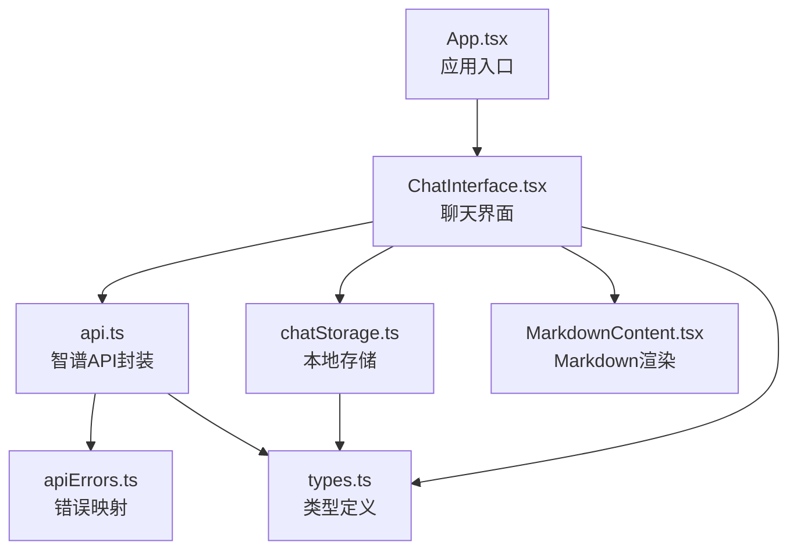
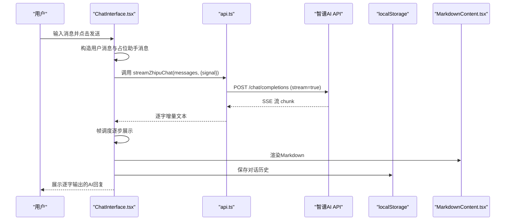
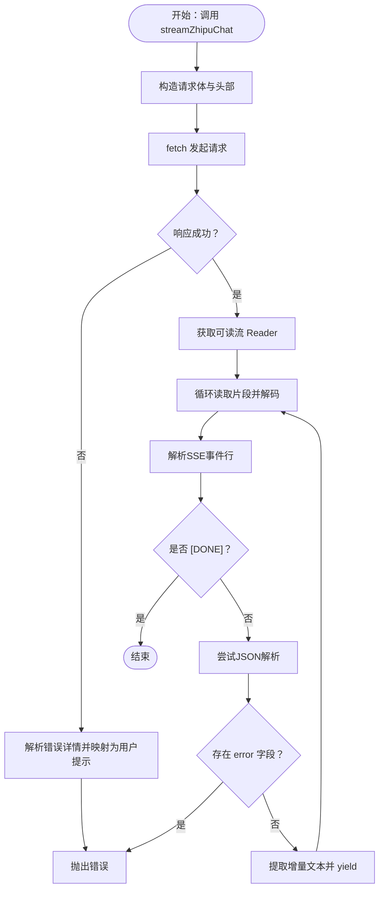
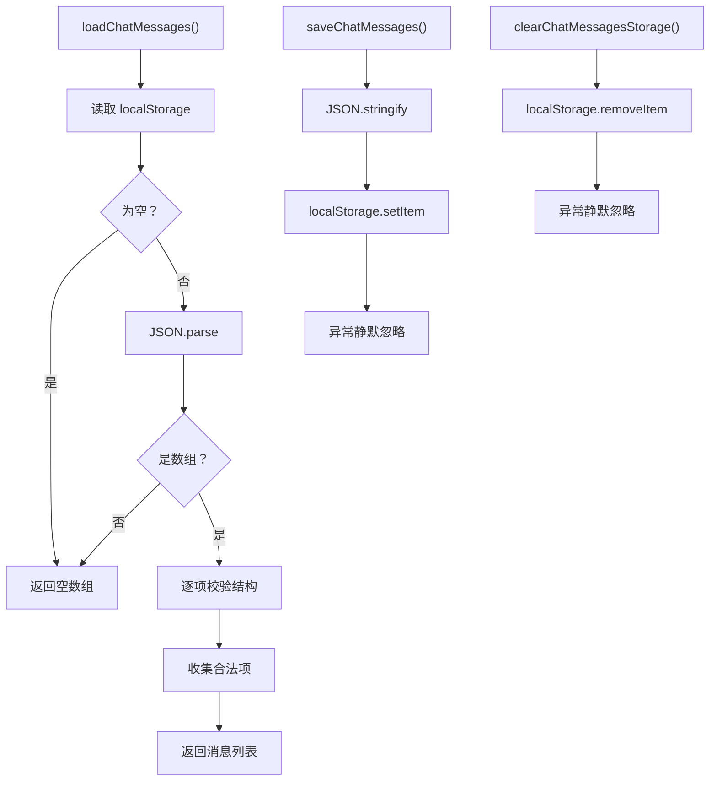
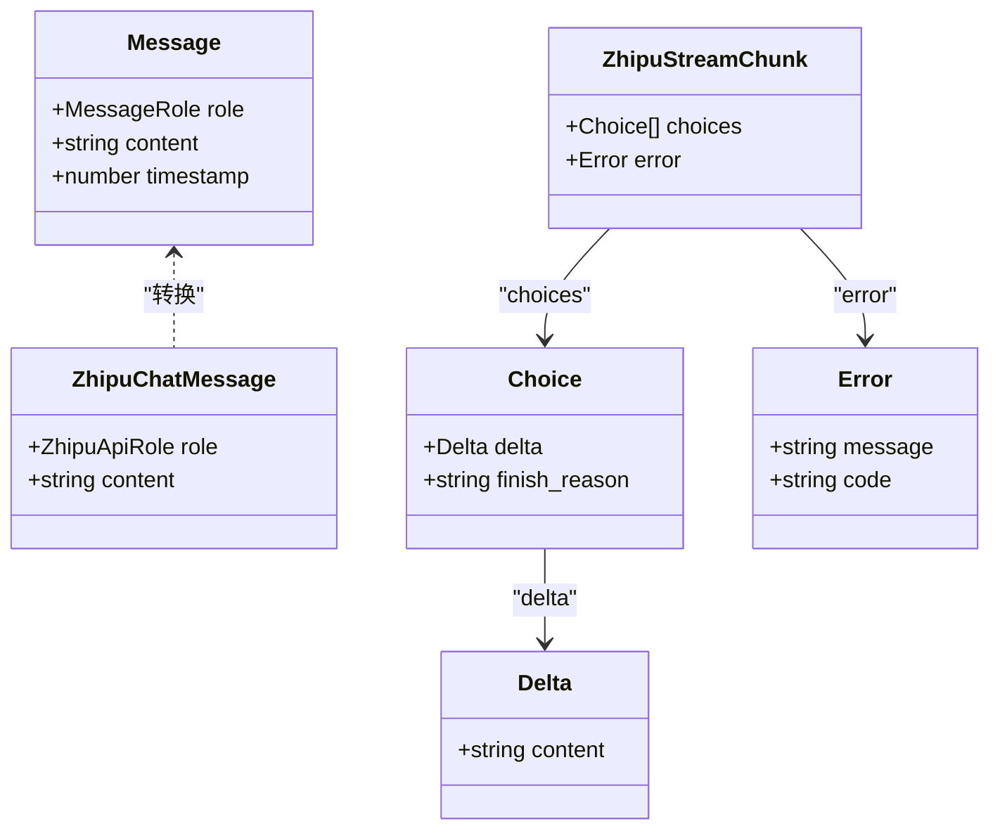
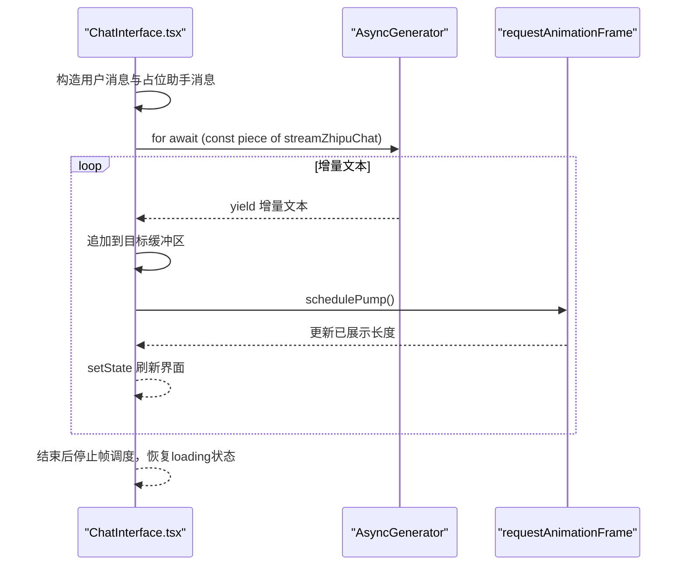
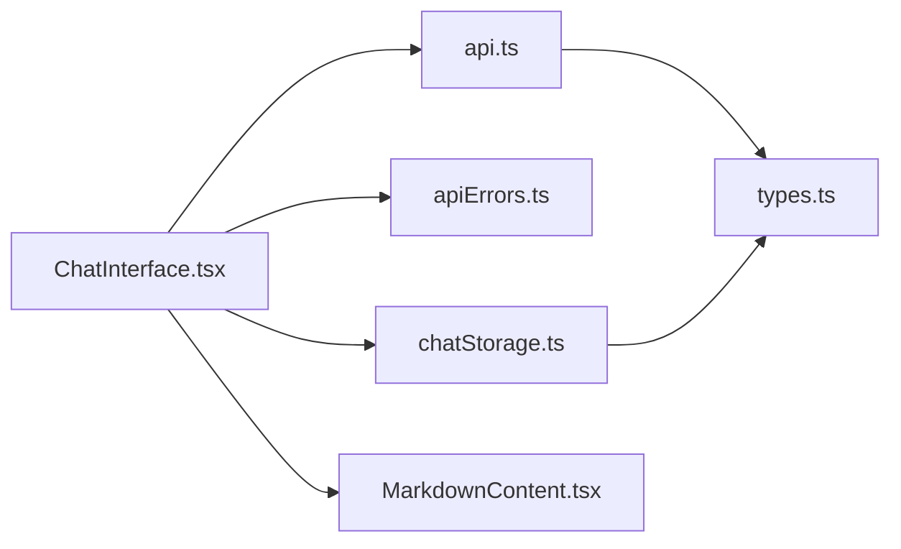

# API集成

<cite>
**本文引用的文件**
- [src/api.ts](file://src/api.ts)
- [src/apiErrors.ts](file://src/apiErrors.ts)
- [src/chatStorage.ts](file://src/chatStorage.ts)
- [src/types.ts](file://src/types.ts)
- [src/App.tsx](file://src/App.tsx)
- [src/components/ChatInterface.tsx](file://src/components/ChatInterface.tsx)
- [src/components/MarkdownContent.tsx](file://src/components/MarkdownContent.tsx)
- [PRD.md](file://PRD.md)
- [TECH_DESIGN.md](file://TECH_DESIGN.md)
- [package.json](file://package.json)
</cite>

## 目录
1. [简介](#简介)
2. [项目结构](#项目结构)
3. [核心组件](#核心组件)
4. [架构总览](#架构总览)
5. [详细组件分析](#详细组件分析)
6. [依赖关系分析](#依赖关系分析)
7. [性能考量](#性能考量)
8. [故障排查指南](#故障排查指南)
9. [结论](#结论)
10. [附录](#附录)

## 简介
本文件面向“AI聊天助手”项目的API集成与前端实现，重点覆盖以下方面：
- 智谱AI Chat Completions API的集成方式：请求参数配置、SSE流式响应解析、错误映射与用户提示。
- 本地存储管理模块：数据持久化策略、序列化格式与容错处理。
- TypeScript类型定义系统：Message接口、角色类型枚举与API响应模型。
- 完整的API调用示例与参数说明、返回值格式。
- 错误处理策略、重试机制与降级方案。
- 异步操作处理模式与性能优化技巧。

## 项目结构
该项目采用React + TypeScript + Vite技术栈，围绕“聊天界面”“API调用”“本地存储”“Markdown渲染”四个维度组织代码。核心入口为应用组件，聊天界面负责交互与流式渲染，API模块封装智谱调用，存储模块负责本地持久化，类型模块统一数据契约。

图表来源
- [src/App.tsx:1-8](file://src/App.tsx#L1-L8)
- [src/components/ChatInterface.tsx:1-344](file://src/components/ChatInterface.tsx#L1-L344)
- [src/api.ts:1-184](file://src/api.ts#L1-L184)
- [src/chatStorage.ts:1-51](file://src/chatStorage.ts#L1-L51)
- [src/components/MarkdownContent.tsx:1-129](file://src/components/MarkdownContent.tsx#L1-L129)
- [src/apiErrors.ts:1-62](file://src/apiErrors.ts#L1-L62)
- [src/types.ts:1-9](file://src/types.ts#L1-L9)

章节来源
- [PRD.md:1-16](file://PRD.md#L1-L16)
- [TECH_DESIGN.md:1-17](file://TECH_DESIGN.md#L1-L17)
- [package.json:1-36](file://package.json#L1-L36)

## 核心组件
- 智谱API封装（请求参数、SSE流式解析、错误映射）
- 本地存储（加载、保存、清理）
- 类型系统（Message、角色枚举）
- 聊天界面（异步生成、帧调度、错误提示）
- Markdown渲染（代码高亮、主题适配）

章节来源
- [src/api.ts:1-184](file://src/api.ts#L1-L184)
- [src/chatStorage.ts:1-51](file://src/chatStorage.ts#L1-L51)
- [src/types.ts:1-9](file://src/types.ts#L1-L9)
- [src/components/ChatInterface.tsx:1-344](file://src/components/ChatInterface.tsx#L1-L344)
- [src/components/MarkdownContent.tsx:1-129](file://src/components/MarkdownContent.tsx#L1-L129)
- [src/apiErrors.ts:1-62](file://src/apiErrors.ts#L1-L62)

## 架构总览
下图展示了从用户输入到流式响应展示的端到端流程，以及与本地存储的交互。

图表来源
- [src/components/ChatInterface.tsx:106-182](file://src/components/ChatInterface.tsx#L106-L182)
- [src/api.ts:70-183](file://src/api.ts#L70-L183)
- [src/chatStorage.ts:20-42](file://src/chatStorage.ts#L20-L42)
- [src/components/MarkdownContent.tsx:117-128](file://src/components/MarkdownContent.tsx#L117-L128)

## 详细组件分析

### 智谱AI Chat Completions API集成
- 请求参数配置
  - 环境变量读取：API Key、Base URL、模型名；未配置时抛出明确错误。
  - 请求体：模型名、消息数组（不含时间戳）、启用流式输出。
  - 请求头：鉴权、JSON内容类型、SSE接受类型。
- SSE流式响应处理
  - 通过ReadableStream读取二进制片段，使用TextDecoder解码。
  - 自定义解析器提取SSE事件行，过滤注释与空行，识别"data:"前缀。
  - 逐块解析JSON，提取delta.content增量文本；遇到"[DONE]"结束。
  - 错误处理：HTTP非2xx时解析JSON或文本详情，映射为友好提示；网络异常捕获并转译。
- 错误映射机制
  - HTTP状态码映射到用户可读提示。
  - 特定错误字符串匹配（如网络错误、API Key缺失）进行友好提示。
  - 对于模型返回的error字段，直接拼接错误码与消息。

图表来源
- [src/api.ts:70-183](file://src/api.ts#L70-L183)
- [src/apiErrors.ts:3-31](file://src/apiErrors.ts#L3-L31)

章节来源
- [src/api.ts:23-38](file://src/api.ts#L23-L38)
- [src/api.ts:70-183](file://src/api.ts#L70-L183)
- [src/apiErrors.ts:33-61](file://src/apiErrors.ts#L33-L61)

### 本地存储管理模块
- 数据持久化策略
  - 使用localStorage键名统一管理对话历史。
  - 加载：解析JSON，校验数组与每条消息的结构，仅保留合法项。
  - 保存：序列化为JSON并写入；异常静默忽略（配额满、隐私模式等）。
  - 清理：移除键值。
- 序列化格式
  - 数组形式存储Message对象；Message包含角色、内容与时间戳。
- 数据迁移方案
  - 当前实现未包含版本迁移逻辑；建议未来扩展时：
    - 引入版本号字段；
    - 在加载时检测旧格式并迁移；
    - 提供回滚策略与兼容性检查。

图表来源
- [src/chatStorage.ts:20-42](file://src/chatStorage.ts#L20-L42)

章节来源
- [src/chatStorage.ts:1-51](file://src/chatStorage.ts#L1-L51)
- [src/types.ts:4-8](file://src/types.ts#L4-L8)

### TypeScript类型定义系统
- 角色类型枚举
  - MessageRole：限定为"user"或"assistant"。
- 消息接口
  - Message：包含role、content、timestamp三要素。
- API响应模型
  - ZhipuChatMessage：与后端期望一致的消息结构（不含timestamp）。
  - ZhipuStreamChunk：SSE流块结构，包含choices.delta.content与finish_reason，以及error字段。

图表来源
- [src/types.ts:2-8](file://src/types.ts#L2-L8)
- [src/api.ts:8-21](file://src/api.ts#L8-L21)

章节来源
- [src/types.ts:1-9](file://src/types.ts#L1-L9)
- [src/api.ts:6-21](file://src/api.ts#L6-L21)

### 聊天界面与异步处理模式
- 异步生成与帧调度
  - 使用AsyncGenerator逐字产出增量文本，内部维护目标缓冲区与已展示长度。
  - 通过requestAnimationFrame分帧推进，控制每帧展示字符数，实现“打字机”效果。
  - 多轮请求生成独立代数（requestGenRef），确保并发请求间不互相干扰。
- 错误处理与降级
  - 捕获AbortError（用户取消）、网络错误、模型错误，分别进行UI提示与状态恢复。
  - 若助手消息为空则移除占位消息，避免空回复。
- 交互细节
  - 支持Enter发送、Shift+Enter换行。
  - 复制助手回复到剪贴板，带短暂反馈。

图表来源
- [src/components/ChatInterface.tsx:106-182](file://src/components/ChatInterface.tsx#L106-L182)

章节来源
- [src/components/ChatInterface.tsx:25-104](file://src/components/ChatInterface.tsx#L25-L104)
- [src/components/ChatInterface.tsx:106-182](file://src/components/ChatInterface.tsx#L106-L182)

### Markdown渲染与代码高亮
- 渲染引擎：react-markdown
- 语法高亮：react-syntax-highlighter + oneDark主题
- 语言别名映射：支持常见语言别名到Prism语言ID的转换
- 内联代码样式：根据消息气泡色调调整背景，避免视觉冲突

章节来源
- [src/components/MarkdownContent.tsx:1-129](file://src/components/MarkdownContent.tsx#L1-L129)

## 依赖关系分析
- 模块耦合
  - ChatInterface依赖api与apiErrors进行调用与错误提示；依赖MarkdownContent进行渲染；依赖chatStorage进行持久化。
  - api.ts与apiErrors紧密协作，前者负责调用，后者负责错误映射。
  - types.ts被多个模块引用，作为统一数据契约。
- 外部依赖
  - React生态：React、react-markdown、react-syntax-highlighter
  - 构建工具：Vite、TypeScript

图表来源
- [src/components/ChatInterface.tsx:1-12](file://src/components/ChatInterface.tsx#L1-L12)
- [src/api.ts:1-2](file://src/api.ts#L1-L2)
- [src/chatStorage.ts:1](file://src/chatStorage.ts#L1)
- [src/components/MarkdownContent.tsx:1-5](file://src/components/MarkdownContent.tsx#L1-L5)
- [src/apiErrors.ts:1](file://src/apiErrors.ts#L1)

章节来源
- [package.json:12-34](file://package.json#L12-L34)

## 性能考量
- 流式渲染
  - 使用requestAnimationFrame分帧推进，降低主线程压力；每帧展示固定数量字符，平衡流畅度与CPU占用。
- 网络与解析
  - SSE解析采用行级缓冲与尾部残留处理，减少重复解析开销。
  - 仅在必要时进行JSON解析，遇到非JSON或无效数据跳过。
- 存储与内存
  - localStorage写入异常静默，避免阻塞UI线程。
  - 加载时对每条消息进行严格校验，避免无效数据污染内存。
- 渲染优化
  - Markdown组件使用useMemo缓存组件映射，减少重复创建。

章节来源
- [src/components/ChatInterface.tsx:58-104](file://src/components/ChatInterface.tsx#L58-L104)
- [src/api.ts:45-57](file://src/api.ts#L45-L57)
- [src/chatStorage.ts:20-42](file://src/chatStorage.ts#L20-L42)
- [src/components/MarkdownContent.tsx:117-122](file://src/components/MarkdownContent.tsx#L117-L122)

## 故障排查指南
- 环境变量未配置
  - 症状：启动即报API Key未配置。
  - 处理：在项目根目录创建.env文件，设置VITE_ZHIPU_API_KEY；可选设置VITE_ZHIPU_API_BASE与VITE_ZHIPU_MODEL。
- 网络连接异常
  - 症状：TypeError或“网络连接异常”提示。
  - 处理：检查网络、代理、防火墙；重试或稍后再试。
- API返回错误
  - 症状：HTTP状态码映射为用户提示；模型返回error字段时直接展示。
  - 处理：根据提示检查模型权限、配额与请求参数。
- 流式读取中断
  - 症状：连接中断提示。
  - 处理：刷新页面或重新发送请求；避免同时发起过多并发请求。
- 本地存储异常
  - 症状：保存失败（静默）。
  - 处理：检查浏览器隐私模式或存储配额；清理无用数据。

章节来源
- [src/api.ts:23-38](file://src/api.ts#L23-L38)
- [src/api.ts:95-102](file://src/api.ts#L95-L102)
- [src/api.ts:125-128](file://src/api.ts#L125-L128)
- [src/apiErrors.ts:3-31](file://src/apiErrors.ts#L3-L31)
- [src/apiErrors.ts:33-61](file://src/apiErrors.ts#L33-L61)
- [src/chatStorage.ts:36-42](file://src/chatStorage.ts#L36-L42)

## 结论
本项目以清晰的模块划分实现了智谱AI Chat Completions API的集成，结合SSE流式响应与帧调度渲染，提供了良好的用户体验。本地存储模块采用严格的校验与容错策略，保障数据安全与稳定性。类型系统统一了数据契约，降低了耦合风险。建议后续在错误重试与数据迁移方面进一步增强，以提升健壮性与可维护性。

## 附录

### API调用示例与参数说明
- 调用入口
  - 函数：streamZhipuChat
  - 参数：
    - messages：Message数组（不含时间戳，由后端使用）
    - options.signal：AbortSignal，用于取消请求
  - 返回：AsyncGenerator<string, void, undefined>，逐字产出增量文本
- 请求体字段
  - model：模型名（默认"glm-4-flash"）
  - messages：ZhipuChatMessage数组
  - stream：布尔值，必须为true
- 响应格式
  - SSE事件行"data:"后跟随JSON字符串
  - JSON包含choices[].delta.content增量文本
  - 结束标记"[DONE]"
- 错误映射
  - HTTP状态码映射为用户提示
  - 网络错误与模型错误分别处理
  - API Key缺失与未授权场景明确提示

章节来源
- [src/api.ts:70-183](file://src/api.ts#L70-L183)
- [src/apiErrors.ts:3-31](file://src/apiErrors.ts#L3-L31)

### 数据模型与序列化
- Message接口
  - role："user" | "assistant"
  - content：字符串
  - timestamp：数字（毫秒时间戳）
- 存储格式
  - localStorage键："ai-chat-assistant:messages"
  - 值：Message[]的JSON字符串
- 校验规则
  - 必须为数组
  - 每项必须包含合法角色、字符串内容与有限数值时间戳

章节来源
- [src/types.ts:4-8](file://src/types.ts#L4-L8)
- [src/chatStorage.ts:20-34](file://src/chatStorage.ts#L20-L34)