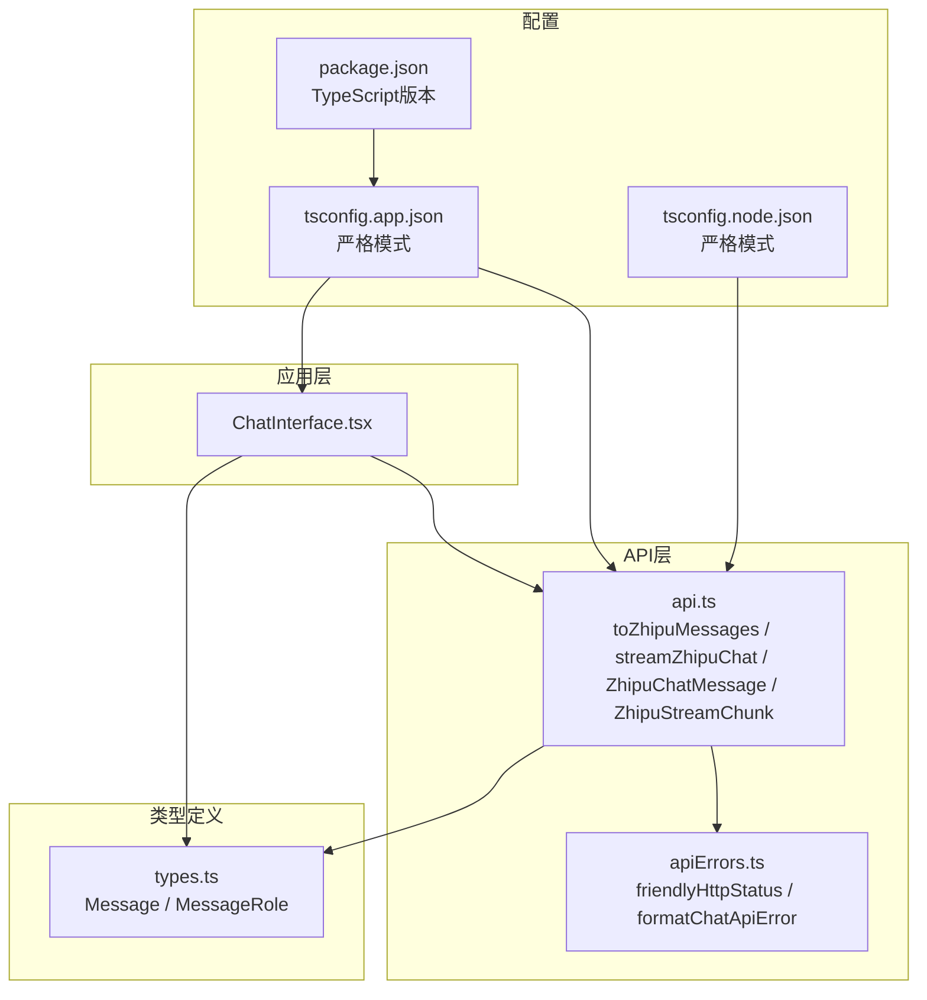
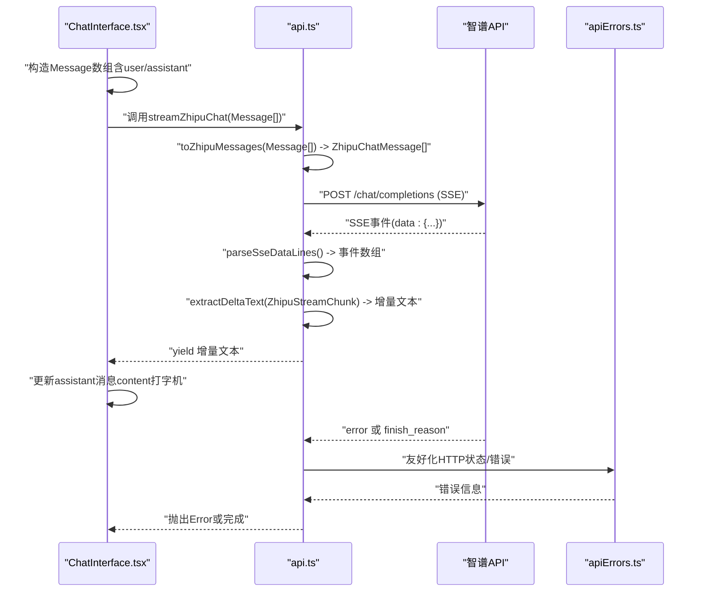
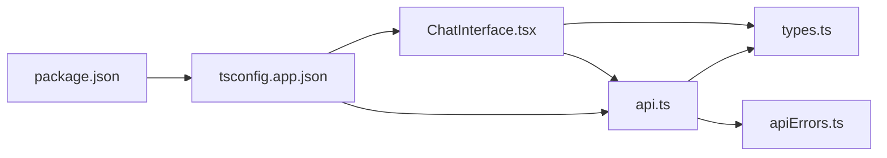

# TypeScript类型系统

<cite>
**本文引用的文件**
- [src/types.ts](file://src/types.ts)
- [src/api.ts](file://src/api.ts)
- [src/apiErrors.ts](file://src/apiErrors.ts)
- [src/components/ChatInterface.tsx](file://src/components/ChatInterface.tsx)
- [package.json](file://package.json)
- [tsconfig.app.json](file://tsconfig.app.json)
- [tsconfig.node.json](file://tsconfig.node.json)
</cite>

## 目录
1. [简介](#简介)
2. [项目结构](#项目结构)
3. [核心组件](#核心组件)
4. [架构总览](#架构总览)
5. [详细组件分析](#详细组件分析)
6. [依赖关系分析](#依赖关系分析)
7. [性能考量](#性能考量)
8. [故障排查指南](#故障排查指南)
9. [结论](#结论)
10. [附录](#附录)

## 简介
本文件聚焦于本仓库中的TypeScript类型定义系统，围绕以下目标展开：
- 全面阐述Message接口的设计，包括role属性（user、assistant）、content字段和timestamp时间戳的类型定义。
- 解释角色类型枚举的使用场景和约束条件。
- 详细说明ZhipuChatMessage接口，用于API通信的消息格式转换。
- 阐述ZhipuStreamChunk接口，描述SSE流式响应的数据结构和可选字段处理。
- 提供类型安全编程的最佳实践，包括接口继承、泛型使用和类型守卫。
- 包含常见类型错误的诊断和解决方案，以及类型推断和显式类型注解的使用指南。

## 项目结构
本项目采用前端React + Vite + TypeScript的典型结构，类型定义集中在src/types.ts，API层位于src/api.ts，UI交互在src/components/ChatInterface.tsx中消费这些类型。tsconfig.app.json启用严格模式，确保类型安全。



图表来源
- [src/components/ChatInterface.tsx:1-344](file://src/components/ChatInterface.tsx#L1-L344)
- [src/types.ts:1-9](file://src/types.ts#L1-L9)
- [src/api.ts:1-184](file://src/api.ts#L1-L184)
- [src/apiErrors.ts:1-62](file://src/apiErrors.ts#L1-L62)
- [tsconfig.app.json:1-28](file://tsconfig.app.json#L1-L28)
- [tsconfig.node.json:1-23](file://tsconfig.node.json#L1-L23)
- [package.json:1-36](file://package.json#L1-L36)

章节来源
- [src/types.ts:1-9](file://src/types.ts#L1-L9)
- [src/api.ts:1-184](file://src/api.ts#L1-L184)
- [src/components/ChatInterface.tsx:1-344](file://src/components/ChatInterface.tsx#L1-L344)
- [tsconfig.app.json:1-28](file://tsconfig.app.json#L1-L28)
- [tsconfig.node.json:1-23](file://tsconfig.node.json#L1-L23)
- [package.json:1-36](file://package.json#L1-L36)

## 核心组件
本节聚焦于类型定义与API层的关键类型，解释其职责、约束与协作方式。

- Message与MessageRole
  - MessageRole是字面量联合类型，限定为"user"与"assistant"，用于统一对话角色的取值范围，避免魔法字符串带来的错误。
  - Message接口包含role、content与timestamp三要素，满足本地存储与UI渲染的时间排序需求。
  - 在ChatInterface.tsx中，用户消息与助手消息分别构造，其中assistant消息初始content为空，后续通过流式增量拼接更新。

- ZhipuChatMessage
  - 用于向智谱Chat Completions API提交的消息体，包含role与content，不包含timestamp。
  - 通过toZhipuMessages函数将本地Message数组转换为ZhipuChatMessage数组，实现跨域数据模型的桥接。

- ZhipuStreamChunk
  - 描述SSE流式响应的单个事件块，choices数组中的delta.content为增量文本，finish_reason表示结束原因，error用于错误上报。
  - 可选字段通过可选链与类型守卫处理，确保在解析JSON后仍能安全访问。

- 流式处理流程
  - streamZhipuChat以AsyncGenerator<string, void, undefined>形式暴露增量文本，内部解析SSE事件，过滤"[DONE]"标记，提取delta.content并产出给调用方。
  - ChatInterface.tsx消费此生成器，维护assistantTargetRef与assistantDisplayedLenRef，通过requestAnimationFrame实现“打字机”效果。

章节来源
- [src/types.ts:1-9](file://src/types.ts#L1-L9)
- [src/api.ts:40-43](file://src/api.ts#L40-L43)
- [src/api.ts:66-183](file://src/api.ts#L66-L183)
- [src/components/ChatInterface.tsx:106-182](file://src/components/ChatInterface.tsx#L106-L182)

## 架构总览
下图展示了从UI到API再到SSE流的端到端类型流转路径，强调类型一致性与边界约束。



图表来源
- [src/components/ChatInterface.tsx:106-182](file://src/components/ChatInterface.tsx#L106-L182)
- [src/api.ts:40-43](file://src/api.ts#L40-L43)
- [src/api.ts:66-183](file://src/api.ts#L66-L183)
- [src/apiErrors.ts:1-62](file://src/apiErrors.ts#L1-L62)

## 详细组件分析

### Message与MessageRole类型设计
- 设计要点
  - 使用字面量联合类型MessageRole，限制角色集合，便于编译期校验与IDE智能提示。
  - Message接口三要素齐全：role、content、timestamp，既满足业务语义，也便于UI时间轴排序。
- 使用场景与约束
  - ChatInterface.tsx在发送消息时，同时构造用户消息与助手消息，助手消息初始为空，随后由流式生成器增量填充。
  - timestamp用于UI时间显示与消息排序，确保界面一致性。
- 类型安全建议
  - 在需要区分角色的分支逻辑中，优先使用switch或严格相等判断，避免遗漏新角色导致的运行时错误。
  - 对外暴露的API输入应先转换为ZhipuChatMessage，避免直接传递包含timestamp的Message对象。

章节来源
- [src/types.ts:1-9](file://src/types.ts#L1-L9)
- [src/components/ChatInterface.tsx:122-137](file://src/components/ChatInterface.tsx#L122-L137)

### ZhipuChatMessage接口与toZhipuMessages转换
- 接口职责
  - ZhipuChatMessage仅包含API所需的role与content，去除timestamp，降低耦合度。
- 转换逻辑
  - toZhipuMessages对Message数组进行映射，保留role与content，丢弃timestamp，保证与智谱API的契约一致。
- 类型安全
  - 映射过程中保持字段一一对应，避免多余字段导致的API错误。
  - 若未来API扩展，应在ZhipuChatMessage中同步新增字段，并在转换函数中处理默认值或校验。

章节来源
- [src/api.ts:8-11](file://src/api.ts#L8-L11)
- [src/api.ts:40-43](file://src/api.ts#L40-L43)

### ZhipuStreamChunk与SSE流式响应解析
- 数据结构
  - choices为可选数组，元素包含delta（可选）与finish_reason（可选）。delta.content为本次增量文本，可能为字符串或null。
  - error为可选对象，包含message与code，用于错误上报。
- 解析策略
  - parseSseDataLines负责从原始SSE文本中提取"data:"行，支持尾部残留缓冲区的处理。
  - extractDeltaText对ZhipuStreamChunk进行类型守卫，确保只在存在有效增量文本时才产出。
  - 最终在streamZhipuChat中遍历事件，遇到"[DONE]"即停止，遇到error则抛出带错误码的用户可读信息。
- 类型安全
  - 对可选字段使用可选链与类型守卫，避免NPE。
  - JSON.parse后的chunk使用类型断言配合try/catch容错，防止异常事件导致整个流中断。

章节来源
- [src/api.ts:13-21](file://src/api.ts#L13-L21)
- [src/api.ts:45-57](file://src/api.ts#L45-L57)
- [src/api.ts:59-64](file://src/api.ts#L59-L64)
- [src/api.ts:147-182](file://src/api.ts#L147-L182)

### 流式生成器与UI渲染
- 生成器签名
  - streamZhipuChat返回AsyncGenerator<string, void, undefined>，调用方通过for-await-of消费增量文本。
- UI状态管理
  - ChatInterface.tsx维护assistantTargetRef与assistantDisplayedLenRef，通过requestAnimationFrame分帧更新，实现“打字机”效果。
  - 对于异常与中断，使用AbortController与DOMException的AbortError分支处理，确保资源释放与状态复位。
- 错误友好化
  - apiErrors.ts提供friendlyHttpStatus与formatChatApiError，将HTTP状态与网络错误转换为用户可读提示。

章节来源
- [src/api.ts:70-183](file://src/api.ts#L70-L183)
- [src/components/ChatInterface.tsx:51-104](file://src/components/ChatInterface.tsx#L51-L104)
- [src/components/ChatInterface.tsx:141-181](file://src/components/ChatInterface.tsx#L141-L181)
- [src/apiErrors.ts:1-62](file://src/apiErrors.ts#L1-L62)

### 类图：类型关系与依赖
```mermaid
classDiagram
class Message {
+role : MessageRole
+content : string
+timestamp : number
}
class MessageRole {
<<union>>
"user"
"assistant"
}
class ZhipuChatMessage {
+role : "user"|"assistant"|"system"
+content : string
}
class ZhipuStreamChunk {
+choices? : Array<{
delta? : { content? : string|null }
finish_reason? : string|null
}>
+error? : { message? : string; code? : string }
}
Message --> MessageRole : "使用"
ZhipuChatMessage --> MessageRole : "扩展(system)"
ZhipuStreamChunk --> ZhipuChatMessage : "与choices配合"
```

图表来源
- [src/types.ts:2-8](file://src/types.ts#L2-L8)
- [src/api.ts:6-11](file://src/api.ts#L6-L11)
- [src/api.ts:13-21](file://src/api.ts#L13-L21)

## 依赖关系分析
- 内部依赖
  - ChatInterface.tsx依赖Message类型与streamZhipuChat生成器；api.ts依赖Message类型与ZhipuChatMessage/ZhipuStreamChunk；apiErrors.ts被api.ts调用。
- 外部依赖
  - React与TypeScript版本由package.json声明，tsconfig.app.json启用严格模式，确保类型安全。
- 依赖可视化



图表来源
- [src/components/ChatInterface.tsx:1-344](file://src/components/ChatInterface.tsx#L1-L344)
- [src/types.ts:1-9](file://src/types.ts#L1-L9)
- [src/api.ts:1-184](file://src/api.ts#L1-L184)
- [src/apiErrors.ts:1-62](file://src/apiErrors.ts#L1-L62)
- [tsconfig.app.json:1-28](file://tsconfig.app.json#L1-L28)
- [package.json:1-36](file://package.json#L1-L36)

章节来源
- [src/components/ChatInterface.tsx:1-344](file://src/components/ChatInterface.tsx#L1-L344)
- [src/types.ts:1-9](file://src/types.ts#L1-L9)
- [src/api.ts:1-184](file://src/api.ts#L1-L184)
- [src/apiErrors.ts:1-62](file://src/apiErrors.ts#L1-L62)
- [tsconfig.app.json:1-28](file://tsconfig.app.json#L1-L28)
- [package.json:1-36](file://package.json#L1-L36)

## 性能考量
- 流式解析
  - 使用TextDecoder与ReadableStream Reader逐块读取SSE，避免一次性加载大文本，降低内存峰值。
  - parseSseDataLines对缓冲区进行增量切分，减少字符串拼接开销。
- 渲染优化
  - 通过requestAnimationFrame分帧更新助手消息content，避免频繁重排。
  - 使用ref持有增量文本与显示长度，减少不必要的状态更新。
- 类型与编译期优化
  - 严格模式开启noUnusedLocals/noUnusedParameters/noFallthroughCasesInSwitch，减少冗余代码与潜在错误。
  - 字面量联合类型在编译期即可捕获非法角色赋值，避免运行时分支遗漏。

## 故障排查指南
- 常见类型错误与解决
  - 角色类型不匹配：当向ZhipuChatMessage传入包含"system"的角色时，需确保上游转换逻辑正确，或在ZhipuChatMessage中扩展角色集合。
  - 可选字段访问异常：在解析SSE事件时，务必使用可选链与类型守卫，避免直接访问未提供的字段。
  - 时间戳不一致：确保UI渲染使用Message.timestamp，而非临时计算，以维持消息顺序与显示一致性。
- 运行时错误与网络问题
  - 网络异常：streamZhipuChat对TypeError进行特殊处理，提示检查网络与代理设置。
  - API错误：通过friendlyHttpStatus与formatChatApiError将HTTP状态与错误信息转换为用户可读提示。
- 调试建议
  - 在toZhipuMessages前后打印消息数组，核对role与content是否一致。
  - 在extractDeltaText处增加日志，观察增量文本是否为空或null。
  - 在ChatInterface.tsx中监控assistantTargetRef与assistantDisplayedLenRef的变化，确认渲染帧率与显示效果。

章节来源
- [src/api.ts:59-64](file://src/api.ts#L59-L64)
- [src/api.ts:95-123](file://src/api.ts#L95-L123)
- [src/apiErrors.ts:33-61](file://src/apiErrors.ts#L33-L61)
- [src/components/ChatInterface.tsx:141-181](file://src/components/ChatInterface.tsx#L141-L181)

## 结论
本项目通过严格的字面量联合类型与清晰的接口边界，实现了从本地消息到智谱API的类型安全转换。ZhipuStreamChunk的可选字段设计与类型守卫确保了SSE流式解析的健壮性。结合UI层的状态管理与错误友好化机制，整体类型系统在易用性与安全性之间取得了良好平衡。建议在未来扩展角色或API字段时，遵循同样的类型约束与转换策略，保持系统一致性。

## 附录
- 类型最佳实践清单
  - 使用字面量联合类型约束枚举值，避免魔法字符串。
  - 对外部API输入进行显式转换，确保字段与契约一致。
  - 对可选字段使用可选链与类型守卫，必要时配合类型断言与容错处理。
  - 利用严格模式选项，尽早发现未使用变量、未覆盖分支等问题。
  - 在复杂数据结构中引入局部类型别名，提升可读性与可维护性。