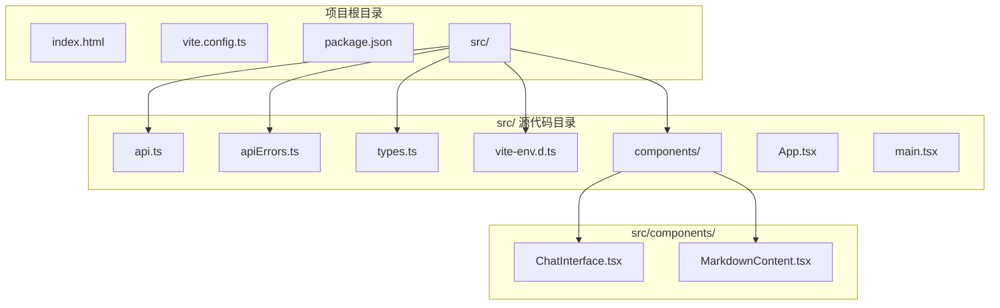
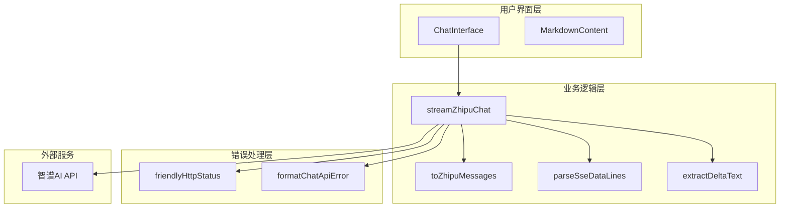
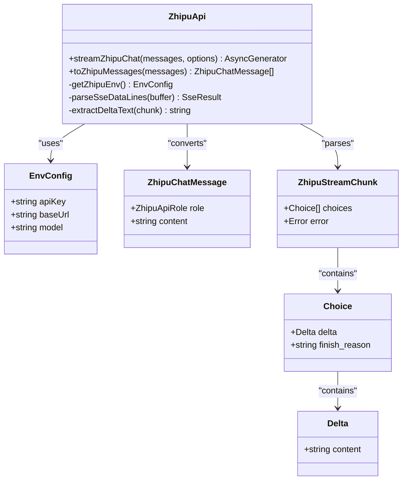
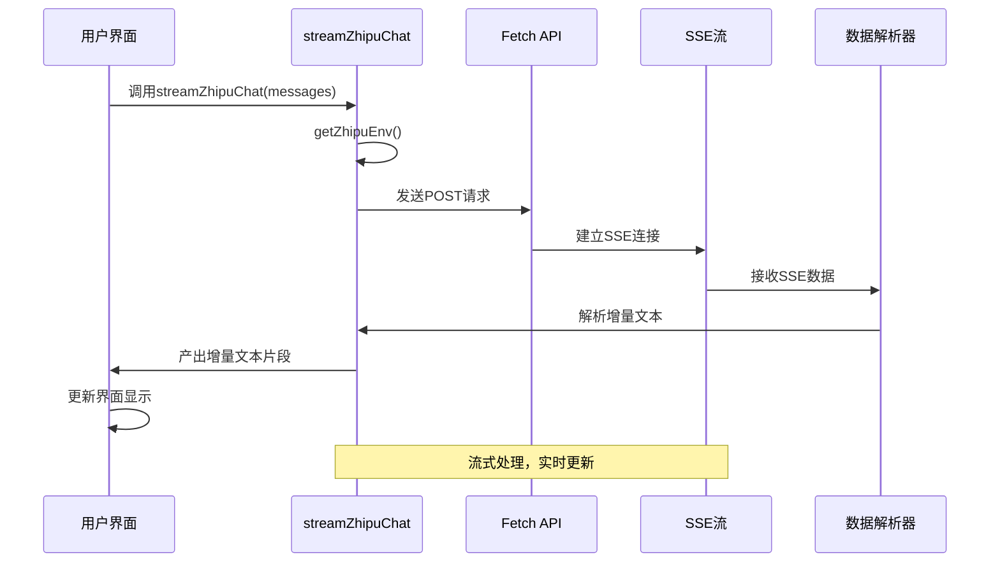
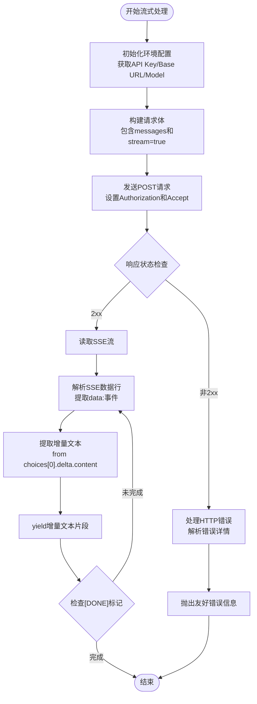
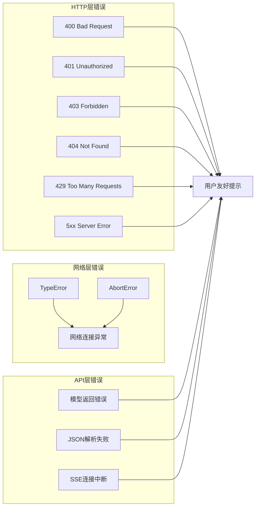
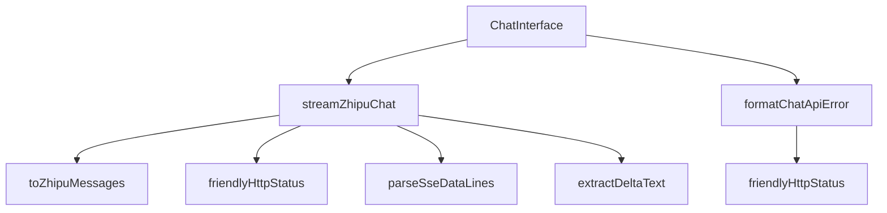

# 智谱AI API集成

<cite>
**本文档引用的文件**
- [src/api.ts](file://src/api.ts)
- [src/apiErrors.ts](file://src/apiErrors.ts)
- [src/components/ChatInterface.tsx](file://src/components/ChatInterface.tsx)
- [src/types.ts](file://src/types.ts)
- [src/vite-env.d.ts](file://src/vite-env.d.ts)
- [vite.config.ts](file://vite.config.ts)
- [package.json](file://package.json)
- [index.html](file://index.html)
</cite>

## 目录
1. [简介](#简介)
2. [项目结构](#项目结构)
3. [核心组件](#核心组件)
4. [架构概览](#架构概览)
5. [详细组件分析](#详细组件分析)
6. [依赖关系分析](#依赖关系分析)
7. [性能考虑](#性能考虑)
8. [故障排除指南](#故障排除指南)
9. [结论](#结论)

## 简介

本项目是一个基于React的聊天应用，集成了智谱AI的Chat Completions API。该系统实现了完整的流式对话功能，支持实时增量文本输出、错误处理、用户界面交互等功能。项目采用现代前端技术栈，包括TypeScript、React、Vite和TailwindCSS。

## 项目结构

项目采用标准的React + Vite项目结构，主要文件组织如下：

**图表来源**
- [src/api.ts:1-184](file://src/api.ts#L1-L184)
- [src/components/ChatInterface.tsx:1-344](file://src/components/ChatInterface.tsx#L1-L344)

**章节来源**
- [package.json:1-36](file://package.json#L1-L36)
- [vite.config.ts:1-14](file://vite.config.ts#L1-L14)

## 核心组件

### API配置和认证机制

系统通过Vite的环境变量机制实现API配置，支持以下环境变量：

| 环境变量 | 必需性 | 默认值 | 描述 |
|---------|--------|--------|------|
| VITE_ZHIPU_API_KEY | 必需 | 无 | 智谱AI API密钥 |
| VITE_ZHIPU_API_BASE | 可选 | https://open.bigmodel.cn/api/paas/v4 | API基础URL |
| VITE_ZHIPU_MODEL | 可选 | glm-4-flash | 默认使用的模型 |

**章节来源**
- [src/api.ts:23-38](file://src/api.ts#L23-L38)
- [src/vite-env.d.ts:3-8](file://src/vite-env.d.ts#L3-L8)

### 流式响应处理实现

系统实现了完整的SSE（Server-Sent Events）流式响应处理，包括：

1. **SSE数据解析**：解析`data:`前缀的事件行
2. **增量文本提取**：从`choices[0].delta.content`中提取增量文本
3. **流式生成器模式**：使用AsyncGenerator实现异步迭代
4. **错误处理**：处理网络异常、API错误和连接中断

**章节来源**
- [src/api.ts:45-64](file://src/api.ts#L45-L64)
- [src/api.ts:70-184](file://src/api.ts#L70-L184)

### 错误处理策略

系统实现了多层次的错误处理机制：

1. **HTTP状态码映射**：针对不同HTTP状态码提供用户友好的错误信息
2. **网络异常处理**：捕获TypeError并转换为用户可理解的错误信息
3. **API错误响应解析**：解析智谱AI的错误响应格式
4. **连接中断处理**：处理流式连接意外断开的情况

**章节来源**
- [src/apiErrors.ts:3-61](file://src/apiErrors.ts#L3-L61)
- [src/api.ts:95-123](file://src/api.ts#L95-L123)

## 架构概览

系统采用分层架构设计，各层职责清晰：

**图表来源**
- [src/components/ChatInterface.tsx:25-182](file://src/components/ChatInterface.tsx#L25-L182)
- [src/api.ts:41-64](file://src/api.ts#L41-L64)
- [src/apiErrors.ts:3-61](file://src/apiErrors.ts#L3-L61)

## 详细组件分析

### API模块分析

API模块是整个系统的数据层，负责与智谱AI API的交互。

#### 类关系图

**图表来源**
- [src/api.ts:6-21](file://src/api.ts#L6-L21)
- [src/api.ts:23-38](file://src/api.ts#L23-L38)
- [src/api.ts:70-184](file://src/api.ts#L70-L184)

#### API调用序列图

**图表来源**
- [src/api.ts:70-184](file://src/api.ts#L70-L184)
- [src/components/ChatInterface.tsx:142-147](file://src/components/ChatInterface.tsx#L142-L147)

#### 流式处理流程图

**图表来源**
- [src/api.ts:45-64](file://src/api.ts#L45-L64)
- [src/api.ts:132-182](file://src/api.ts#L132-L182)

**章节来源**
- [src/api.ts:1-184](file://src/api.ts#L1-L184)

### 用户界面组件分析

#### ChatInterface组件

ChatInterface组件实现了完整的聊天界面，包括：

1. **消息管理**：维护用户和助手的消息历史
2. **流式渲染**：使用requestAnimationFrame实现渐进式文本显示
3. **取消控制**：支持用户取消正在进行的请求
4. **错误处理**：集成API错误处理机制

**章节来源**
- [src/components/ChatInterface.tsx:25-344](file://src/components/ChatInterface.tsx#L25-L344)

### 错误处理机制

系统实现了完善的错误处理策略：

#### 错误分类和处理

**图表来源**
- [src/apiErrors.ts:3-61](file://src/apiErrors.ts#L3-L61)
- [src/api.ts:95-123](file://src/api.ts#L95-L123)

**章节来源**
- [src/apiErrors.ts:1-62](file://src/apiErrors.ts#L1-L62)

## 依赖关系分析

### 外部依赖

项目的主要依赖包括：

| 依赖包 | 版本 | 用途 |
|--------|------|------|
| react | ^19.0.0 | 核心UI框架 |
| react-dom | ^19.0.0 | React DOM绑定 |
| react-markdown | ^10.1.0 | Markdown渲染 |
| react-syntax-highlighter | ^15.6.1 | 代码语法高亮 |
| @vitejs/plugin-react | ^4.3.4 | Vite React插件 |
| tailwindcss | ^4.0.0 | CSS框架 |

### 内部模块依赖

**图表来源**
- [src/components/ChatInterface.tsx:8-11](file://src/components/ChatInterface.tsx#L8-L11)
- [src/api.ts:41-64](file://src/api.ts#L41-L64)
- [src/apiErrors.ts:33-61](file://src/apiErrors.ts#L33-L61)

**章节来源**
- [package.json:12-34](file://package.json#L12-L34)

## 性能考虑

### 流式处理优化

1. **增量渲染**：使用requestAnimationFrame实现平滑的文本增量显示
2. **内存管理**：及时释放流式读取器锁，避免内存泄漏
3. **连接复用**：支持请求取消，避免不必要的网络开销

### 最佳实践建议

1. **参数验证**：
   - 验证messages数组的有效性
   - 检查消息内容的长度限制
   - 确保角色字段的合法性

2. **超时控制**：
   - 设置合理的请求超时时间
   - 实现自动重试机制
   - 提供用户取消选项

3. **取消信号处理**：
   - 使用AbortController管理请求生命周期
   - 支持多请求并发场景下的独立取消
   - 清理资源和定时器

## 故障排除指南

### 常见问题及解决方案

#### 环境变量配置问题

**问题**：`未配置 VITE_ZHIPU_API_KEY`
**解决方案**：
1. 在项目根目录创建`.env`文件
2. 添加`VITE_ZHIPU_API_KEY=your_api_key_here`
3. 重启开发服务器

#### 网络连接问题

**问题**：网络连接异常
**可能原因**：
- 网络不稳定
- 防火墙阻止
- 代理设置问题

**解决方案**：
1. 检查网络连接
2. 配置正确的代理设置
3. 关闭防火墙测试

#### API错误处理

**问题**：API返回错误
**常见错误类型**：
- 401：API Key无效
- 403：权限不足
- 429：请求过于频繁
- 503：服务不可用

**解决方案**：
1. 检查API Key有效性
2. 确认账户状态和配额
3. 实现指数退避重试

**章节来源**
- [src/api.ts:23-38](file://src/api.ts#L23-L38)
- [src/apiErrors.ts:3-31](file://src/apiErrors.ts#L3-L31)

## 结论

本项目成功实现了智谱AI Chat Completions API的完整集成，具有以下特点：

1. **完整的流式处理**：实现了真正的SSE流式响应处理
2. **健壮的错误处理**：提供了多层次的错误处理机制
3. **良好的用户体验**：支持增量文本显示和请求取消
4. **清晰的架构设计**：模块化设计便于维护和扩展

系统为开发者提供了可靠的智谱AI集成基础，可以根据具体需求进行定制和扩展。