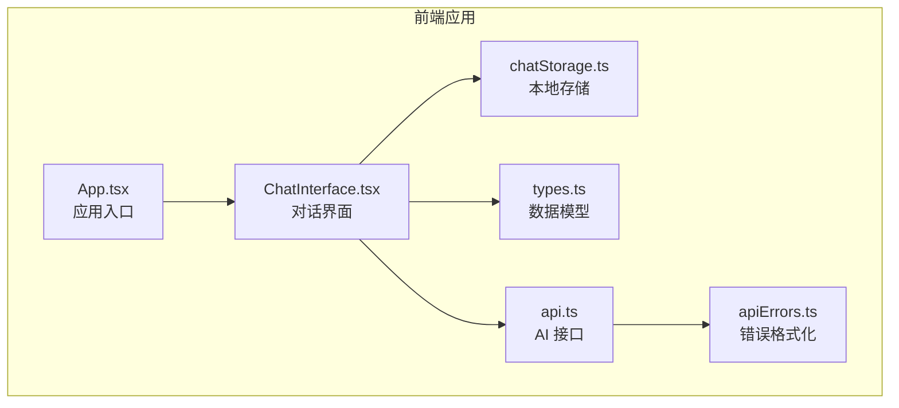
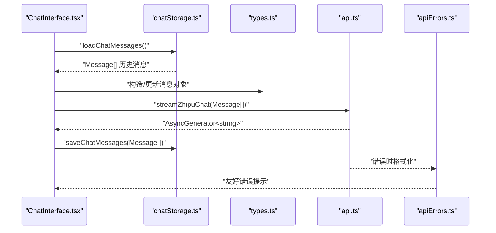
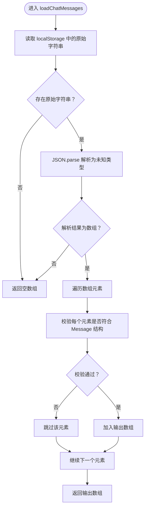
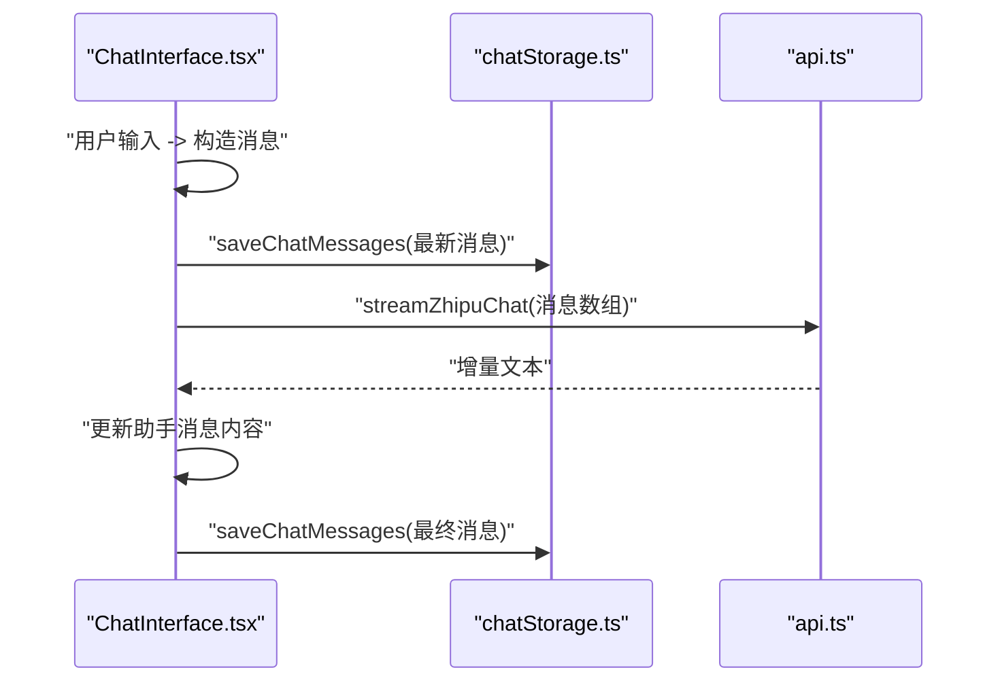
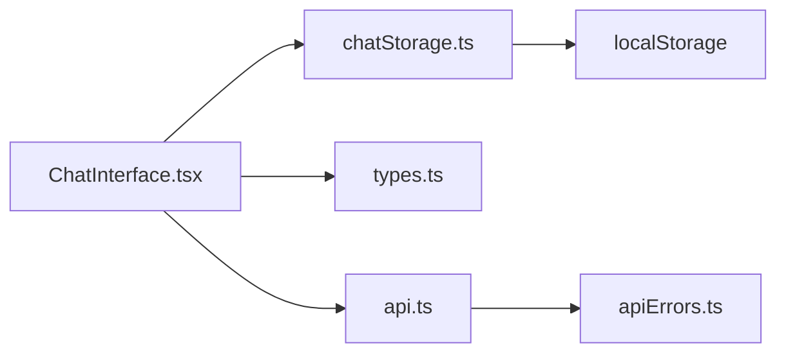

# 本地存储管理

<cite>
**本文引用的文件列表**
- [src/chatStorage.ts](file://src/chatStorage.ts)
- [src/types.ts](file://src/types.ts)
- [src/components/ChatInterface.tsx](file://src/components/ChatInterface.tsx)
- [src/api.ts](file://src/api.ts)
- [src/apiErrors.ts](file://src/apiErrors.ts)
- [PRD.md](file://PRD.md)
- [TECH_DESIGN.md](file://TECH_DESIGN.md)
- [index.html](file://index.html)
- [src/main.tsx](file://src/main.tsx)
</cite>

## 目录
1. [简介](#简介)
2. [项目结构](#项目结构)
3. [核心组件](#核心组件)
4. [架构总览](#架构总览)
5. [详细组件分析](#详细组件分析)
6. [依赖关系分析](#依赖关系分析)
7. [性能考量](#性能考量)
8. [故障排查指南](#故障排查指南)
9. [结论](#结论)
10. [附录](#附录)

## 简介
本文件面向“本地存储管理系统”的综合文档，聚焦于对话历史数据的持久化策略与实现细节。当前系统采用浏览器本地存储（localStorage）作为对话历史的唯一持久化介质，结合类型安全的数据校验与序列化/反序列化机制，确保数据在刷新页面后仍可保留。本文将从系统架构、数据模型、存储API、错误处理、版本兼容与迁移策略等方面进行深入解析，并给出使用示例与最佳实践建议。

## 项目结构
该项目为基于 React + TypeScript + Vite 的前端应用，本地存储模块位于 src/chatStorage.ts，数据模型定义在 src/types.ts，对话界面组件在 src/components/ChatInterface.tsx 中负责加载与更新消息列表，API 层在 src/api.ts 中封装智谱 AI 的流式对话能力，错误格式化逻辑在 src/apiErrors.ts 中。

图表来源
- [src/main.tsx:1-11](file://src/main.tsx#L1-L11)
- [src/App.tsx:1-8](file://src/App.tsx#L1-L8)
- [src/components/ChatInterface.tsx:1-344](file://src/components/ChatInterface.tsx#L1-L344)
- [src/chatStorage.ts:1-51](file://src/chatStorage.ts#L1-L51)
- [src/types.ts:1-9](file://src/types.ts#L1-L9)
- [src/api.ts:1-184](file://src/api.ts#L1-L184)
- [src/apiErrors.ts:1-62](file://src/apiErrors.ts#L1-L62)

章节来源
- [src/main.tsx:1-11](file://src/main.tsx#L1-L11)
- [src/App.tsx:1-8](file://src/App.tsx#L1-L8)
- [PRD.md:1-16](file://PRD.md#L1-L16)
- [TECH_DESIGN.md:1-17](file://TECH_DESIGN.md#L1-L17)

## 核心组件
- 本地存储模块（chatStorage.ts）
  - 提供加载、保存、清理对话历史的纯函数式 API，使用单一键值进行序列化存储。
  - 内置严格的数据校验，确保仅接受符合 Message 结构的对象数组。
- 数据模型（types.ts）
  - 定义 Message 接口与 MessageRole 枚举，保证消息字段的类型一致性。
- 对话界面（ChatInterface.tsx）
  - 在组件初始化时调用加载函数获取历史消息；每次发送消息时更新内存中的消息列表，并在合适时机触发保存。
- API 层（api.ts）
  - 将本地消息转换为外部 API 所需的消息格式，发起流式请求并产出增量文本。
- 错误格式化（apiErrors.ts）
  - 将网络与服务端错误转换为用户可读的中文提示，辅助 UI 展示。

章节来源
- [src/chatStorage.ts:1-51](file://src/chatStorage.ts#L1-L51)
- [src/types.ts:1-9](file://src/types.ts#L1-L9)
- [src/components/ChatInterface.tsx:1-344](file://src/components/ChatInterface.tsx#L1-L344)
- [src/api.ts:1-184](file://src/api.ts#L1-L184)
- [src/apiErrors.ts:1-62](file://src/apiErrors.ts#L1-L62)

## 架构总览
下图展示了从界面交互到本地存储与外部 API 的整体流程，以及数据在各层之间的传递路径。

图表来源
- [src/components/ChatInterface.tsx:106-182](file://src/components/ChatInterface.tsx#L106-L182)
- [src/chatStorage.ts:20-42](file://src/chatStorage.ts#L20-L42)
- [src/types.ts:4-8](file://src/types.ts#L4-L8)
- [src/api.ts:70-183](file://src/api.ts#L70-L183)
- [src/apiErrors.ts:33-61](file://src/apiErrors.ts#L33-L61)

## 详细组件分析

### 本地存储模块（chatStorage.ts）
- 存储键值管理
  - 使用统一的键名进行读写，避免与其他页面或同域站点冲突。
- 数据序列化与反序列化
  - 写入时将消息数组序列化为 JSON 字符串；读取时先解析为未知类型，再进行严格校验，过滤非法项。
- 数据格式规范
  - 仅接受数组形式的顶层结构；数组元素必须满足 Message 接口的字段类型与完整性约束。
- 版本兼容性处理
  - 当前实现未显式引入版本号字段，但通过严格的类型校验可忽略不兼容字段，实现向后兼容。
- 错误处理
  - 读取/写入/删除过程中捕获异常，读取失败返回空数组，写入/删除失败静默忽略，保证 UI 不被阻断。

图表来源
- [src/chatStorage.ts:20-34](file://src/chatStorage.ts#L20-L34)

章节来源
- [src/chatStorage.ts:1-51](file://src/chatStorage.ts#L1-L51)

### 数据模型（types.ts）
- Message 接口包含角色、内容与时间戳三个字段，其中角色限定为 "user" 或 "assistant"，时间戳为数值且为有限数。
- 该模型直接用于本地存储与外部 API 的消息转换，确保两端数据结构一致。

章节来源
- [src/types.ts:1-9](file://src/types.ts#L1-L9)

### 对话界面（ChatInterface.tsx）
- 初始化加载
  - 组件挂载后，会调用本地存储加载函数获取历史消息并渲染。
- 发送消息流程
  - 构造用户消息与占位助手消息，追加到内存消息列表；
  - 启动流式读取，增量拼接到助手消息内容；
  - 流结束后，停止动画泵，更新状态。
- 保存策略
  - 在合适的时机（例如发送成功后）调用保存函数将最新消息列表写入本地存储。
- 错误处理
  - 对网络异常、API 错误与中断请求进行分类处理，必要时移除空的助手消息，避免产生无效记录。

图表来源
- [src/components/ChatInterface.tsx:106-182](file://src/components/ChatInterface.tsx#L106-L182)
- [src/chatStorage.ts:36-42](file://src/chatStorage.ts#L36-L42)
- [src/api.ts:70-183](file://src/api.ts#L70-L183)

章节来源
- [src/components/ChatInterface.tsx:1-344](file://src/components/ChatInterface.tsx#L1-L344)

### API 层（api.ts）
- 将本地消息转换为外部 API 所需的消息格式，发起流式请求并逐块解码 SSE 数据，提取增量文本。
- 对响应状态与读取过程进行健壮性处理，抛出可读性强的错误信息。

章节来源
- [src/api.ts:1-184](file://src/api.ts#L1-L184)

### 错误格式化（apiErrors.ts）
- 将网络错误、服务端错误与中断请求等转换为用户可读的中文提示，便于 UI 展示与用户理解。

章节来源
- [src/apiErrors.ts:1-62](file://src/apiErrors.ts#L1-L62)

## 依赖关系分析
- 组件耦合
  - ChatInterface.tsx 依赖 chatStorage.ts 进行数据持久化，依赖 types.ts 进行数据建模，依赖 api.ts 进行外部通信。
- 外部依赖
  - localStorage 作为唯一持久化介质；fetch 用于流式请求；React Hooks 管理状态与副作用。
- 潜在风险
  - 本地存储容量限制、隐私模式、跨标签页并发写入可能引发竞态；当前实现对写入失败采取静默处理，需在上层业务中补充监控与降级策略。

图表来源
- [src/components/ChatInterface.tsx:1-344](file://src/components/ChatInterface.tsx#L1-L344)
- [src/chatStorage.ts:1-51](file://src/chatStorage.ts#L1-L51)
- [src/types.ts:1-9](file://src/types.ts#L1-L9)
- [src/api.ts:1-184](file://src/api.ts#L1-L184)
- [src/apiErrors.ts:1-62](file://src/apiErrors.ts#L1-L62)

章节来源
- [src/components/ChatInterface.tsx:1-344](file://src/components/ChatInterface.tsx#L1-L344)
- [src/chatStorage.ts:1-51](file://src/chatStorage.ts#L1-L51)
- [src/types.ts:1-9](file://src/types.ts#L1-L9)
- [src/api.ts:1-184](file://src/api.ts#L1-L184)
- [src/apiErrors.ts:1-62](file://src/apiErrors.ts#L1-L62)

## 性能考量
- 读取性能
  - 单次读取为 O(n) 遍历数组并进行字段校验，n 为历史消息数量；对于典型对话场景，开销极小。
- 写入性能
  - 写入为一次 JSON 序列化与一次 localStorage 写入；建议在批量更新后合并写入，减少频繁 IO。
- 内存占用
  - 历史消息在内存中以数组形式持有，建议在长对话场景中定期清理过期或冗余消息，避免内存膨胀。
- 动画与渲染
  - 流式展示采用 requestAnimationFrame 控制，逐字渲染，避免大段文本一次性渲染带来的卡顿。

章节来源
- [src/chatStorage.ts:20-42](file://src/chatStorage.ts#L20-L42)
- [src/components/ChatInterface.tsx:58-104](file://src/components/ChatInterface.tsx#L58-L104)

## 故障排查指南
- 存储空间不足或隐私模式
  - 写入失败会被静默忽略，可通过 UI 行为观察（如消息未持久化）定位；建议在上层增加存储容量检测与提示。
- 数据损坏或格式异常
  - 读取时会过滤非法项并返回有效数组，若发现历史缺失，可尝试重新发起对话以重建数据。
- 权限问题
  - localStorage 在隐私模式或受限环境下可能不可用，需在初始化阶段进行降级处理（例如仅内存缓存）。
- 数据迁移与版本升级
  - 当前未引入版本号字段，可通过严格校验自动忽略不兼容字段；若未来需要引入版本控制，可在存储键值后附加版本号，或在顶层对象中新增版本字段，迁移时按版本分支处理。
- 备份与导入导出
  - 当前未提供导入导出功能，可在上层 UI 中添加导出为 JSON 的按钮，并在设置页提供导入入口，导入时进行严格校验与去重处理。

章节来源
- [src/chatStorage.ts:20-50](file://src/chatStorage.ts#L20-L50)
- [src/components/ChatInterface.tsx:106-182](file://src/components/ChatInterface.tsx#L106-L182)

## 结论
当前本地存储系统以最小实现满足了对话历史持久化的核心需求：类型安全的校验、简洁的序列化/反序列化、以及对异常的稳健处理。建议在后续迭代中补充以下能力：
- 存储容量监控与告警
- 导入导出与备份恢复
- 版本化存储与自动迁移
- 过期数据清理与空间回收
- 并发写入的锁机制或去重策略

这些增强将显著提升系统的可靠性与用户体验。

## 附录

### 存储 API 使用示例（步骤说明）
- 读取对话历史
  - 在组件初始化时调用加载函数，获取历史消息并设置到状态中。
  - 参考路径：[src/components/ChatInterface.tsx:1-344](file://src/components/ChatInterface.tsx#L1-L344)，[src/chatStorage.ts:20-34](file://src/chatStorage.ts#L20-L34)
- 写入对话历史
  - 在发送消息成功后，将最新消息数组写入本地存储。
  - 参考路径：[src/components/ChatInterface.tsx:106-182](file://src/components/ChatInterface.tsx#L106-L182)，[src/chatStorage.ts:36-42](file://src/chatStorage.ts#L36-L42)
- 删除对话历史
  - 在用户选择清空时，移除本地存储中的键值。
  - 参考路径：[src/chatStorage.ts:44-50](file://src/chatStorage.ts#L44-L50)

### 数据格式规范
- 存储键值：统一键名，避免冲突。
- 数据结构：数组形式，元素为符合 Message 接口的对象。
- 字段要求：角色为 "user" 或 "assistant"，内容为字符串，时间戳为有限数值。
- 参考路径：[src/types.ts:4-8](file://src/types.ts#L4-L8)，[src/chatStorage.ts:9-18](file://src/chatStorage.ts#L9-L18)

### 版本兼容与迁移建议
- 当前实现通过严格校验实现向后兼容，未显式版本号。
- 建议在键名或顶层对象中引入版本字段，迁移时按版本分支处理。
- 参考路径：[src/chatStorage.ts:3-18](file://src/chatStorage.ts#L3-L18)

### 错误处理与恢复策略
- 写入失败静默忽略，读取失败返回空数组，保证 UI 稳定。
- 建议在上层增加存储容量检测与用户提示。
- 参考路径：[src/chatStorage.ts:20-50](file://src/chatStorage.ts#L20-L50)