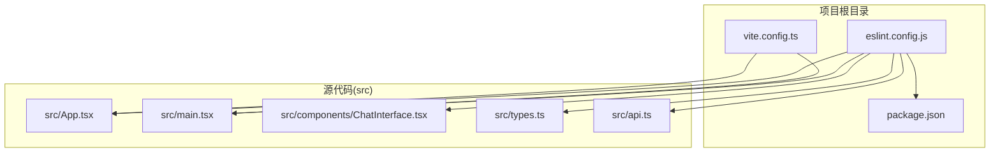
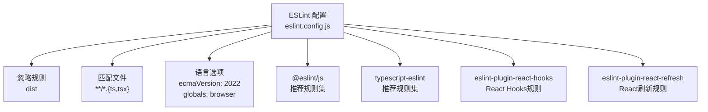
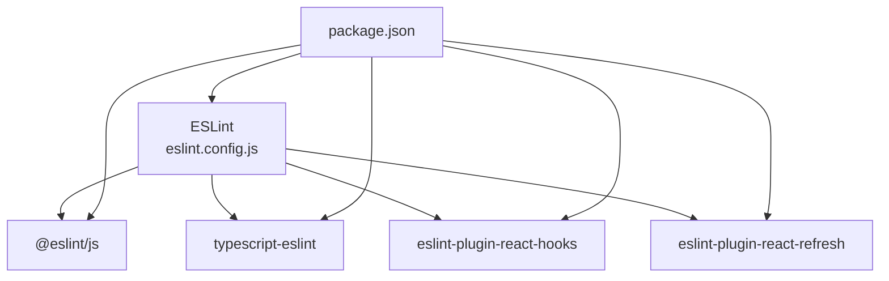

# ESLint配置与规则

<cite>
**本文档引用的文件**
- [eslint.config.js](file://eslint.config.js)
- [package.json](file://package.json)
- [vite.config.ts](file://vite.config.ts)
- [src/App.tsx](file://src/App.tsx)
- [src/main.tsx](file://src/main.tsx)
- [src/components/ChatInterface.tsx](file://src/components/ChatInterface.tsx)
- [src/types.ts](file://src/types.ts)
- [src/api.ts](file://src/api.ts)
</cite>

## 目录
1. [简介](#简介)
2. [项目结构](#项目结构)
3. [核心组件](#核心组件)
4. [架构总览](#架构总览)
5. [详细组件分析](#详细组件分析)
6. [依赖分析](#依赖分析)
7. [性能考虑](#性能考虑)
8. [故障排除指南](#故障排除指南)
9. [结论](#结论)
10. [附录](#附录)

## 简介
本文件面向ESLint配置与代码质量检查，聚焦于项目中的eslint.config.js配置文件，系统性解析其配置结构、继承关系、插件配置与规则定义；阐述推荐规则集的来源与作用、React Hooks规则的特殊配置、react-refresh插件的用途；并提供工作原理、自动化修复机制与常见问题排查方法，最后给出自定义规则添加、忽略文件配置与团队规则统一的最佳实践建议。

## 项目结构
该项目采用React + TypeScript + Vite技术栈，ESLint作为代码质量检查工具集成在开发流程中。关键配置与文件分布如下：
- 配置文件：eslint.config.js（ESLint 9.x 推荐的扁平化配置）
- 包管理：package.json（声明ESLint及相关插件依赖）
- 构建工具：vite.config.ts（Vite配置，与ESLint协同工作）
- 源码：src目录下的TypeScript/TSX文件（ESLint检查目标）

图表来源
- [eslint.config.js:1-29](file://eslint.config.js#L1-L29)
- [package.json:1-36](file://package.json#L1-L36)
- [vite.config.ts:1-14](file://vite.config.ts#L1-L14)
- [src/App.tsx:1-8](file://src/App.tsx#L1-L8)
- [src/main.tsx:1-11](file://src/main.tsx#L1-L11)
- [src/components/ChatInterface.tsx:1-344](file://src/components/ChatInterface.tsx#L1-L344)
- [src/types.ts:1-9](file://src/types.ts#L1-L9)
- [src/api.ts:1-184](file://src/api.ts#L1-L184)

章节来源
- [eslint.config.js:1-29](file://eslint.config.js#L1-L29)
- [package.json:1-36](file://package.json#L1-L36)
- [vite.config.ts:1-14](file://vite.config.ts#L1-L14)

## 核心组件
本节聚焦eslint.config.js的配置结构与职责划分，包括：
- 忽略规则：通过ignores字段排除构建产物目录
- 继承规则集：基于@eslint/js与typescript-eslint推荐规则
- 语言选项：ECMAScript版本与浏览器全局变量
- 插件配置：react-hooks与react-refresh插件
- 规则定义：合并推荐规则并定制react-refresh规则

章节来源
- [eslint.config.js:7-28](file://eslint.config.js#L7-L28)

## 架构总览
下图展示了ESLint配置在项目中的作用范围与影响边界，以及与Vite构建工具的协作关系。

图表来源
- [eslint.config.js:8-28](file://eslint.config.js#L8-L28)
- [package.json:20-32](file://package.json#L20-L32)

## 详细组件分析

### 配置结构与继承关系
- 忽略规则：配置排除构建产物目录，避免对编译输出进行重复检查
- 继承规则集：
  - @eslint/js推荐规则集：提供基础JavaScript最佳实践
  - typescript-eslint推荐规则集：提供TypeScript语言特性相关的推荐规则
- 文件匹配：仅对TypeScript与TSX文件生效，确保类型安全与语法一致性
- 语言选项：设定ECMAScript版本与浏览器全局变量，保证规则评估上下文正确

章节来源
- [eslint.config.js:8-15](file://eslint.config.js#L8-L15)
- [eslint.config.js:10-11](file://eslint.config.js#L10-L11)

### 插件配置与作用
- react-hooks插件：提供React Hooks相关的规则，帮助识别潜在的错误使用模式
- react-refresh插件：针对React Refresh能力进行约束，确保组件导出符合热更新要求

章节来源
- [eslint.config.js:16-19](file://eslint.config.js#L16-L19)
- [package.json:27-28](file://package.json#L27-L28)

### 规则定义与定制
- 合并推荐规则：将react-hooks推荐规则集的规则合并到当前配置
- react-refresh定制规则：
  - 类型：仅导出组件的警告级别
  - 选项：允许常量导出，减少对纯常量导出的误报
- 这种定制兼顾了开发体验与团队规范，既提醒不合规导出，又避免对无副作用常量导出的过度干扰

章节来源
- [eslint.config.js:20-26](file://eslint.config.js#L20-L26)

### 推荐规则集来源与作用
- 来源：@eslint/js与typescript-eslint官方推荐规则集
- 作用：
  - 基础规则：避免常见的语法与语义陷阱
  - TypeScript规则：覆盖类型检查、泛型使用、装饰器等语言特性
  - 与react-hooks结合：在函数式组件与Hook使用场景下提供针对性指导

章节来源
- [eslint.config.js:10](file://eslint.config.js#L10)
- [package.json:20-32](file://package.json#L20-L32)

### React Hooks规则的特殊配置
- 合并策略：直接采用react-hooks推荐规则集，确保与官方最佳实践保持一致
- 适用范围：所有TS/TSX文件，由文件匹配规则控制
- 与react-refresh联动：两者共同保障组件开发阶段的稳定性与可维护性

章节来源
- [eslint.config.js:21](file://eslint.config.js#L21)
- [eslint.config.js:10-11](file://eslint.config.js#L10-L11)

### react-refresh插件的使用目的
- 目的：限制仅导出组件的导出方式，避免破坏热更新机制
- 定制策略：允许常量导出，降低对纯数据/常量导出的误报
- 影响范围：所有TS/TSX文件，通过文件匹配规则生效

章节来源
- [eslint.config.js:22-25](file://eslint.config.js#L22-L25)
- [eslint.config.js:10-11](file://eslint.config.js#L10-L11)

### 代码质量检查工作原理
- 文件扫描：ESLint遍历项目中匹配的TS/TSX文件
- 规则评估：依据继承的推荐规则集与自定义规则逐条评估
- 结果输出：根据规则严重级别生成报告（错误/警告），并可触发自动修复

章节来源
- [eslint.config.js:8-28](file://eslint.config.js#L8-L28)

### 自动化修复机制
- 修复范围：部分规则支持自动修复（如格式化、简单语法调整）
- 触发方式：通过命令行参数或编辑器扩展触发
- 注意事项：复杂逻辑或潜在风险较高的修复需人工确认

章节来源
- [package.json:9](file://package.json#L9)

### 常见问题排查方法
- 规则冲突：检查是否同时启用了相互矛盾的规则
- 文件匹配：确认文件路径与glob模式是否正确
- 插件版本：核对插件版本与ESLint版本兼容性
- 全局变量：确保语言选项中的全局变量声明与实际运行环境一致

章节来源
- [eslint.config.js:12-15](file://eslint.config.js#L12-L15)
- [package.json:20-32](file://package.json#L20-L32)

### 自定义规则添加与忽略文件配置
- 自定义规则：在rules对象中新增或覆盖现有规则，遵循ESLint规则语法
- 忽略文件：通过ignores数组添加需要跳过的目录或文件模式
- 最佳实践：
  - 优先使用官方推荐规则集，减少自定义规则数量
  - 对团队共享的规则集中统一约定，避免分散配置
  - 通过lint脚本在CI/CD中强制执行

章节来源
- [eslint.config.js:8](file://eslint.config.js#L8)
- [eslint.config.js:20-26](file://eslint.config.js#L20-L26)
- [package.json:9](file://package.json#L9)

### 团队规则统一的最佳实践
- 集中式配置：将规则集中在eslint.config.js中，便于版本控制与审查
- 版本锁定：固定ESLint与插件版本，避免因升级导致规则差异
- 文档化：在README或技术文档中说明规则来源与例外情况
- CI集成：在持续集成中执行lint脚本，确保提交代码符合规范

章节来源
- [eslint.config.js:10-11](file://eslint.config.js#L10-L11)
- [package.json:9](file://package.json#L9)

## 依赖分析
ESLint配置与项目其他工具的依赖关系如下：

图表来源
- [eslint.config.js:1-5](file://eslint.config.js#L1-L5)
- [package.json:20-32](file://package.json#L20-L32)

章节来源
- [eslint.config.js:1-5](file://eslint.config.js#L1-L5)
- [package.json:20-32](file://package.json#L20-L32)

## 性能考虑
- 规则评估成本：推荐规则集通常经过优化，但过多自定义规则会增加评估时间
- 文件匹配效率：精确的glob模式可减少不必要的文件扫描
- 缓存策略：利用ESLint缓存机制提升增量检查速度
- 并行处理：在大型项目中考虑分模块或分层检查以降低单次检查压力

## 故障排除指南
- 规则冲突：当两个规则对同一问题给出相反建议时，优先参考官方推荐规则集，必要时在rules中显式覆盖
- 文件未被检查：确认文件扩展名与glob模式匹配，检查ignores是否误排除
- 插件加载失败：核对插件安装与版本，确保与ESLint主版本兼容
- 全局变量缺失：在languageOptions.globals中补充必要的全局变量声明
- 热更新相关告警：遵循react-refresh规则，避免在组件导出处使用非标准模式

章节来源
- [eslint.config.js:12-15](file://eslint.config.js#L12-L15)
- [eslint.config.js:22-25](file://eslint.config.js#L22-L25)
- [package.json:20-32](file://package.json#L20-L32)

## 结论
本项目的ESLint配置采用ESLint 9.x推荐的扁平化配置方式，通过继承官方推荐规则集与团队专用插件，实现了对TypeScript/TSX代码的高质量检查。配置重点在于：
- 明确的文件匹配与忽略规则
- 基于官方推荐规则集的稳定基线
- 针对React Hooks与React Refresh的专项规则
- 与Vite构建工具的协同工作

建议在团队内统一规则来源与例外处理策略，并在CI中强制执行，以确保代码质量与一致性。

## 附录
- 术语说明：
  - 推荐规则集：由ESLint官方提供的通用规则集合，覆盖常见问题与最佳实践
  - 插件：扩展ESLint能力的第三方模块，提供特定语言或框架的规则
  - 热更新：开发时无需刷新页面即可更新组件状态的能力，需要满足特定导出规范