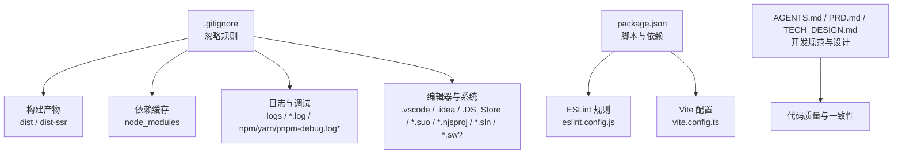
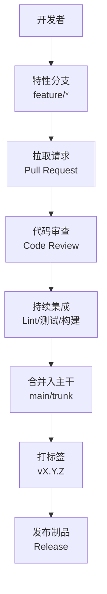
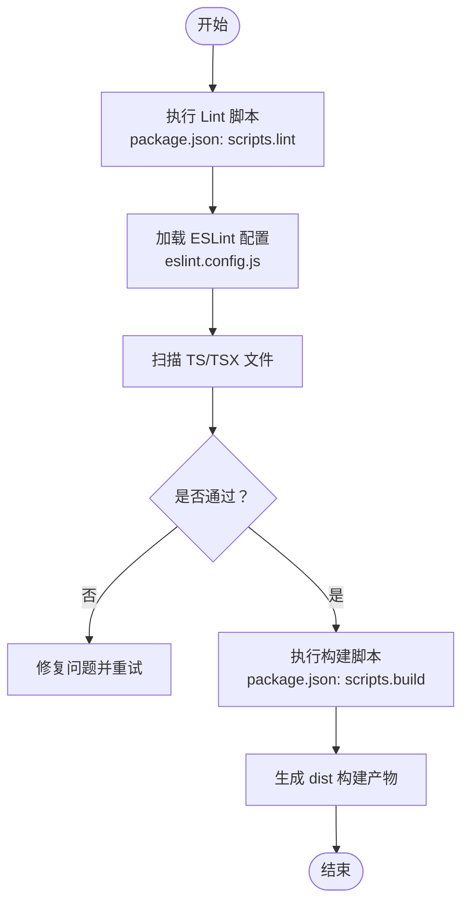
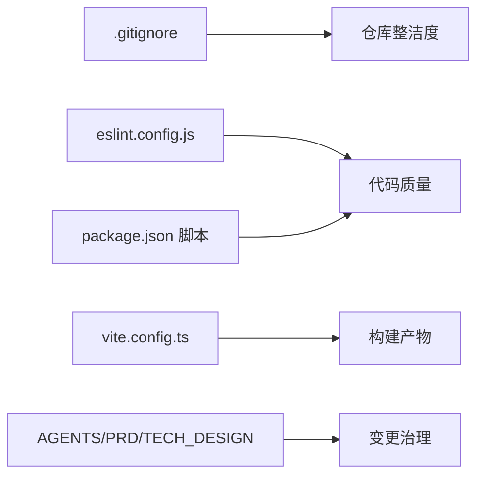

# Git工作流程与版本控制

<cite>
**本文引用的文件**
- [.gitignore](file://.gitignore)
- [package.json](file://package.json)
- [eslint.config.js](file://eslint.config.js)
- [vite.config.ts](file://vite.config.ts)
- [AGENTS.md](file://AGENTS.md)
- [PRD.md](file://PRD.md)
- [TECH_DESIGN.md](file://TECH_DESIGN.md)
</cite>

## 目录
1. [简介](#简介)
2. [项目结构](#项目结构)
3. [核心组件](#核心组件)
4. [架构总览](#架构总览)
5. [详细组件分析](#详细组件分析)
6. [依赖分析](#依赖分析)
7. [性能考虑](#性能考虑)
8. [故障排查指南](#故障排查指南)
9. [结论](#结论)
10. [附录](#附录)

## 简介
本指南面向使用 Git 进行版本控制与协作的团队，结合仓库中的实际配置与文档，系统化梳理忽略规则、分支与提交规范、合并流程、代码审查、版本标签与发布策略、冲突解决、历史修改技巧以及自动化与质量保障建议。目标是帮助团队建立一致、可追溯且高效的 Git 工作流。

## 项目结构
该仓库为前端应用工程，采用 React + TypeScript + Vite 技术栈，并通过 ESLint 进行代码质量管控。关键目录与文件如下：
- 源码与组件：src/
- 构建与工具链：vite.config.ts、tsconfig*.json、eslint.config.js
- 包管理与脚本：package.json
- 忽略规则：.gitignore
- 项目文档：AGENTS.md、PRD.md、TECH_DESIGN.md

图表来源
- [.gitignore:1-30](file://.gitignore#L1-L30)
- [package.json:1-36](file://package.json#L1-L36)
- [eslint.config.js:1-29](file://eslint.config.js#L1-L29)
- [vite.config.ts:1-14](file://vite.config.ts#L1-L14)
- [AGENTS.md:1-22](file://AGENTS.md#L1-L22)
- [PRD.md:1-16](file://PRD.md#L1-L16)
- [TECH_DESIGN.md:1-17](file://TECH_DESIGN.md#L1-L17)

章节来源
- [.gitignore:1-30](file://.gitignore#L1-L30)
- [package.json:1-36](file://package.json#L1-L36)
- [eslint.config.js:1-29](file://eslint.config.js#L1-L29)
- [vite.config.ts:1-14](file://vite.config.ts#L1-L14)
- [AGENTS.md:1-22](file://AGENTS.md#L1-L22)
- [PRD.md:1-16](file://PRD.md#L1-L16)
- [TECH_DESIGN.md:1-17](file://TECH_DESIGN.md#L1-L17)

## 核心组件
- 忽略规则与文件过滤策略：通过 .gitignore 明确排除日志、构建产物、依赖缓存、编辑器与系统文件，避免无关内容进入版本库。
- 质量保障与静态检查：ESLint 配置覆盖 TS/TSX 文件，定义推荐规则与插件，结合项目脚本执行统一校验。
- 构建与别名：Vite 配置启用 React 与 Tailwind 插件，并设置模块别名，提升开发体验与一致性。
- 文档与规范：AGENTS/PRD/TECH_DESIGN 提供开发规范、需求与技术设计，作为提交与评审的重要依据。

章节来源
- [.gitignore:1-30](file://.gitignore#L1-L30)
- [eslint.config.js:1-29](file://eslint.config.js#L1-L29)
- [vite.config.ts:1-14](file://vite.config.ts#L1-L14)
- [AGENTS.md:1-22](file://AGENTS.md#L1-L22)
- [PRD.md:1-16](file://PRD.md#L1-L16)
- [TECH_DESIGN.md:1-17](file://TECH_DESIGN.md#L1-L17)

## 架构总览
下图展示从开发到发布的典型流程，强调质量门禁与自动化：

说明
- 分支命名与变更范围：以 feature/* 表示功能开发；hotfix/* 用于紧急修复；release/* 用于发布准备。
- 提交信息规范：采用约定式提交，如 feat/fix/docs/chore/refactor/types 等类型前缀，配合简明描述与关联 Issue。
- 合并策略：优先使用 Squash Merge 保持主干整洁；必要时使用 Rebase 以线性历史。
- 审查与门禁：PR 至少一名审查者同意，CI 通过后方可合并。
- 版本标签：遵循语义化版本，按需打标签并生成发布说明。

（本图为概念性流程图，不直接映射具体源文件）

## 详细组件分析

### 忽略规则与文件过滤策略
- 日志与调试：排除 logs、*.log、npm/yarn/pnpm-debug.log*、yarn-error.log*、lerna-debug.log*，减少噪音与敏感信息泄露风险。
- 构建产物：dist、dist-ssr 由构建脚本生成，不应纳入版本库。
- 依赖缓存：node_modules 由包管理器生成，应忽略并使用 package-lock.json/pnpm-lock.yaml 等锁定文件确保可复现。
- 编辑器与系统：.vscode（保留 extensions.json）、.idea、.DS_Store、*.suo/*.njsproj/*.sln/*.sw? 等，避免 IDE/OS 特定文件污染。
- 环境变量：.env、.env.local、.env.*.local，防止敏感信息入库。

最佳实践
- 将大型二进制或临时文件放入单独的 .gitattributes 属性文件进行特殊处理（如大文件加速）。
- 对 .env 文件使用模板与说明，不在仓库中存放真实密钥。
- 在团队内统一 .gitignore 模板，定期同步更新。

章节来源
- [.gitignore:1-30](file://.gitignore#L1-L30)

### 分支管理策略
- 主干保护：main/trunk 仅允许受控变更，通过 PR 合并。
- 特性分支：feature/*，短期存在，随功能完成即合并或废弃。
- 热修复分支：hotfix/*，从最近标签或主干切出，快速修复后回并至主干与发布分支。
- 发布分支：release/*，用于发布前的最终验证与小修，完成后合并至主干并打标签。

建议
- 严格限制对主干的直接推送，强制 PR 流程。
- 使用分支保护规则（如至少一次审查、CI 通过）。

（本节为通用策略说明，未直接分析具体文件）

### 提交信息规范
- 类型：feat（新增功能）、fix（缺陷修复）、docs（文档更新）、style（格式调整）、refactor（重构）、perf（性能优化）、test（测试）、chore（维护任务）、types（类型定义）等。
- 结构：type(scope): subject（简短描述），正文说明动机与影响，底部引用 Issue。
- 示例路径参考：[package.json 脚本:6-11](file://package.json#L6-L11)

最佳实践
- 提交粒度适中，便于回溯与审阅。
- 关联 Issue 与 PR，形成闭环追踪。

章节来源
- [package.json:6-11](file://package.json#L6-L11)

### 合并流程
- Squash Merge：将特性分支的多次提交压缩为单条提交，保持主干清晰。
- Rebase：在合并前对齐上游变更，获得线性历史。
- 合并前要求：PR 审查通过、CI 成功、无冲突。

（本节为通用流程说明，未直接分析具体文件）

### 代码审查流程
- 触发条件：所有非主干变更必须通过 PR。
- 审查要点：功能正确性、代码可读性、性能与安全性、测试覆盖、文档更新。
- 工具与标准：基于 AGENTS/PRD/TECH_DESIGN 的规范进行一致性检查。

章节来源
- [AGENTS.md:6-22](file://AGENTS.md#L6-L22)
- [PRD.md:1-16](file://PRD.md#L1-L16)
- [TECH_DESIGN.md:1-17](file://TECH_DESIGN.md#L1-L17)

### 版本标签管理与发布策略
- 标签策略：语义化版本 v0.1.0、v1.0.0 等，与发布说明配套。
- 打标签时机：合并至主干并通过质量门禁后打标签。
- 发布说明：基于变更日志与 PR 描述自动生成。

（本节为通用策略说明，未直接分析具体文件）

### 冲突解决方法
- 预防：频繁同步主干、小步提交、清晰的分支命名与 PR 描述。
- 处理：rebase 或 merge 解决冲突，保留最小改动集；必要时寻求审查者协助。
- 验证：冲突解决后运行本地 Lint/Build/测试，确保无回归。

（本节为通用方法说明，未直接分析具体文件）

### 历史修改技巧
- 修改最近一次提交：使用 amend，适合修正拼写或微调。
- 交互式变基：reword/reword/split/edit 等操作，整理复杂提交历史。
- 交互式变基：squash/split/reword，将多个提交合并或拆分，保持主干整洁。

（本节为通用技巧说明，未直接分析具体文件）

### 团队协作规范
- 统一的 ESLint 规则与编辑器配置，确保风格一致。
- PR 描述与审查清单：功能说明、变更点、测试与风险评估。
- 文档驱动：AGENTS/PRD/TECH_DESIGN 作为开发与评审依据。

章节来源
- [eslint.config.js:1-29](file://eslint.config.js#L1-L29)
- [AGENTS.md:6-22](file://AGENTS.md#L6-L22)
- [PRD.md:1-16](file://PRD.md#L1-L16)
- [TECH_DESIGN.md:1-17](file://TECH_DESIGN.md#L1-L17)

### 自动化脚本与质量保证
- Lint 脚本：通过 package.json 的 lint 脚本统一执行 ESLint。
- 构建脚本：先执行类型检查再打包，确保类型安全与产物质量。
- ESLint 配置：针对 TS/TSX 文件启用推荐规则与插件，过滤 dist 目录。

图表来源
- [package.json:6-11](file://package.json#L6-L11)
- [eslint.config.js:1-29](file://eslint.config.js#L1-L29)

章节来源
- [package.json:6-11](file://package.json#L6-L11)
- [eslint.config.js:1-29](file://eslint.config.js#L1-L29)

### CI/CD 集成建议
- 触发条件：push 到分支与 PR 事件。
- 步骤建议：安装依赖 → Lint → 类型检查 → 单元测试 → 构建 → 产物上传。
- 产物与标签：成功后打标签并发布制品，生成发布说明。
- 安全：避免在 CI 中暴露敏感信息，使用受保护变量与密钥管理。

（本节为通用集成建议，未直接分析具体文件）

## 依赖分析
- 忽略规则与质量工具耦合度低，但对仓库整洁度影响最大。
- 构建与质量工具通过脚本串联，形成“Lint → Build”的质量门禁。
- 文档与规范为代码审查与变更治理提供依据。

图表来源
- [.gitignore:1-30](file://.gitignore#L1-L30)
- [eslint.config.js:1-29](file://eslint.config.js#L1-L29)
- [package.json:6-11](file://package.json#L6-L11)
- [vite.config.ts:1-14](file://vite.config.ts#L1-L14)
- [AGENTS.md:1-22](file://AGENTS.md#L1-L22)
- [PRD.md:1-16](file://PRD.md#L1-L16)
- [TECH_DESIGN.md:1-17](file://TECH_DESIGN.md#L1-L17)

章节来源
- [.gitignore:1-30](file://.gitignore#L1-L30)
- [eslint.config.js:1-29](file://eslint.config.js#L1-L29)
- [package.json:6-11](file://package.json#L6-L11)
- [vite.config.ts:1-14](file://vite.config.ts#L1-L14)
- [AGENTS.md:1-22](file://AGENTS.md#L1-L22)
- [PRD.md:1-16](file://PRD.md#L1-L16)
- [TECH_DESIGN.md:1-17](file://TECH_DESIGN.md#L1-L17)

## 性能考虑
- 仓库体积：通过 .gitignore 排除不必要的文件，减少克隆与推送时间。
- 构建性能：合理划分模块与懒加载，利用 Vite 的热更新与按需编译。
- 质量门禁：在本地先行 Lint/Build，降低 CI 失败率与等待时间。

（本节为通用指导，未直接分析具体文件）

## 故障排查指南
- 忽略规则未生效
  - 检查是否已添加到暂存区，必要时先移除再重新添加。
  - 确认 .gitignore 语法与路径匹配。
- Lint 失败
  - 依据 ESLint 输出定位问题，优先修复推荐规则。
  - 在本地执行脚本确保与 CI 环境一致。
- 构建失败
  - 先执行类型检查，修复类型错误后再构建。
  - 清理构建缓存后重试。
- PR 审查阻塞
  - 按照 AGENTS/PRD/TECH_DESIGN 的规范补充说明与测试。
  - 与审查者沟通变更影响与风险。

章节来源
- [.gitignore:1-30](file://.gitignore#L1-L30)
- [eslint.config.js:1-29](file://eslint.config.js#L1-L29)
- [package.json:6-11](file://package.json#L6-L11)
- [AGENTS.md:6-22](file://AGENTS.md#L6-L22)
- [PRD.md:1-16](file://PRD.md#L1-L16)
- [TECH_DESIGN.md:1-17](file://TECH_DESIGN.md#L1-L17)

## 结论
通过明确的忽略规则、统一的质量门禁、规范化的分支与提交流程、严格的代码审查与发布策略，团队可以在保证质量的同时提升协作效率。建议将本文档作为团队基线，结合项目实际持续演进。

## 附录
- 建议在仓库根目录新增或完善以下文件以完善工作流：
  - .github/workflows/ci.yml：定义 CI 流程
  - .github/PULL_REQUEST_TEMPLATE.md：PR 模板
  - .github/CODEOWNERS：指定代码责任人
  - .gitmessage：提交信息模板
  - .husky 或 pre-commit 配置：本地钩子（可选）
- 与现有配置的对应关系：
  - 忽略规则：.gitignore
  - 质量门禁：eslint.config.js + package.json 脚本
  - 构建入口：vite.config.ts
  - 规范依据：AGENTS/PRD/TECH_DESIGN

（本节为扩展建议，未直接分析具体文件）