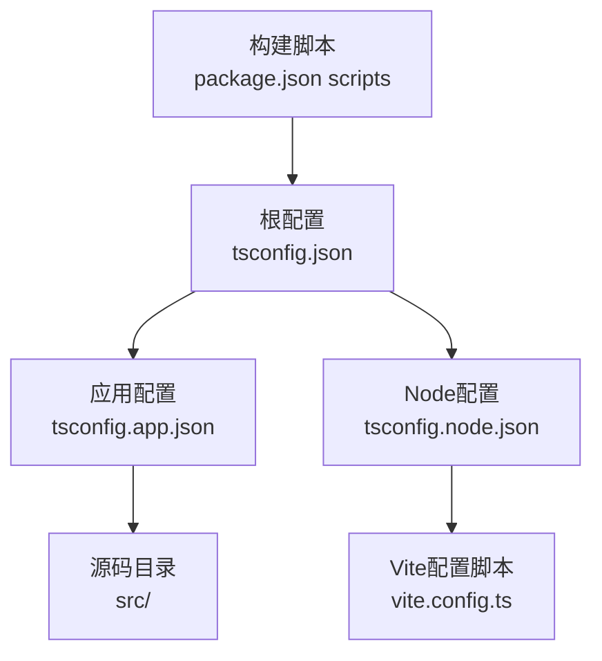
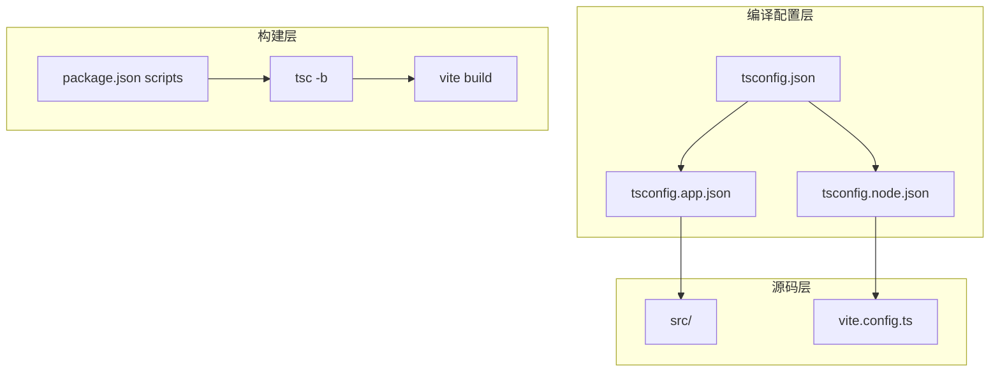
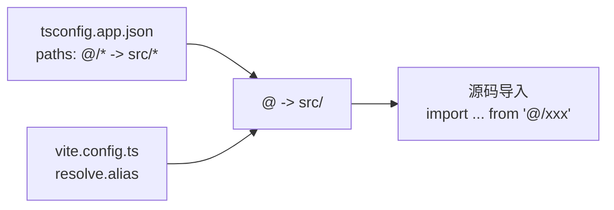
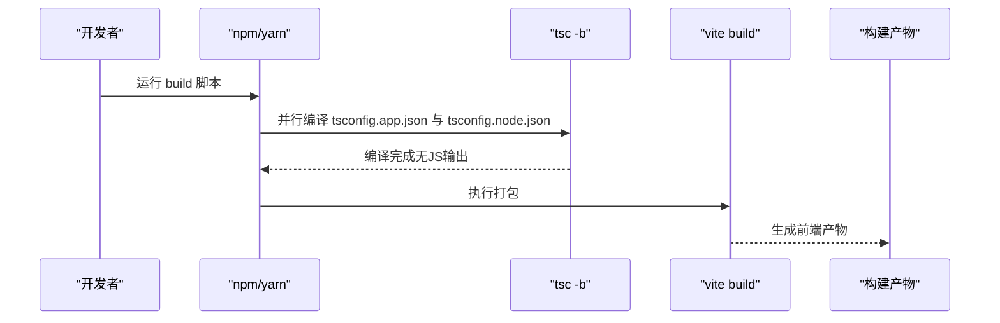
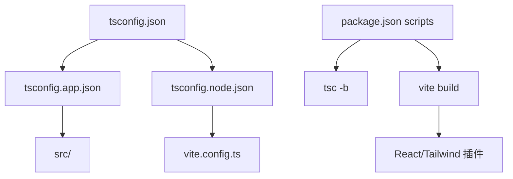

# TypeScript编译配置

<cite>
**本文档引用的文件**
- [tsconfig.json](file://tsconfig.json)
- [tsconfig.app.json](file://tsconfig.app.json)
- [tsconfig.node.json](file://tsconfig.node.json)
- [package.json](file://package.json)
- [vite.config.ts](file://vite.config.ts)
- [src/main.tsx](file://src/main.tsx)
- [src/App.tsx](file://src/App.tsx)
- [src/types.ts](file://src/types.ts)
- [src/vite-env.d.ts](file://src/vite-env.d.ts)
- [src/api.ts](file://src/api.ts)
</cite>

## 目录
1. [简介](#简介)
2. [项目结构](#项目结构)
3. [核心组件](#核心组件)
4. [架构总览](#架构总览)
5. [详细组件分析](#详细组件分析)
6. [依赖关系分析](#依赖关系分析)
7. [性能考虑](#性能考虑)
8. [故障排除指南](#故障排除指南)
9. [结论](#结论)
10. [附录](#附录)

## 简介
本指南围绕本项目的TypeScript编译配置展开，系统性解释主配置文件tsconfig.json及其子配置tsconfig.app.json和tsconfig.node.json的差异与用途，涵盖编译器选项、文件包含规则、路径映射、类型检查策略、模块解析规则、输出配置以及类型定义管理与第三方库类型支持。同时结合Vite构建工具与React项目实践，给出编译性能优化建议与常见问题排查方法，帮助开发者在应用开发与Node.js环境之间实现清晰、可维护且高性能的TypeScript编译流程。

## 项目结构
本项目采用多配置分层结构：
- 根配置：通过references将应用配置与Node配置组合，形成复合项目。
- 应用配置：面向浏览器端React应用，启用严格类型检查与现代JSX语法。
- Node配置：面向Vite配置脚本，启用Node类型支持与严格检查。
- 构建脚本：通过tsc -b并行构建两个子配置，再由Vite打包前端产物。

图表来源
- [tsconfig.json:1-5](file://tsconfig.json#L1-L5)
- [tsconfig.app.json:1-28](file://tsconfig.app.json#L1-L28)
- [tsconfig.node.json:1-23](file://tsconfig.node.json#L1-L23)
- [package.json:6-11](file://package.json#L6-L11)

章节来源
- [tsconfig.json:1-5](file://tsconfig.json#L1-L5)
- [tsconfig.app.json:1-28](file://tsconfig.app.json#L1-L28)
- [tsconfig.node.json:1-23](file://tsconfig.node.json#L1-L23)
- [package.json:6-11](file://package.json#L6-L11)

## 核心组件
本节聚焦三个关键配置文件的职责与差异：
- 根配置tsconfig.json：声明复合项目结构，通过references指向应用与Node子配置，避免重复定义公共选项。
- 应用配置tsconfig.app.json：面向浏览器端React应用，启用严格类型检查、现代JSX、路径别名等，确保开发体验与类型安全。
- Node配置tsconfig.node.json：面向Vite配置脚本，启用Node类型支持，限制include范围，避免污染应用类型检查。

章节来源
- [tsconfig.json:1-5](file://tsconfig.json#L1-L5)
- [tsconfig.app.json:1-28](file://tsconfig.app.json#L1-L28)
- [tsconfig.node.json:1-23](file://tsconfig.node.json#L1-L23)

## 架构总览
下图展示了TypeScript编译配置在项目中的整体作用：根配置作为入口，应用与Node配置分别服务于不同运行时环境；构建脚本通过tsc -b并行编译两个子配置，随后由Vite进行打包。

图表来源
- [tsconfig.json:1-5](file://tsconfig.json#L1-L5)
- [tsconfig.app.json:1-28](file://tsconfig.app.json#L1-L28)
- [tsconfig.node.json:1-23](file://tsconfig.node.json#L1-L23)
- [package.json:6-11](file://package.json#L6-L11)

## 详细组件分析

### 根配置tsconfig.json
- 复合项目入口：通过references将应用与Node配置纳入同一编译工作区，便于统一管理与增量编译。
- 文件清单：files为空，避免直接列出源文件，减少维护成本。
- 组合优势：允许子配置共享缓存与增量编译状态，提升整体构建效率。

章节来源
- [tsconfig.json:1-5](file://tsconfig.json#L1-L5)

### 应用配置tsconfig.app.json
- 编译器选项要点
  - 目标与库：目标版本与内置库集合面向现代浏览器，确保兼容性与API可用性。
  - 模块与解析：使用bundler模块解析与verbatimModuleSyntax，配合Vite生态实现零配置导入与严格模块行为。
  - 类型检查：启用严格模式与多项严格检查开关，降低运行时风险。
  - JSX：采用react-jsx，与@vitejs/plugin-react插件协同生成高效JSX代码。
  - 路径映射：通过baseUrl与paths提供@/*别名，简化相对路径导入。
  - 输出控制：noEmit确保仅进行类型检查与模块解析，不生成JS文件，由Vite负责打包。
- 文件包含规则：include仅包含src目录，聚焦应用源码。
- 适用场景：浏览器端React应用，强调类型安全与现代模块特性。

章节来源
- [tsconfig.app.json:1-28](file://tsconfig.app.json#L1-L28)

### Node配置tsconfig.node.json
- 编译器选项要点
  - 目标与库：目标版本与内置库集合面向Node运行时。
  - 模块与解析：同样采用bundler解析与verbatimModuleSyntax，保证与应用配置一致的模块行为。
  - 类型检查：启用严格模式与多项严格检查开关，确保配置脚本质量。
  - 类型支持：types数组包含node，为Vite配置脚本提供Node全局类型。
  - 输出控制：noEmit，仅用于类型检查。
- 文件包含规则：仅包含vite.config.ts，避免将Node类型泄漏到应用源码。
- 适用场景：Vite配置脚本与Node环境相关任务，强调类型安全与最小暴露面。

章节来源
- [tsconfig.node.json:1-23](file://tsconfig.node.json#L1-L23)

### 路径映射与模块解析
- 路径映射：应用配置通过baseUrl与paths提供@/*到src/*的别名映射，简化导入路径，提升可读性与可维护性。
- 模块解析：bundler解析与verbatimModuleSyntax确保与Vite生态无缝协作，避免CommonJS/ESM混用带来的歧义。
- Vite集成：vite.config.ts中通过resolve.alias将@映射到src目录，与tsconfig.app.json保持一致，避免路径不一致导致的类型检查失败。

图表来源
- [tsconfig.app.json:21-24](file://tsconfig.app.json#L21-L24)
- [vite.config.ts:8-12](file://vite.config.ts#L8-L12)

章节来源
- [tsconfig.app.json:21-24](file://tsconfig.app.json#L21-L24)
- [vite.config.ts:8-12](file://vite.config.ts#L8-L12)

### 类型检查策略
- 严格模式：应用与Node配置均启用strict，确保类型推断与检查的严谨性。
- 未使用项检查：开启noUnusedLocals与noUnusedParameters，减少冗余代码。
- 控制流检查：noFallthroughCasesInSwitch与noUncheckedSideEffectImports降低逻辑错误风险。
- 构建信息：tsBuildInfoFile指定构建缓存位置，提升增量编译速度。

章节来源
- [tsconfig.app.json:15-20](file://tsconfig.app.json#L15-L20)
- [tsconfig.node.json:13-17](file://tsconfig.node.json#L13-L17)

### 输出配置与构建流程
- 输出控制：应用配置noEmit，由Vite负责打包与输出；Node配置同样noEmit，仅用于类型检查。
- 构建脚本：package.json中build脚本先执行tsc -b并行构建两个子配置，再由vite build进行打包。
- 并行构建：复合项目通过references实现并行编译，缩短构建时间。

图表来源
- [package.json:8](file://package.json#L8)
- [tsconfig.json:2-4](file://tsconfig.json#L2-L4)

章节来源
- [package.json:8](file://package.json#L8)
- [tsconfig.json:2-4](file://tsconfig.json#L2-L4)

### 类型定义文件管理与第三方库类型支持
- 全局类型声明：src/vite-env.d.ts为Vite环境提供类型声明，包括ImportMetaEnv接口，确保环境变量类型安全。
- React类型：通过@types/react与@types/react-dom提供React相关类型，确保组件与Hooks类型正确。
- Node类型：Node配置通过types包含node，为Vite配置脚本提供Node全局类型。
- 第三方库类型：项目依赖中包含多种@types前缀的包，确保第三方库具备类型支持。

章节来源
- [src/vite-env.d.ts:1-14](file://src/vite-env.d.ts#L1-L14)
- [package.json:18-34](file://package.json#L18-L34)

### 实际使用示例与类型约束
- 类型定义：src/types.ts定义了Message与MessageRole等核心类型，为组件与API层提供统一的数据契约。
- 组件使用：src/App.tsx与src/main.tsx通过类型导入与导出，体现类型在组件间的传递与约束。
- API层类型：src/api.ts通过类型别名与接口约束，确保与外部服务交互的数据结构一致。

章节来源
- [src/types.ts:1-9](file://src/types.ts#L1-L9)
- [src/App.tsx:1-8](file://src/App.tsx#L1-L8)
- [src/main.tsx:1-11](file://src/main.tsx#L1-L11)
- [src/api.ts:1-184](file://src/api.ts#L1-L184)

## 依赖关系分析
- 配置依赖：根配置依赖应用与Node子配置；应用配置依赖src目录；Node配置依赖vite.config.ts。
- 工具链依赖：构建脚本依赖TypeScript编译器与Vite；Vite依赖React插件与TailwindCSS插件。
- 类型依赖：应用与Node配置分别提供不同的类型支持，避免相互污染。

图表来源
- [tsconfig.json:1-5](file://tsconfig.json#L1-L5)
- [tsconfig.app.json:26](file://tsconfig.app.json#L26)
- [tsconfig.node.json:21](file://tsconfig.node.json#L21)
- [package.json:6-11](file://package.json#L6-L11)

章节来源
- [tsconfig.json:1-5](file://tsconfig.json#L1-L5)
- [tsconfig.app.json:26](file://tsconfig.app.json#L26)
- [tsconfig.node.json:21](file://tsconfig.node.json#L21)
- [package.json:6-11](file://package.json#L6-L11)

## 性能考虑
- 增量编译：通过tsBuildInfoFile与复合项目结构，利用TypeScript的增量编译能力，显著缩短二次构建时间。
- 并行构建：tsc -b并行编译应用与Node配置，充分利用多核CPU资源。
- 模块解析优化：bundler解析与verbatimModuleSyntax减少模块解析歧义，提高编译速度。
- 严格检查：适度的严格检查在保证类型安全的同时，避免过度严格的规则导致编译时间增加。
- 路径映射：合理使用@/*别名减少深度相对路径，有助于IDE索引与编译器查找。

## 故障排除指南
- 路径别名不生效
  - 症状：导入@/*报错或IDE无法跳转。
  - 排查：确认tsconfig.app.json的baseUrl与paths配置一致；确保vite.config.ts的resolve.alias也配置相同别名。
  - 参考
    - [tsconfig.app.json:21-24](file://tsconfig.app.json#L21-L24)
    - [vite.config.ts:8-12](file://vite.config.ts#L8-L12)
- 类型检查失败
  - 症状：出现严格检查相关的编译错误。
  - 排查：检查应用与Node配置的strict选项是否符合预期；确认第三方库类型是否正确安装。
  - 参考
    - [tsconfig.app.json:15-20](file://tsconfig.app.json#L15-L20)
    - [tsconfig.node.json:13-17](file://tsconfig.node.json#L13-L17)
    - [package.json:18-34](file://package.json#L18-L34)
- 构建失败
  - 症状：tsc -b或vite build阶段报错。
  - 排查：确认根配置references指向正确；检查应用与Node配置的include范围；验证Vite插件与配置脚本类型。
  - 参考
    - [tsconfig.json:2-4](file://tsconfig.json#L2-L4)
    - [tsconfig.app.json:26](file://tsconfig.app.json#L26)
    - [tsconfig.node.json:21](file://tsconfig.node.json#L21)
    - [package.json:8](file://package.json#L8)
- 环境变量类型缺失
  - 症状：import.meta.env访问时报类型错误。
  - 排查：确认src/vite-env.d.ts中定义了所需的环境变量接口；确保Vite配置脚本类型正确。
  - 参考
    - [src/vite-env.d.ts:1-14](file://src/vite-env.d.ts#L1-L14)

章节来源
- [tsconfig.app.json:21-24](file://tsconfig.app.json#L21-L24)
- [vite.config.ts:8-12](file://vite.config.ts#L8-L12)
- [tsconfig.app.json:15-20](file://tsconfig.app.json#L15-L20)
- [tsconfig.node.json:13-17](file://tsconfig.node.json#L13-L17)
- [package.json:18-34](file://package.json#L18-L34)
- [tsconfig.json:2-4](file://tsconfig.json#L2-L4)
- [tsconfig.app.json:26](file://tsconfig.app.json#L26)
- [tsconfig.node.json:21](file://tsconfig.node.json#L21)
- [package.json:8](file://package.json#L8)
- [src/vite-env.d.ts:1-14](file://src/vite-env.d.ts#L1-L14)

## 结论
本项目的TypeScript编译配置通过复合项目结构实现了应用与Node环境的清晰分离，配合严格类型检查、现代模块解析与路径别名，既保证了开发体验与类型安全，又兼顾了构建性能。遵循本文档的配置原则与最佳实践，可在React/Vite生态中获得稳定、高效的TypeScript开发体验。

## 附录
- 关键配置要点速览
  - 根配置：references组合子配置，避免重复定义公共选项。
  - 应用配置：strict、noEmit、paths别名、bundler解析，适配浏览器端React应用。
  - Node配置：types包含node、noEmit、仅包含vite.config.ts，适配Vite配置脚本。
  - 构建脚本：tsc -b并行编译，vite build打包。
- 相关文件参考
  - [tsconfig.json](file://tsconfig.json)
  - [tsconfig.app.json](file://tsconfig.app.json)
  - [tsconfig.node.json](file://tsconfig.node.json)
  - [package.json](file://package.json)
  - [vite.config.ts](file://vite.config.ts)
  - [src/vite-env.d.ts](file://src/vite-env.d.ts)