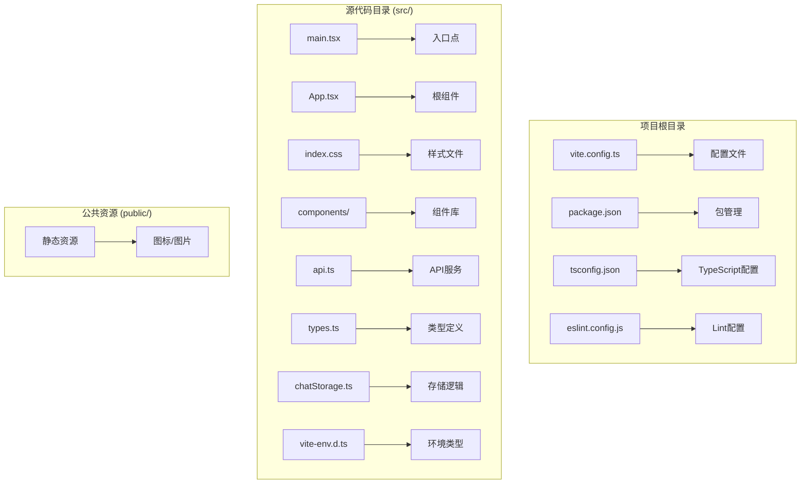
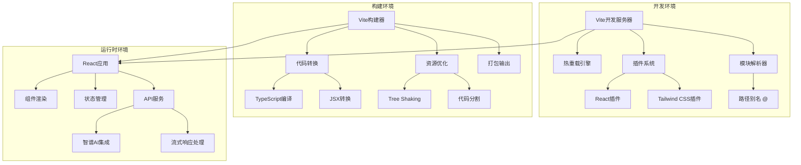
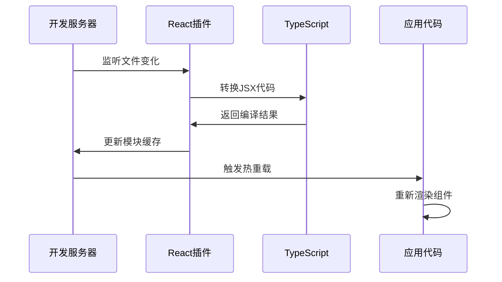
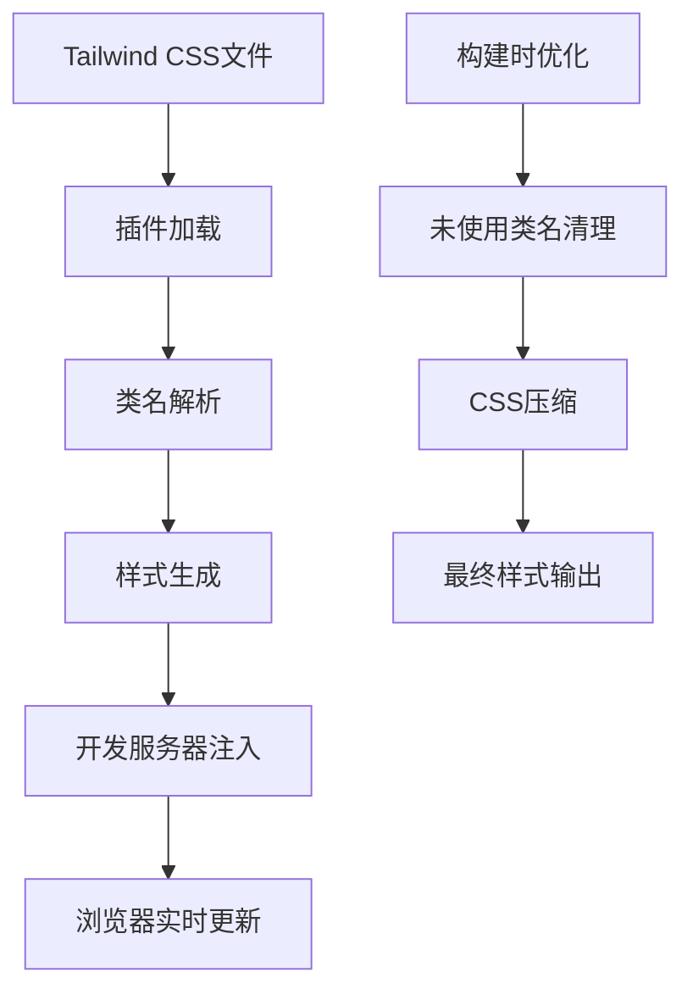
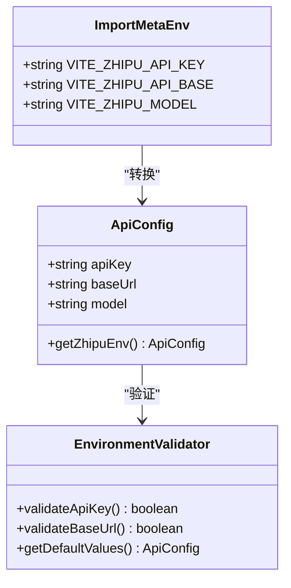

# Vite构建工具配置

<cite>
**本文档引用的文件**
- [vite.config.ts](file://vite.config.ts)
- [package.json](file://package.json)
- [tsconfig.app.json](file://tsconfig.app.json)
- [tsconfig.node.json](file://tsconfig.node.json)
- [eslint.config.js](file://eslint.config.js)
- [src/main.tsx](file://src/main.tsx)
- [src/App.tsx](file://src/App.tsx)
- [src/index.css](file://src/index.css)
- [src/api.ts](file://src/api.ts)
- [src/types.ts](file://src/types.ts)
- [src/chatStorage.ts](file://src/chatStorage.ts)
- [src/vite-env.d.ts](file://src/vite-env.d.ts)
</cite>

## 目录
1. [简介](#简介)
2. [项目结构](#项目结构)
3. [核心组件](#核心组件)
4. [架构概览](#架构概览)
5. [详细组件分析](#详细组件分析)
6. [依赖关系分析](#依赖关系分析)
7. [性能考虑](#性能考虑)
8. [故障排除指南](#故障排除指南)
9. [结论](#结论)
10. [附录](#附录)

## 简介

本项目采用Vite作为构建工具和开发服务器，结合React 19和TypeScript实现现代化的聊天应用开发体验。Vite提供了极速的开发服务器启动速度、即时的模块热替换(HMR)和高效的生产构建优化。

该项目的核心特点包括：
- 基于Vite 6.1.0的现代构建系统
- React 19 + TypeScript开发环境
- Tailwind CSS 4.0样式框架集成
- 智谱AI API的流式聊天功能
- 完整的开发和生产环境配置

## 项目结构

项目采用标准的Vite + React + TypeScript项目布局，主要目录结构如下：



**图表来源**
- [vite.config.ts:1-14](file://vite.config.ts#L1-L14)
- [package.json:1-36](file://package.json#L1-L36)
- [tsconfig.json:1-5](file://tsconfig.json#L1-L5)

**章节来源**
- [vite.config.ts:1-14](file://vite.config.ts#L1-L14)
- [package.json:1-36](file://package.json#L1-L36)
- [tsconfig.json:1-5](file://tsconfig.json#L1-L5)

## 核心组件

### Vite配置核心组件

项目的核心配置集中在vite.config.ts文件中，主要包含以下关键组件：

#### 插件系统
- **React插件**: `@vitejs/plugin-react` 提供React JSX转换和开发时优化
- **Tailwind CSS插件**: `@tailwindcss/vite` 集成CSS原子化框架

#### 路径别名系统
- 使用 `@` 别名指向 `./src` 目录，简化模块导入路径
- 在TypeScript配置中保持同步的路径映射

#### 开发服务器配置
- 默认端口监听
- 自动热重载机制
- 支持ES模块解析

**章节来源**
- [vite.config.ts:6-13](file://vite.config.ts#L6-L13)
- [tsconfig.app.json:22-24](file://tsconfig.app.json#L22-L24)

### TypeScript集成组件

#### 应用程序配置
- 目标版本: ES2022
- 模块系统: ESNext + bundler
- JSX支持: react-jsx
- 路径映射: `@/*` → `src/*`

#### Node.js配置
- 类型安全: 严格模式
- 模块解析: bundler
- 包含文件: 仅vite.config.ts

**章节来源**
- [tsconfig.app.json:1-28](file://tsconfig.app.json#L1-L28)
- [tsconfig.node.json:1-22](file://tsconfig.node.json#L1-L22)

## 架构概览

项目采用分层架构设计，各组件协同工作以提供完整的开发和构建体验：



**图表来源**
- [vite.config.ts:6-13](file://vite.config.ts#L6-L13)
- [src/main.tsx:1-11](file://src/main.tsx#L1-L11)
- [src/api.ts:23-38](file://src/api.ts#L23-L38)

## 详细组件分析

### React插件集成分析

React插件在项目中发挥着核心作用，提供以下功能特性：

#### 开发时优化
- 即时的组件热重载
- JSX语法高亮和错误报告
- 组件栈追踪和调试信息

#### 生产构建优化
- 自动的React特定优化
- Tree Shaking支持
- 代码分割建议



**图表来源**
- [vite.config.ts:7](file://vite.config.ts#L7)
- [src/main.tsx:6-10](file://src/main.tsx#L6-L10)

**章节来源**
- [vite.config.ts:7](file://vite.config.ts#L7)
- [src/main.tsx:1-11](file://src/main.tsx#L1-L11)

### Tailwind CSS集成分析

Tailwind CSS通过专用插件实现深度集成：

#### 配置集成
- 直接在CSS中使用 `@import "tailwindcss"`
- 自动扫描类名生成样式
- 支持响应式设计和暗色模式

#### 开发体验
- 实时预览CSS变更
- 类名智能提示
- 构建时优化和压缩



**图表来源**
- [src/index.css:1](file://src/index.css#L1)
- [vite.config.ts:7](file://vite.config.ts#L7)

**章节来源**
- [src/index.css:1-56](file://src/index.css#L1-L56)
- [vite.config.ts:7](file://vite.config.ts#L7)

### 环境变量处理分析

项目实现了完整的环境变量管理系统：

#### 类型安全的环境变量
- 编译时类型检查
- 运行时值验证
- 默认值处理

#### API密钥管理
- 智谱AI API密钥
- 可选的基础URL配置
- 模型名称配置



**图表来源**
- [src/vite-env.d.ts:3-13](file://src/vite-env.d.ts#L3-L13)
- [src/api.ts:23-38](file://src/api.ts#L23-L38)

**章节来源**
- [src/vite-env.d.ts:1-13](file://src/vite-env.d.ts#L1-L13)
- [src/api.ts:23-38](file://src/api.ts#L23-L38)

### 开发服务器配置分析

开发服务器提供了完整的开发体验：

#### 热重载机制
- 文件变更检测
- 模块级热替换
- 状态保持

#### 路径解析优化
- ES模块解析
- 路径别名支持
- 类型声明自动解析

**章节来源**
- [vite.config.ts:8-12](file://vite.config.ts#L8-L12)
- [tsconfig.app.json:9-14](file://tsconfig.app.json#L9-L14)

## 依赖关系分析

项目依赖关系呈现清晰的层次结构：

```mermaid
graph TB
subgraph "运行时依赖"
A[react] --> B[用户界面]
C[react-dom] --> D[DOM渲染]
E[react-markdown] --> F[Markdown渲染]
G[react-syntax-highlighter] --> H[代码高亮]
end
subgraph "开发时依赖"
I[@vitejs/plugin-react] --> J[React支持]
K[@tailwindcss/vite] --> L[Tailwind集成]
M[tailwindcss] --> N[CSS框架]
O[typescript] --> P[类型系统]
Q[vite] --> R[构建工具]
end
subgraph "工具链"
S[eslint] --> T[代码质量]
U[typescript-eslint] --> V[TS规则]
W[@types/*] --> X[类型定义]
end
A --> I
C --> K
M --> Q
```

**图表来源**
- [package.json:12-34](file://package.json#L12-L34)

**章节来源**
- [package.json:1-36](file://package.json#L1-L36)

## 性能考虑

### 开发性能优化

#### 启动时间优化
- Vite的原生ES模块支持
- 按需编译和懒加载
- 缓存友好的模块结构

#### 热重载性能
- 模块图优化
- 精确的变更通知
- 最小化重渲染范围

### 生产构建优化

#### 代码分割策略
- 动态导入支持
- 路由级别的代码分割
- 第三方库分离

#### 资源优化
- Tree Shaking
- CSS和JavaScript压缩
- 图片和字体优化

### 内存使用优化

#### 开发时内存管理
- 模块缓存策略
- 垃圾回收优化
- 大文件处理

**章节来源**
- [package.json:6-11](file://package.json#L6-L11)
- [vite.config.ts:6-13](file://vite.config.ts#L6-L13)

## 故障排除指南

### 常见构建问题

#### 环境变量配置问题
**症状**: 运行时抛出API密钥未配置错误
**解决方案**: 
- 检查 `.env` 文件是否正确配置
- 验证环境变量命名格式
- 确认Vite环境变量前缀

#### 路径解析错误
**症状**: 模块导入失败或类型检查错误
**解决方案**:
- 验证 `tsconfig.app.json` 中的路径映射
- 检查 `vite.config.ts` 的别名配置
- 确认文件扩展名和导入路径

#### 插件兼容性问题
**症状**: 构建失败或开发服务器异常
**解决方案**:
- 检查插件版本兼容性
- 验证插件配置参数
- 清理node_modules和重新安装

### 性能问题诊断

#### 开发服务器响应慢
**症状**: 热重载延迟或编译时间过长
**解决方案**:
- 检查大型依赖项的处理
- 优化模块结构
- 调整Vite配置参数

#### 构建产物过大
**症状**: 打包后文件体积超出预期
**解决方案**:
- 分析包大小组成
- 实施代码分割策略
- 移除未使用的依赖

**章节来源**
- [src/api.ts:23-38](file://src/api.ts#L23-L38)
- [src/vite-env.d.ts:3-8](file://src/vite-env.d.ts#L3-L8)

## 结论

本项目展示了Vite在现代前端开发中的最佳实践应用。通过精心配置的插件系统、TypeScript集成和Tailwind CSS支持，项目实现了快速的开发迭代和高质量的生产构建。

关键优势包括：
- 极速的开发体验和热重载
- 类型安全的环境变量管理
- 现代化的构建优化策略
- 完善的工具链集成

建议的后续改进方向：
- 添加代理配置用于API开发
- 实施更精细的代码分割策略
- 集成性能监控和分析工具
- 完善测试和持续集成流程

## 附录

### 配置文件参考

#### 核心配置要点
- **插件配置**: React和Tailwind CSS插件的正确集成
- **路径别名**: `@` 到 `src` 的映射配置
- **TypeScript集成**: 应用和Node.js配置的协调
- **环境变量**: 类型安全的配置管理

#### 开发脚本说明
- `npm run dev`: 启动开发服务器
- `npm run build`: TypeScript编译后进行Vite构建
- `npm run preview`: 预览生产构建结果
- `npm run lint`: 代码质量检查

**章节来源**
- [package.json:6-11](file://package.json#L6-L11)
- [vite.config.ts:6-13](file://vite.config.ts#L6-L13)
- [tsconfig.app.json:22-24](file://tsconfig.app.json#L22-L24)