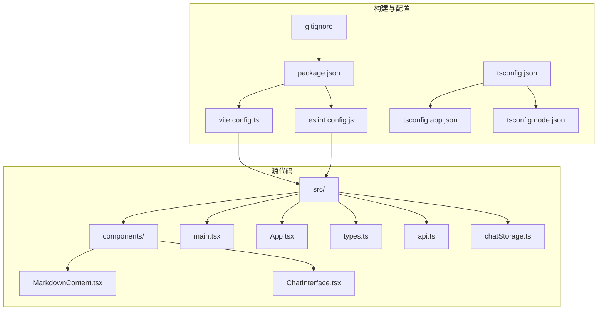
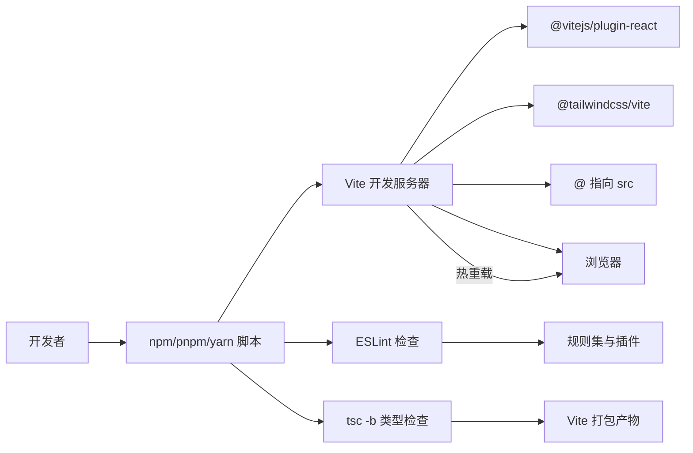
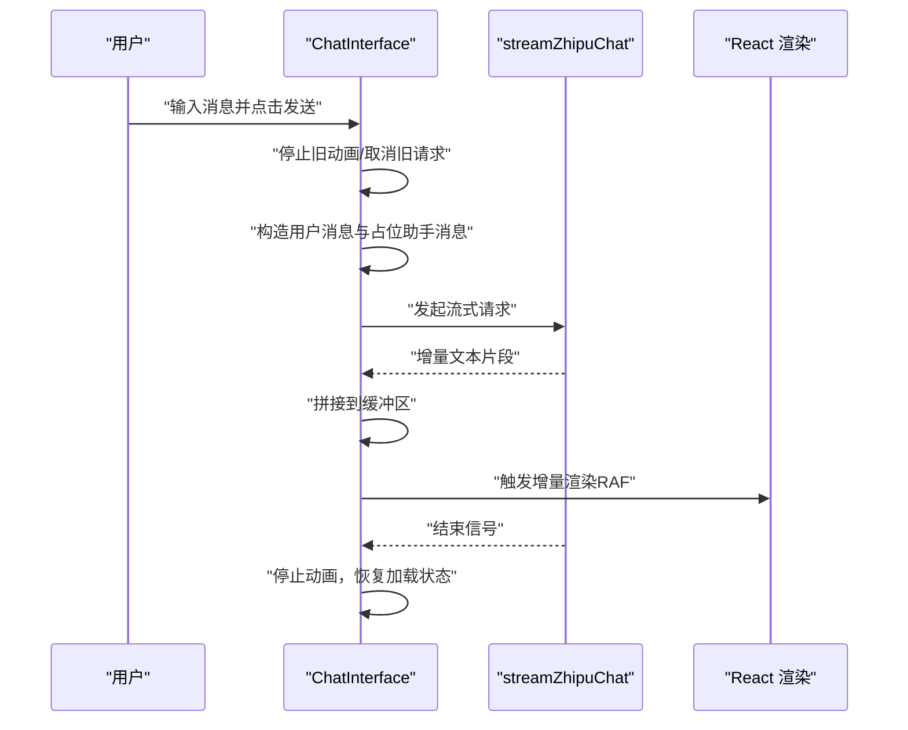
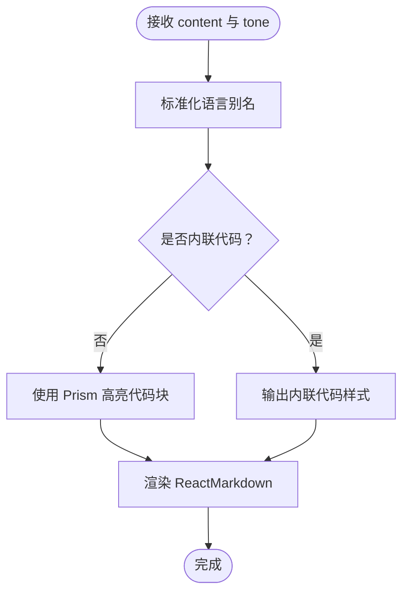
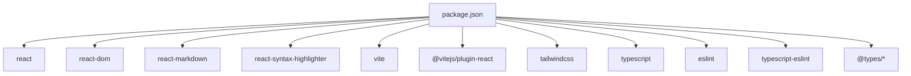

# 开发工具与规范

<cite>
**本文引用的文件**
- [eslint.config.js](file://eslint.config.js)
- [package.json](file://package.json)
- [vite.config.ts](file://vite.config.ts)
- [tsconfig.json](file://tsconfig.json)
- [tsconfig.app.json](file://tsconfig.app.json)
- [tsconfig.node.json](file://tsconfig.node.json)
- [.gitignore](file://.gitignore)
- [src/main.tsx](file://src/main.tsx)
- [src/App.tsx](file://src/App.tsx)
- [src/types.ts](file://src/types.ts)
- [src/components/ChatInterface.tsx](file://src/components/ChatInterface.tsx)
- [src/components/MarkdownContent.tsx](file://src/components/MarkdownContent.tsx)
- [src/api.ts](file://src/api.ts)
- [src/chatStorage.ts](file://src/chatStorage.ts)
- [PRD.md](file://PRD.md)
</cite>

## 目录
1. [引言](#引言)
2. [项目结构](#项目结构)
3. [核心组件](#核心组件)
4. [架构总览](#架构总览)
5. [详细组件分析](#详细组件分析)
6. [依赖分析](#依赖分析)
7. [性能考虑](#性能考虑)
8. [故障排查指南](#故障排查指南)
9. [结论](#结论)
10. [附录](#附录)

## 引言
本指南面向前端与全栈开发者，系统梳理本项目的开发工具链与编码规范，覆盖以下主题：
- ESLint 配置与规则、代码质量检查与自动化修复
- TypeScript 编译配置、类型检查选项与项目设置
- Vite 开发服务器配置、热重载机制与路径别名
- Git 工作流程、分支管理与提交规范
- 代码格式化标准、命名约定与注释规范
- 调试技巧、性能分析与开发效率提升
- 团队协作最佳实践与代码审查流程

## 项目结构
该项目采用 React + TypeScript + Vite 的现代前端技术栈，使用 TailwindCSS 作为样式框架，通过 TypeScript 严格类型约束与 ESLint 规范化开发流程，确保代码一致性与可维护性。

图表来源
- [vite.config.ts:1-14](file://vite.config.ts#L1-L14)
- [package.json:1-36](file://package.json#L1-L36)
- [tsconfig.json:1-5](file://tsconfig.json#L1-L5)
- [tsconfig.app.json:1-28](file://tsconfig.app.json#L1-L28)
- [tsconfig.node.json:1-23](file://tsconfig.node.json#L1-L23)
- [.gitignore:1-30](file://.gitignore#L1-L30)

章节来源
- [package.json:1-36](file://package.json#L1-L36)
- [vite.config.ts:1-14](file://vite.config.ts#L1-L14)
- [tsconfig.json:1-5](file://tsconfig.json#L1-L5)
- [tsconfig.app.json:1-28](file://tsconfig.app.json#L1-L28)
- [tsconfig.node.json:1-23](file://tsconfig.node.json#L1-L23)
- [.gitignore:1-30](file://.gitignore#L1-L30)

## 核心组件
- 构建与脚本
  - 开发：vite 启动本地服务
  - 预览：vite 预览生产包
  - 构建：先执行 tsc -b 进行类型检查与增量编译，再由 vite 打包
  - 代码检查：eslint 扫描项目
- 类型系统
  - 使用复合 tsconfig，分别针对应用与 Node 环境进行编译配置
  - 严格模式开启，启用未使用局部变量与参数检查，禁止 switch 穿透与未检查副作用导入
- ESLint
  - 推荐规则扩展，结合 TypeScript、React Hooks、React Refresh 插件
  - 仅对 .ts/.tsx 文件生效，忽略 dist 输出目录
- Vite
  - 集成 @vitejs/plugin-react 与 @tailwindcss/vite
  - 配置路径别名 @ 指向 src，便于模块导入

章节来源
- [package.json:6-11](file://package.json#L6-L11)
- [eslint.config.js:1-29](file://eslint.config.js#L1-L29)
- [vite.config.ts:1-14](file://vite.config.ts#L1-L14)
- [tsconfig.app.json:14-24](file://tsconfig.app.json#L14-L24)
- [tsconfig.node.json:12-20](file://tsconfig.node.json#L12-L20)

## 架构总览
下图展示了从开发到构建的关键流程与工具交互关系：

图表来源
- [package.json:6-11](file://package.json#L6-L11)
- [vite.config.ts:6-13](file://vite.config.ts#L6-L13)
- [eslint.config.js:7-28](file://eslint.config.js#L7-L28)
- [tsconfig.app.json:14-24](file://tsconfig.app.json#L14-L24)

## 详细组件分析

### ESLint 配置与规则
- 规则范围
  - 仅对 TypeScript/TSX 文件生效，忽略 dist 目录
  - 语言环境为浏览器，目标版本 2022
- 插件与继承
  - 继承官方推荐规则与 TypeScript 推荐规则
  - 启用 React Hooks 与 React Refresh 插件
  - React Refresh 仅对导出组件发出警告，允许常量导出
- 建议实践
  - 在编辑器中启用 ESLint 自动修复
  - 提交前运行 lint 脚本，确保无严重问题
  - 如需调整规则，建议在团队内达成共识并通过 PR 审查

章节来源
- [eslint.config.js:8-28](file://eslint.config.js#L8-L28)

### TypeScript 编译配置
- 复合配置
  - 根 tsconfig.json 通过 references 引入应用与 Node 环境配置
- 应用配置（tsconfig.app.json）
  - 目标与模块：ES2022 与 ESNext
  - 解析策略：bundler，强制模块检测
  - 严格模式：开启；未使用局部变量/参数检查；switch 穿透禁止；未检查副作用导入禁止
  - JSX：react-jsx
  - 路径映射：@/* -> src/*
- Node 配置（tsconfig.node.json）
  - 目标与模块：ES2023 与 ESNext
  - 解析策略：bundler，强制模块检测
  - 严格模式：开启；未使用局部变量/参数检查；switch 穿透禁止；未检查副作用导入禁止
  - 类型：包含 node
- 建议实践
  - 保持严格模式与路径别名一致性
  - 新增文件时遵循 include 与路径映射规则
  - 使用 tsc -b 进行增量编译，提升大型项目构建速度

章节来源
- [tsconfig.json:1-5](file://tsconfig.json#L1-L5)
- [tsconfig.app.json:14-24](file://tsconfig.app.json#L14-L24)
- [tsconfig.node.json:12-20](file://tsconfig.node.json#L12-L20)

### Vite 开发服务器与热重载
- 插件
  - @vitejs/plugin-react：启用 React 快速刷新与 JSX 优化
  - @tailwindcss/vite：集成 TailwindCSS
- 路径别名
  - @ 指向 src，统一导入路径，减少相对路径复杂度
- 热重载机制
  - Vite 基于原生 ESM 的模块热替换，实现快速刷新
  - 修改组件或样式后，浏览器端即时反映变化
- 建议实践
  - 使用 @ 别名导入，避免深层相对路径
  - 在开发阶段开启严格的 TypeScript 检查，提前发现类型问题

章节来源
- [vite.config.ts:1-14](file://vite.config.ts#L1-L14)

### 代码质量检查与自动化修复
- 脚本入口
  - dev：启动 Vite 开发服务器
  - build：先 tsc -b 再 vite build
  - lint：运行 ESLint 检查
  - preview：预览生产包
- 自动化修复
  - 在编辑器中启用 ESLint 自动修复
  - 提交前运行 lint 脚本，确保无严重问题
- 建议实践
  - 在 CI 中加入 lint 步骤，保证主干分支质量
  - 对新增规则进行团队评审，避免破坏既有代码风格

章节来源
- [package.json:6-11](file://package.json#L6-L11)
- [eslint.config.js:20-26](file://eslint.config.js#L20-L26)

### 组件与数据流分析

#### ChatInterface 组件
- 功能要点
  - 维护消息列表、输入框状态、加载与错误状态
  - 使用 requestAnimationFrame 实现“打字机”式增量渲染
  - 支持取消请求与错误处理
  - 键盘事件监听（Enter 发送，Shift+Enter 换行）
- 关键流程（发送消息与流式渲染）

图表来源
- [src/components/ChatInterface.tsx:106-182](file://src/components/ChatInterface.tsx#L106-L182)
- [src/api.ts:70-183](file://src/api.ts#L70-L183)

章节来源
- [src/components/ChatInterface.tsx:25-344](file://src/components/ChatInterface.tsx#L25-L344)
- [src/api.ts:1-184](file://src/api.ts#L1-L184)

#### MarkdownContent 组件
- 功能要点
  - 使用 ReactMarkdown 渲染 Markdown
  - 代码块高亮：基于 Prism，支持多种语言别名映射
  - 内联代码与块级代码不同样式，适配用户/助手气泡背景
- 关键流程（代码高亮与渲染）

图表来源
- [src/components/MarkdownContent.tsx:64-129](file://src/components/MarkdownContent.tsx#L64-L129)

章节来源
- [src/components/MarkdownContent.tsx:1-129](file://src/components/MarkdownContent.tsx#L1-L129)

#### 类型定义与存储
- 类型定义
  - MessageRole：用户/助手
  - Message：包含角色、内容、时间戳
- 本地存储
  - 读取/保存/清理对话记录，使用 localStorage
  - 存储键名固定，解析时进行类型校验与过滤

章节来源
- [src/types.ts:1-9](file://src/types.ts#L1-L9)
- [src/chatStorage.ts:1-51](file://src/chatStorage.ts#L1-L51)

## 依赖分析
- 运行时依赖
  - React 19、React DOM 19、React Markdown、React Syntax Highlighter
- 开发依赖
  - Vite 6、@vitejs/plugin-react、TailwindCSS 4、TypeScript ~5.7、ESLint 9、typescript-eslint、globals、@types/* 等
- 脚本与命令
  - dev、build、lint、preview

图表来源
- [package.json:12-34](file://package.json#L12-L34)

章节来源
- [package.json:1-36](file://package.json#L1-L36)

## 性能考虑
- 流式渲染与 RAF
  - 使用 requestAnimationFrame 控制增量渲染节奏，避免主线程阻塞
  - 通过缓冲区与显示长度分离，实现稳定的“打字机”效果
- 类型检查与增量编译
  - 使用 tsc -b 进行增量编译，缩短二次构建时间
- Vite 热重载
  - 基于 ESM 的模块热替换，减少页面刷新开销
- 建议实践
  - 对长列表与高频更新的 UI 进行节流/防抖
  - 在开发阶段开启严格类型检查，尽早暴露潜在性能问题

章节来源
- [src/components/ChatInterface.tsx:51-104](file://src/components/ChatInterface.tsx#L51-L104)
- [tsconfig.app.json:14-20](file://tsconfig.app.json#L14-L20)

## 故障排查指南
- 环境变量与 API 访问
  - 未配置 API Key：抛出明确错误，提示在 .env 中添加 VITE_ZHIPU_API_KEY
  - 网络异常：捕获 TypeError 并提示检查网络/代理/防火墙
  - 非 2xx 响应：解析错误详情并友好提示
- 流式读取与 SSE
  - 读取流失败：提示刷新页面或稍后重试
  - 数据截断：处理剩余缓冲区，确保收尾数据被消费
- 本地存储
  - 解析失败或非数组：回退为空数组
  - 写入异常：静默失败，避免影响主流程
- 建议实践
  - 在开发阶段打印关键日志，定位网络与流式读取问题
  - 对异常进行分类处理，提供用户可理解的错误信息

章节来源
- [src/api.ts:23-38](file://src/api.ts#L23-L38)
- [src/api.ts:95-102](file://src/api.ts#L95-L102)
- [src/api.ts:104-123](file://src/api.ts#L104-L123)
- [src/api.ts:125-131](file://src/api.ts#L125-L131)
- [src/api.ts:167-179](file://src/api.ts#L167-L179)
- [src/chatStorage.ts:20-42](file://src/chatStorage.ts#L20-L42)

## 结论
本项目通过 ESLint、TypeScript 与 Vite 的组合，建立了高质量的前端开发基础。建议团队在现有基础上持续完善：
- 在 CI 中增加 lint 与类型检查步骤
- 明确分支策略与提交规范，配合代码审查
- 逐步引入单元测试与端到端测试，提升交付质量
- 对性能热点进行监控与优化，保障用户体验

## 附录

### Git 工作流程与分支管理
- 分支策略
  - 主分支：稳定版本，仅合并经审查的 PR
  - 开发分支：集成日常开发，定期与主分支同步
  - 功能分支：按功能或任务创建，完成后合并到开发分支
- 提交规范
  - 类型：feat、fix、docs、style、refactor、test、chore
  - 格式：type(scope): subject
  - 示例：feat(components): 添加 Markdown 高亮支持
- 提交前检查
  - 运行 lint 与类型检查
  - 本地预览 build 产物，确认无明显问题

章节来源
- [.gitignore:1-30](file://.gitignore#L1-L30)
- [PRD.md:1-16](file://PRD.md#L1-L16)

### 代码格式化与命名约定
- 代码格式化
  - 使用 ESLint 规则统一风格，必要时启用自动修复
- 命名约定
  - 组件：帕斯卡命名（如 ChatInterface）
  - 类型：帕斯卡命名（如 MessageRole、Message）
  - 变量/函数：驼峰命名（如 formatTime、toZhipuMessages）
  - 常量：大写下划线（如 CHARS_PER_FRAME）
- 注释规范
  - 公共接口与复杂逻辑添加 JSDoc 风格注释
  - 行内注释简洁明了，解释“为什么”而非“是什么”
- 路径别名
  - 统一使用 @/* 导入 src 下模块，避免深层相对路径

章节来源
- [eslint.config.js:20-26](file://eslint.config.js#L20-L26)
- [tsconfig.app.json:22-24](file://tsconfig.app.json#L22-L24)
- [vite.config.ts:9-11](file://vite.config.ts#L9-L11)

### 调试技巧与性能分析
- 调试技巧
  - 在 ChatInterface 中利用日志定位流式渲染与取消逻辑
  - 使用浏览器开发者工具观察网络请求与 SSE 流
- 性能分析
  - 使用 React Profiler 分析组件渲染与重渲染热点
  - 使用 Vite DevTools 查看模块依赖与打包体积
- 开发效率提升
  - 启用 ESLint 自动修复与 TypeScript 智能提示
  - 使用路径别名与编辑器快捷导入，减少路径书写成本

章节来源
- [src/components/ChatInterface.tsx:13-20](file://src/components/ChatInterface.tsx#L13-L20)
- [src/api.ts:140-146](file://src/api.ts#L140-L146)

### 团队协作与代码审查
- 代码审查流程
  - 提交 PR 前确保通过 lint 与类型检查
  - 在 PR 描述中说明变更动机、影响范围与测试情况
  - 审查者关注代码风格、类型安全与性能影响
- 最佳实践
  - 小步快跑，频繁提交与合并
  - 对复杂逻辑补充注释与测试
  - 在 CI 中强制执行 lint 与类型检查

章节来源
- [package.json:6-11](file://package.json#L6-L11)
- [PRD.md:1-16](file://PRD.md#L1-L16)