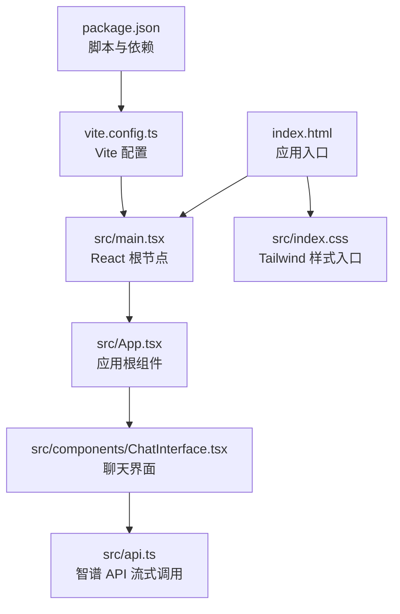
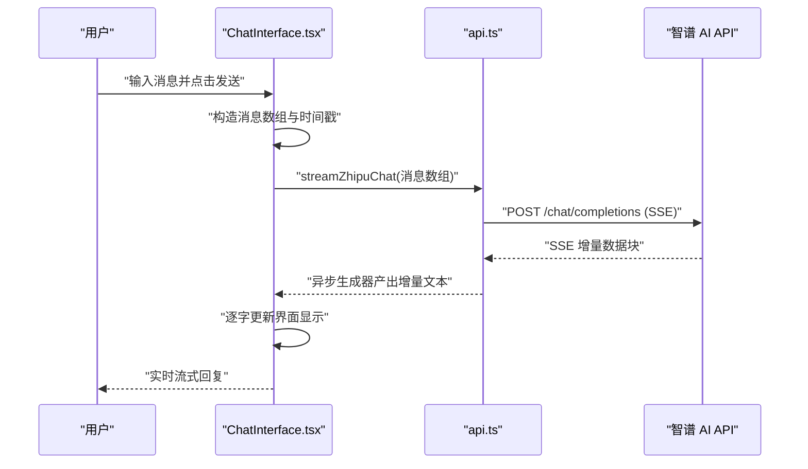
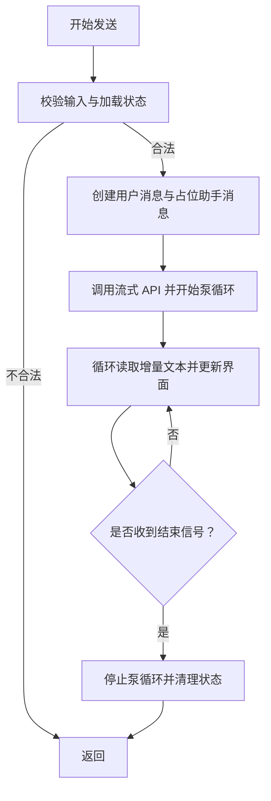
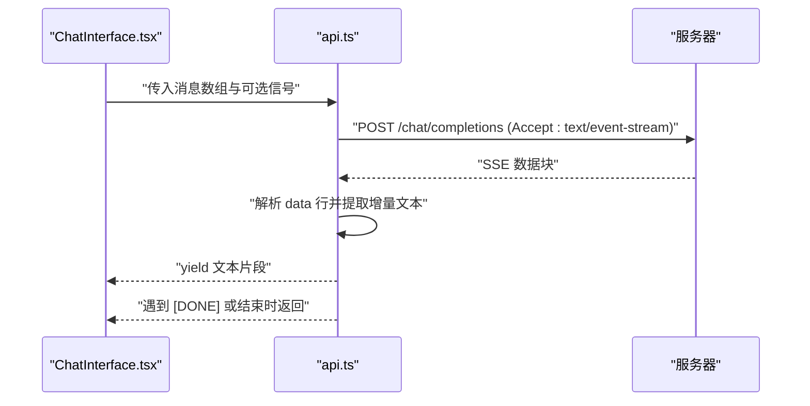
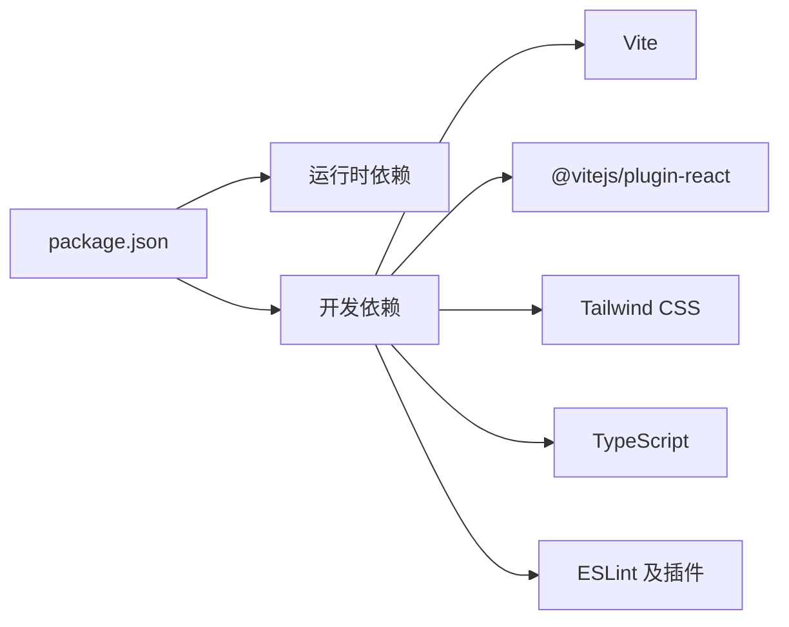

# 快速开始

<cite>
**本文引用的文件**
- [package.json](file://package.json)
- [vite.config.ts](file://vite.config.ts)
- [index.html](file://index.html)
- [src/main.tsx](file://src/main.tsx)
- [src/App.tsx](file://src/App.tsx)
- [src/components/ChatInterface.tsx](file://src/components/ChatInterface.tsx)
- [src/api.ts](file://src/api.ts)
- [src/types.ts](file://src/types.ts)
- [src/index.css](file://src/index.css)
- [eslint.config.js](file://eslint.config.js)
- [tsconfig.json](file://tsconfig.json)
- [PRD.md](file://PRD.md)
- [AGENTS.md](file://AGENTS.md)
- [TECH_DESIGN.md](file://TECH_DESIGN.md)
</cite>

## 目录
1. [简介](#简介)
2. [项目结构](#项目结构)
3. [核心组件](#核心组件)
4. [架构总览](#架构总览)
5. [详细组件分析](#详细组件分析)
6. [依赖分析](#依赖分析)
7. [性能考虑](#性能考虑)
8. [故障排查指南](#故障排查指南)
9. [结论](#结论)
10. [附录](#附录)

## 简介
本指南面向首次接触本项目的开发者，帮助你在约 30 分钟内完成环境准备、项目克隆、依赖安装与开发服务器启动，并成功运行 AI 聊天助手。你将了解关键配置文件的作用、必要的环境变量配置、常见初始化问题及解决方案，以及如何进行基础的功能验证。

## 项目结构
该项目采用 React + TypeScript + Vite 构建，使用 Tailwind CSS 进行样式组织，前端通过智谱 AI 的 Chat Completions API 实现流式对话能力。核心入口为 HTML 页面中的挂载点，随后由 React 应用渲染聊天界面组件。

图表来源
- [index.html:1-14](file://index.html#L1-L14)
- [src/main.tsx:1-11](file://src/main.tsx#L1-L11)
- [src/App.tsx:1-8](file://src/App.tsx#L1-L8)
- [src/components/ChatInterface.tsx:1-344](file://src/components/ChatInterface.tsx#L1-L344)
- [src/api.ts:1-184](file://src/api.ts#L1-L184)
- [src/index.css:1-56](file://src/index.css#L1-L56)
- [vite.config.ts:1-14](file://vite.config.ts#L1-L14)
- [package.json:1-36](file://package.json#L1-L36)

章节来源
- [index.html:1-14](file://index.html#L1-L14)
- [src/main.tsx:1-11](file://src/main.tsx#L1-L11)
- [src/App.tsx:1-8](file://src/App.tsx#L1-L8)
- [vite.config.ts:1-14](file://vite.config.ts#L1-L14)
- [package.json:1-36](file://package.json#L1-L36)

## 核心组件
- 应用入口与渲染
  - HTML 入口负责挂载 React 根节点，随后由 main.tsx 创建根实例并渲染 App。
- 应用根组件
  - App.tsx 将界面委托给 ChatInterface，后者承载所有交互逻辑。
- 聊天界面
  - ChatInterface.tsx 负责消息列表渲染、输入处理、发送流程、流式展示与错误提示。
- API 层
  - api.ts 提供 streamZhipuChat 异步生成器，封装 SSE 流式响应解析与错误格式化。
- 类型定义
  - types.ts 定义消息结构，保证前后端数据一致性。
- 样式与构建
  - index.css 引入 Tailwind；vite.config.ts 配置插件与路径别名；package.json 提供开发/构建脚本。

章节来源
- [src/main.tsx:1-11](file://src/main.tsx#L1-L11)
- [src/App.tsx:1-8](file://src/App.tsx#L1-L8)
- [src/components/ChatInterface.tsx:1-344](file://src/components/ChatInterface.tsx#L1-L344)
- [src/api.ts:1-184](file://src/api.ts#L1-L184)
- [src/types.ts:1-9](file://src/types.ts#L1-L9)
- [src/index.css:1-56](file://src/index.css#L1-L56)
- [vite.config.ts:1-14](file://vite.config.ts#L1-L14)
- [package.json:1-36](file://package.json#L1-L36)

## 架构总览
下图展示了从用户输入到流式响应的关键调用链路，以及与外部 API 的交互方式。

图表来源
- [src/components/ChatInterface.tsx:106-182](file://src/components/ChatInterface.tsx#L106-L182)
- [src/api.ts:70-183](file://src/api.ts#L70-L183)

章节来源
- [src/components/ChatInterface.tsx:106-182](file://src/components/ChatInterface.tsx#L106-L182)
- [src/api.ts:70-183](file://src/api.ts#L70-L183)

## 详细组件分析

### 组件一：聊天界面（ChatInterface）
- 职责
  - 管理消息列表、输入状态、加载与错误状态。
  - 实现流式展示：通过 requestAnimationFrame 控制“逐字”显示。
  - 处理发送、取消、复制、滚动至底部等交互。
- 关键流程（发送消息）
  - 校验输入与加载状态。
  - 构造用户消息与占位助手消息。
  - 调用流式 API，累积增量文本并更新界面。
  - 捕获异常并友好提示。
- 逐字展示算法
  - 维护目标缓冲区与已展示长度，按帧增量更新，避免阻塞主线程。

图表来源
- [src/components/ChatInterface.tsx:51-104](file://src/components/ChatInterface.tsx#L51-L104)
- [src/components/ChatInterface.tsx:106-182](file://src/components/ChatInterface.tsx#L106-L182)

章节来源
- [src/components/ChatInterface.tsx:1-344](file://src/components/ChatInterface.tsx#L1-L344)

### 组件二：API 层（streamZhipuChat）
- 职责
  - 从环境变量读取 API Key、Base URL 与模型名。
  - 通过 fetch 发起 SSE 请求，解析 data 行，提取增量文本。
  - 对网络错误、HTTP 非 OK、流中断等情况进行统一错误处理。
- 关键点
  - 使用 AbortController 支持取消请求。
  - 解析 SSE 事件行，过滤注释与空行，识别 [DONE] 结束标记。
  - 对模型返回的 error 字段进行格式化提示。

图表来源
- [src/api.ts:70-183](file://src/api.ts#L70-L183)

章节来源
- [src/api.ts:1-184](file://src/api.ts#L1-L184)

### 组件三：类型系统（Message）
- 角色限定为 user/assistant，包含内容与时间戳。
- 作为消息序列的基础单元，贯穿 ChatInterface 与 API 层的数据传递。

章节来源
- [src/types.ts:1-9](file://src/types.ts#L1-L9)

### 组件四：样式与构建（Tailwind/Vite）
- Tailwind 通过 @tailwindcss/vite 插件集成，CSS 通过 @import 引入。
- Vite 配置了 React 插件与路径别名，便于模块导入。
- package.json 提供 dev/build/preview/lint 脚本，满足开发与预览需求。

章节来源
- [src/index.css:1-56](file://src/index.css#L1-L56)
- [vite.config.ts:1-14](file://vite.config.ts#L1-L14)
- [package.json:1-36](file://package.json#L1-L36)

## 依赖分析
- 运行时依赖
  - React 生态与 react-markdown、react-syntax-highlighter 用于界面与代码高亮。
- 开发依赖
  - Vite、@vitejs/plugin-react、Tailwind CSS、TypeScript、ESLint 及相关插件。
- 构建与脚本
  - dev 启动开发服务器，build 执行类型检查与打包，preview 预览生产包，lint 运行代码检查。

图表来源
- [package.json:1-36](file://package.json#L1-L36)

章节来源
- [package.json:1-36](file://package.json#L1-L36)
- [eslint.config.js:1-29](file://eslint.config.js#L1-L29)
- [tsconfig.json:1-5](file://tsconfig.json#L1-L5)

## 性能考虑
- 流式渲染
  - 使用 requestAnimationFrame 控制逐字展示，避免长文本导致的卡顿。
- 取消与去抖
  - 每次发送前创建新的 AbortController，及时取消上一次请求，防止竞态。
- UI 状态最小化
  - 仅更新最后一条助手消息的内容，减少不必要的重渲染。
- 构建优化
  - 使用 Vite 的原生热更新与按需编译，提升开发体验。

## 故障排查指南
- 未配置 API Key
  - 现象：启动后立即报错，提示未配置 VITE_ZHIPU_API_KEY。
  - 处理：在项目根目录创建 .env 文件，写入智谱开放平台 API Key。
  - 参考：[src/api.ts:23-38](file://src/api.ts#L23-L38)
- 网络连接异常
  - 现象：TypeError 导致网络连接异常提示。
  - 处理：检查网络、代理或防火墙设置后重试。
  - 参考：[src/api.ts:95-102](file://src/api.ts#L95-L102)
- HTTP 非 OK
  - 现象：接口返回非 2xx，错误信息来自响应体或文本。
  - 处理：根据返回的 message 或 error 字段调整请求参数或权限。
  - 参考：[src/api.ts:104-123](file://src/api.ts#L104-L123)
- 流中断或无法读取
  - 现象：提示无法读取模型回复或连接中断。
  - 处理：刷新页面或稍后再试，确认网络稳定。
  - 参考：[src/api.ts:125-139](file://src/api.ts#L125-L139)
- 环境变量未生效
  - 现象：修改 .env 后未生效。
  - 处理：重启开发服务器，确保 Vite 重新加载环境变量。
  - 参考：[vite.config.ts:1-14](file://vite.config.ts#L1-L14)
- 路径别名无效
  - 现象：导入 @/xxx 报错。
  - 处理：确认 Vite 别名配置正确且拼写无误。
  - 参考：[vite.config.ts:8-12](file://vite.config.ts#L8-L12)
- 样式未加载
  - 现象：界面样式缺失。
  - 处理：确认 Tailwind 插件已启用，CSS 正确引入。
  - 参考：[src/index.css:1-1](file://src/index.css#L1-L1)
- TypeScript/ESLint 报错
  - 处理：根据 lint 输出修复类型或规则问题。
  - 参考：[eslint.config.js:1-29](file://eslint.config.js#L1-L29)

章节来源
- [src/api.ts:23-38](file://src/api.ts#L23-L38)
- [src/api.ts:95-139](file://src/api.ts#L95-L139)
- [vite.config.ts:1-14](file://vite.config.ts#L1-L14)
- [src/index.css:1-1](file://src/index.css#L1-L1)
- [eslint.config.js:1-29](file://eslint.config.js#L1-L29)

## 结论
按照本指南完成环境准备与初始化配置后，你将能在 30 分钟内成功运行项目并进行基本交互。建议在开发过程中关注 API Key 的安全性与网络稳定性，并结合 ESLint 与 TypeScript 提升代码质量。

## 附录

### 环境要求
- Node.js 版本：与项目使用的 TypeScript、Vite 版本兼容即可（建议使用长期支持版本）。
- 包管理器：npm、yarn 或 pnpm 均可，推荐使用与团队一致的工具。
- 浏览器：现代浏览器即可，支持 fetch 与 AbortController。

### 克隆与安装步骤
- 克隆仓库到本地
  - 示例命令：git clone <仓库地址>
- 进入项目目录
  - 示例命令：cd chat
- 安装依赖
  - 示例命令：npm install
- 创建环境变量文件
  - 在项目根目录创建 .env 文件，写入 VITE_ZHIPU_API_KEY=你的API密钥
- 启动开发服务器
  - 示例命令：npm run dev
  - 预期输出：Vite 启动成功，控制台显示本地访问地址（如 http://localhost:5173）

章节来源
- [package.json:6-11](file://package.json#L6-L11)
- [src/api.ts:23-38](file://src/api.ts#L23-L38)

### 关键配置说明
- package.json
  - scripts：提供 dev、build、preview、lint 四类常用命令。
  - dependencies/devDependencies：声明运行时与开发依赖。
- vite.config.ts
  - plugins：启用 React 与 Tailwind 插件。
  - resolve.alias：配置 @ 到 src 的路径别名。
- index.html
  - 挂载点与入口脚本：将 React 应用挂载到 #root。
- src/index.css
  - 引入 Tailwind 并定义 Markdown 气泡样式。
- eslint.config.js
  - 配置 TypeScript 与 React Hooks 规则，忽略 dist 目录。
- tsconfig.json
  - 使用 references 聚合 app 与 node 配置。

章节来源
- [package.json:1-36](file://package.json#L1-L36)
- [vite.config.ts:1-14](file://vite.config.ts#L1-L14)
- [index.html:1-14](file://index.html#L1-L14)
- [src/index.css:1-56](file://src/index.css#L1-L56)
- [eslint.config.js:1-29](file://eslint.config.js#L1-L29)
- [tsconfig.json:1-5](file://tsconfig.json#L1-L5)

### 初始化问题与解决方案清单
- 未配置 VITE_ZHIPU_API_KEY → 在 .env 写入 API Key 并重启开发服务器
- 网络错误 → 检查代理/防火墙，重试
- 非 2xx 响应 → 查看返回的 message/error 字段，修正请求
- 流中断 → 刷新页面或稍后再试
- 路径别名无效 → 检查 vite.config.ts 的 alias 配置
- 样式缺失 → 确认 Tailwind 插件与 CSS 引入
- ESLint/TS 报错 → 根据规则修复类型或语法

章节来源
- [src/api.ts:23-38](file://src/api.ts#L23-L38)
- [src/api.ts:95-139](file://src/api.ts#L95-L139)
- [vite.config.ts:8-12](file://vite.config.ts#L8-L12)
- [src/index.css:1-1](file://src/index.css#L1-L1)
- [eslint.config.js:1-29](file://eslint.config.js#L1-L29)

### 验证安装成功的简单测试
- 启动开发服务器后，在浏览器打开本地地址。
- 在输入框中输入一段简短的测试消息，点击发送或按回车。
- 观察界面是否出现逐字显示的 AI 回复，且无明显错误提示。
- 若出现 API Key 相关错误，请回到 .env 文件核对配置并重启服务。

章节来源
- [src/components/ChatInterface.tsx:106-182](file://src/components/ChatInterface.tsx#L106-L182)
- [src/api.ts:70-183](file://src/api.ts#L70-L183)