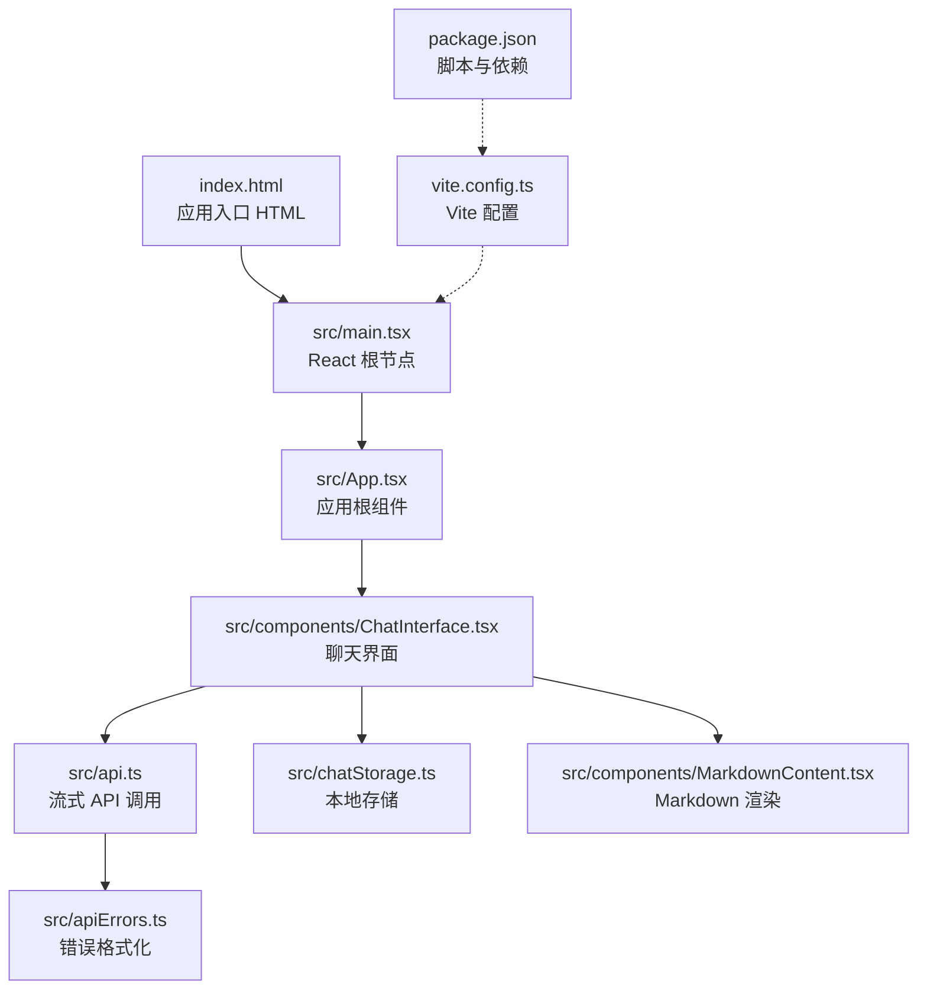
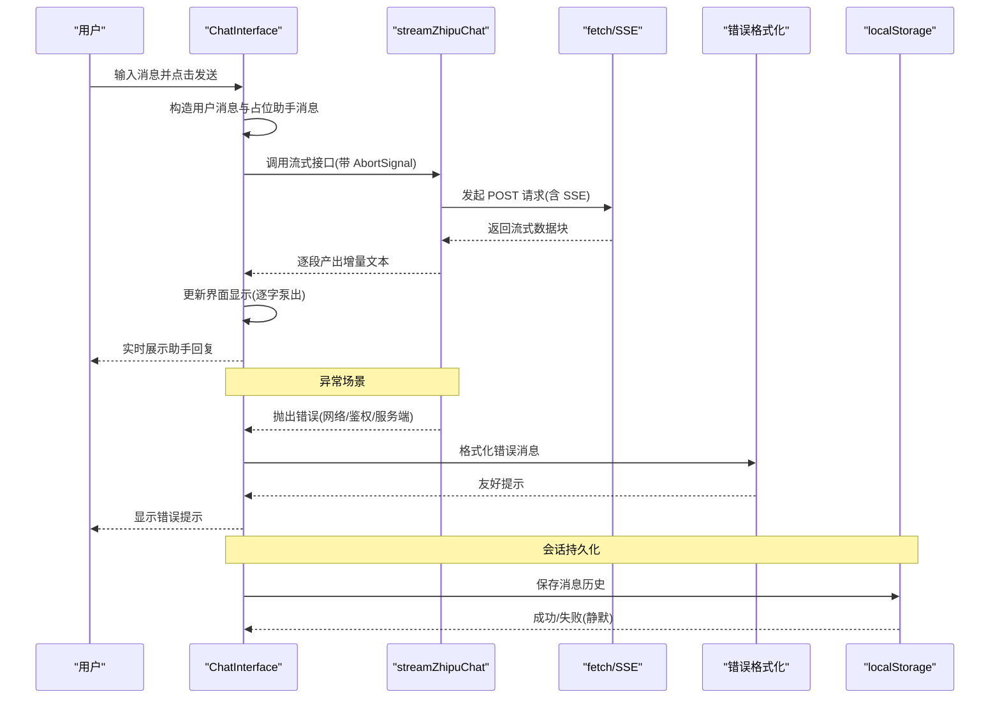
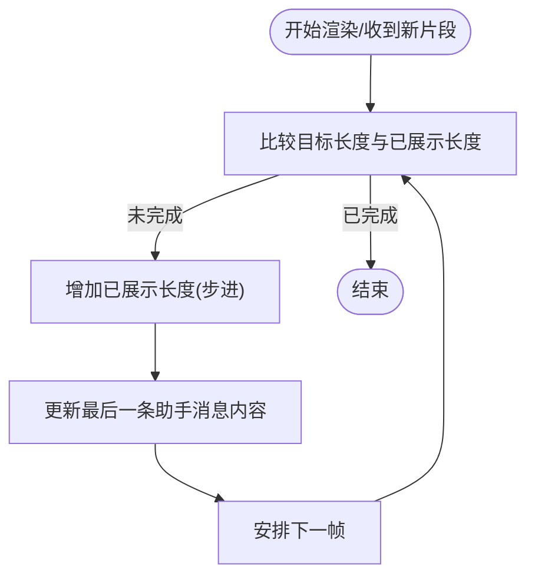
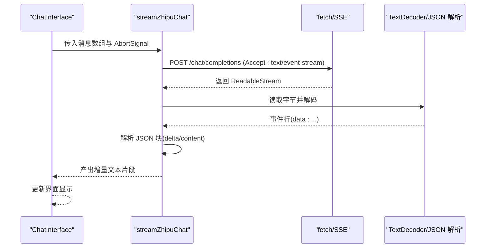
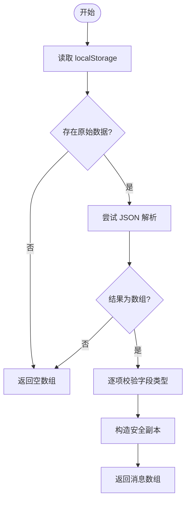
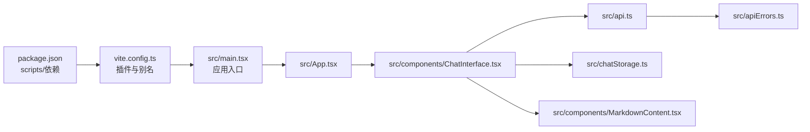

# 故障排除与常见问题

<cite>
**本文引用的文件**
- [package.json](file://package.json)
- [vite.config.ts](file://vite.config.ts)
- [index.html](file://index.html)
- [src/main.tsx](file://src/main.tsx)
- [src/App.tsx](file://src/App.tsx)
- [src/types.ts](file://src/types.ts)
- [src/api.ts](file://src/api.ts)
- [src/apiErrors.ts](file://src/apiErrors.ts)
- [src/chatStorage.ts](file://src/chatStorage.ts)
- [src/components/ChatInterface.tsx](file://src/components/ChatInterface.tsx)
- [src/components/MarkdownContent.tsx](file://src/components/MarkdownContent.tsx)
- [eslint.config.js](file://eslint.config.js)
</cite>

## 目录
1. [简介](#简介)
2. [项目结构](#项目结构)
3. [核心组件](#核心组件)
4. [架构总览](#架构总览)
5. [详细组件分析](#详细组件分析)
6. [依赖关系分析](#依赖关系分析)
7. [性能考虑](#性能考虑)
8. [故障排除指南](#故障排除指南)
9. [结论](#结论)
10. [附录](#附录)

## 简介
本文件面向开发者与使用者，提供本聊天应用在开发与运行过程中的系统化故障排除与常见问题解答。内容覆盖环境配置、依赖安装、构建与预览、API 集成（网络、认证、流式响应）、本地存储（localStorage）与权限、浏览器兼容性、性能与内存、调试与日志、以及问题反馈与社区支持建议。

## 项目结构
该项目基于 Vite + React + TypeScript 构建，采用前端单页应用架构，主要源码位于 src 目录，入口为 main.tsx，应用根组件为 App.tsx；聊天界面由 ChatInterface 组件负责，消息持久化通过 chatStorage.ts 访问浏览器 localStorage，API 调用封装于 api.ts 并统一错误格式化。

图表来源
- [index.html](file://index.html)
- [src/main.tsx](file://src/main.tsx)
- [src/App.tsx](file://src/App.tsx)
- [src/components/ChatInterface.tsx](file://src/components/ChatInterface.tsx)
- [src/api.ts](file://src/api.ts)
- [src/apiErrors.ts](file://src/apiErrors.ts)
- [src/chatStorage.ts](file://src/chatStorage.ts)
- [src/components/MarkdownContent.tsx](file://src/components/MarkdownContent.tsx)
- [vite.config.ts](file://vite.config.ts)
- [package.json](file://package.json)

章节来源
- [index.html](file://index.html)
- [src/main.tsx](file://src/main.tsx)
- [src/App.tsx](file://src/App.tsx)
- [vite.config.ts](file://vite.config.ts)
- [package.json](file://package.json)

## 核心组件
- 应用入口与根组件：负责挂载 React 根节点与渲染应用。
- 聊天界面：负责消息列表渲染、输入处理、发送逻辑、流式响应消费、错误提示与复制功能。
- API 层：封装智谱 Chat Completions 流式接口调用，解析 SSE 数据，统一错误格式化。
- 本地存储：封装 localStorage 的读取、保存与清理，具备容错与隐私模式保护。
- Markdown 渲染：基于 react-markdown 与 Prism 语法高亮，支持多种语言别名映射。
- 类型定义：Message 与 MessageRole 的类型约束，确保数据结构一致性。

章节来源
- [src/main.tsx](file://src/main.tsx)
- [src/App.tsx](file://src/App.tsx)
- [src/components/ChatInterface.tsx](file://src/components/ChatInterface.tsx)
- [src/api.ts](file://src/api.ts)
- [src/apiErrors.ts](file://src/apiErrors.ts)
- [src/chatStorage.ts](file://src/chatStorage.ts)
- [src/components/MarkdownContent.tsx](file://src/components/MarkdownContent.tsx)
- [src/types.ts](file://src/types.ts)

## 架构总览
下图展示了从用户输入到流式响应展示的关键路径，以及错误处理与本地存储交互。

图表来源
- [src/components/ChatInterface.tsx](file://src/components/ChatInterface.tsx)
- [src/api.ts](file://src/api.ts)
- [src/apiErrors.ts](file://src/apiErrors.ts)
- [src/chatStorage.ts](file://src/chatStorage.ts)

## 详细组件分析

### 组件一：ChatInterface（聊天界面）
职责与行为
- 管理消息列表、输入框、加载态与错误态。
- 使用 AbortController 控制请求取消，避免竞态。
- 使用 requestAnimationFrame 实现“逐字”打字机效果。
- 处理键盘事件（Enter 发送，Shift+Enter 换行）。
- 错误处理：区分取消、网络异常、服务端错误并给出友好提示。
- 复制功能：通过 Clipboard API 写入剪贴板，失败时提示权限问题。

关键流程图（逐字泵出）

图表来源
- [src/components/ChatInterface.tsx](file://src/components/ChatInterface.tsx)

章节来源
- [src/components/ChatInterface.tsx](file://src/components/ChatInterface.tsx)

### 组件二：API 层（流式接口）
职责与行为
- 从环境变量读取 API Key、基础地址与模型名。
- 构造 SSE 请求，解析 data 行，提取增量文本。
- 统一处理网络异常、HTTP 非 OK、流式中断、尾部垃圾数据等。
- 将服务端错误映射为用户可读提示。

序列图（流式响应）

图表来源
- [src/api.ts](file://src/api.ts)

章节来源
- [src/api.ts](file://src/api.ts)

### 组件三：本地存储（localStorage）
职责与行为
- 读取：从 localStorage 获取并解析消息数组，进行类型校验，异常时返回空数组。
- 写入：将消息数组序列化后保存，异常时静默失败（配额满、隐私模式等）。
- 清理：移除指定键，异常时忽略。

流程图（读取）

图表来源
- [src/chatStorage.ts](file://src/chatStorage.ts)

章节来源
- [src/chatStorage.ts](file://src/chatStorage.ts)

### 组件四：Markdown 渲染
职责与行为
- 支持内联代码与代码块高亮，根据主题调整内联代码样式。
- 提供语言别名映射，增强可用性。
- 使用 useMemo 缓存组件配置，减少重复渲染。

章节来源
- [src/components/MarkdownContent.tsx](file://src/components/MarkdownContent.tsx)

## 依赖关系分析
- 构建与开发：Vite 提供开发服务器与打包能力；TailwindCSS 与 @tailwindcss/vite 插件用于样式；React 插件加速开发体验。
- 运行时依赖：React 生态、react-markdown 与 react-syntax-highlighter 用于界面与代码高亮。
- 开发依赖：TypeScript、ESLint、TailwindCSS、Vite 等工具链。

图表来源
- [package.json](file://package.json)
- [vite.config.ts](file://vite.config.ts)
- [src/main.tsx](file://src/main.tsx)
- [src/App.tsx](file://src/App.tsx)
- [src/components/ChatInterface.tsx](file://src/components/ChatInterface.tsx)
- [src/api.ts](file://src/api.ts)
- [src/apiErrors.ts](file://src/apiErrors.ts)
- [src/chatStorage.ts](file://src/chatStorage.ts)
- [src/components/MarkdownContent.tsx](file://src/components/MarkdownContent.tsx)

章节来源
- [package.json](file://package.json)
- [vite.config.ts](file://vite.config.ts)
- [eslint.config.js](file://eslint.config.js)

## 性能考虑
- 流式渲染：通过 requestAnimationFrame 控制“逐字”展示，避免主线程阻塞；CHARS_PER_FRAME 可调以平衡流畅度与实时性。
- 渲染优化：Markdown 渲染组件使用 useMemo 缓存组件配置；代码块高亮仅在需要时渲染。
- 存储优化：本地存储读取时进行类型校验与过滤，避免无效数据影响渲染。
- 网络优化：SSE 流式读取，及时释放 reader；对非 OK 状态进行快速失败与错误提示。

[本节为通用指导，无需列出章节来源]

## 故障排除指南

### 一、环境配置与依赖问题
- 环境变量未配置
  - 现象：启动时报错提示未配置 API Key 或读取失败。
  - 排查：确认项目根目录存在 .env 文件，且包含 VITE_ZHIPU_API_KEY；必要时检查 VITE_ZHIPU_API_BASE 与 VITE_ZHIPU_MODEL。
  - 参考路径：[src/api.ts](file://src/api.ts)
- 依赖安装失败或版本冲突
  - 现象：npm install/yarn/pnpm 报错、模块解析失败。
  - 排查：删除 node_modules 与锁定文件后重装；核对 package.json 中依赖版本与 Node 版本兼容性。
  - 参考路径：[package.json](file://package.json)
- 构建失败
  - 现象：tsc 或 vite build 报错。
  - 排查：先执行类型检查修复错误；检查 Vite 插件与别名配置；查看 ESLint 规则是否导致报错。
  - 参考路径：[vite.config.ts](file://vite.config.ts)、[eslint.config.js](file://eslint.config.js)、[package.json](file://package.json)

章节来源
- [src/api.ts](file://src/api.ts)
- [package.json](file://package.json)
- [vite.config.ts](file://vite.config.ts)
- [eslint.config.js](file://eslint.config.js)

### 二、API 集成问题（网络、认证、流式）
- 网络错误
  - 现象：提示网络连接异常，无法发起请求或中途断开。
  - 排查：检查网络连通性、代理/防火墙设置；确认 VITE_ZHIPU_API_BASE 地址正确；观察浏览器网络面板。
  - 参考路径：[src/api.ts](file://src/api.ts)、[src/apiErrors.ts](file://src/apiErrors.ts)
- 认证失败（401）
  - 现象：提示 API Key 无效或未授权。
  - 排查：确认 .env 中 VITE_ZHIPU_API_KEY 正确；检查账户状态、模型权限与配额；核对基础地址与模型名。
  - 参考路径：[src/api.ts](file://src/api.ts)、[src/apiErrors.ts](file://src/apiErrors.ts)
- 服务端错误（4xx/5xx）
  - 现象：提示请求参数错误、接口不存在、服务不可用等。
  - 排查：根据状态码与详情信息调整请求参数、模型与基础地址；关注限流与配额。
  - 参考路径：[src/apiErrors.ts](file://src/apiErrors.ts)
- 流式响应异常
  - 现象：连接中断、无法完整接收回复、SSE 数据解析失败。
  - 排查：确认服务端支持 SSE；检查网络稳定性；留意 reader 释放与异常捕获；验证尾部数据处理。
  - 参考路径：[src/api.ts](file://src/api.ts)

章节来源
- [src/api.ts](file://src/api.ts)
- [src/apiErrors.ts](file://src/apiErrors.ts)

### 三、本地存储与权限问题
- 无法保存/读取
  - 现象：消息未持久化或加载为空。
  - 排查：检查浏览器隐私模式或存储配额限制；确认 localStorage 可用；查看控制台是否有异常。
  - 参考路径：[src/chatStorage.ts](file://src/chatStorage.ts)
- 数据损坏或类型不匹配
  - 现象：读取返回空数组或渲染异常。
  - 排查：确认存储键值正确；检查数据结构是否符合 Message 接口；必要时清理存储后重试。
  - 参考路径：[src/chatStorage.ts](file://src/chatStorage.ts)、[src/types.ts](file://src/types.ts)
- 复制功能失败
  - 现象：提示无法复制到剪贴板。
  - 排查：检查浏览器权限与安全上下文（HTTPS）；尝试手动选择复制。
  - 参考路径：[src/components/ChatInterface.tsx](file://src/components/ChatInterface.tsx)

章节来源
- [src/chatStorage.ts](file://src/chatStorage.ts)
- [src/types.ts](file://src/types.ts)
- [src/components/ChatInterface.tsx](file://src/components/ChatInterface.tsx)

### 四、浏览器兼容性与性能问题
- 兼容性问题
  - 现象：部分浏览器不支持 fetch/AbortController/SSE/Clipboard API。
  - 排查：确认目标浏览器版本；对缺失特性添加 polyfill 或降级方案；测试不同设备与系统。
- 性能瓶颈
  - 现象：大段回复渲染卡顿、内存占用上升。
  - 排查：降低逐字步进速度；拆分长消息；避免不必要的重渲染；使用 React.memo/useMemo 优化渲染。
- 内存泄漏
  - 现象：长时间使用后内存持续增长。
  - 排查：确保取消请求时释放 reader 与动画帧；避免闭包持有过期引用；定期清理定时器与订阅。

[本节为通用指导，无需列出章节来源]

### 五、调试与日志分析
- 调试工具
  - 浏览器 DevTools：网络面板观察请求与 SSE；Console 查看错误；Elements 检查渲染；Performance 分析性能。
  - React DevTools：检查组件树与状态变化。
- 日志与错误解读
  - 友好错误：通过 formatChatApiError/friendlyHttpStatus 将底层错误映射为中文提示。
  - 关键点：区分 AbortError（用户取消）、网络异常（Failed to fetch）、服务端错误（状态码与详情）。
- 建议流程
  - 启用严格模式与 ESLint 规范；在 ChatInterface 中临时打印关键状态；在网络面板中抓取请求与响应摘要。

章节来源
- [src/apiErrors.ts](file://src/apiErrors.ts)
- [src/components/ChatInterface.tsx](file://src/components/ChatInterface.tsx)

### 六、问题反馈与社区支持
- 反馈前准备
  - 环境信息：操作系统、浏览器版本、Node 版本、依赖版本。
  - 复现步骤：最小可复现示例、关键配置（.env 示例但不泄露密钥）。
  - 日志与截图：网络面板快照、Console 截图、错误提示。
- 社区渠道
  - GitHub Issues：提交问题与建议，遵循模板。
  - 讨论区：分享经验与寻求帮助。
  - 文档与示例：参考本仓库 README/PRD/TECH_DESIGN 与现有实现。

[本节为通用指导，无需列出章节来源]

## 结论
本指南围绕环境配置、依赖管理、API 集成、本地存储、浏览器兼容性与性能等方面提供了系统化的排障思路与实践建议。建议在开发与发布前完成环境与依赖验证、API 权限与配额检查、本地存储与权限测试，并结合调试工具与日志进行问题定位。对于持续集成与发布，建议加入自动化测试与监控埋点，以便更早发现问题。

[本节为总结性内容，无需列出章节来源]

## 附录

### A. 常见错误码与提示对照（摘自错误格式化）
- 400：请求参数有问题
- 401：API Key 无效或未授权
- 403：没有权限访问该接口
- 404：请求的接口或模型不存在
- 408：请求超时
- 429：请求过于频繁
- 5xx：服务暂时不可用

章节来源
- [src/apiErrors.ts](file://src/apiErrors.ts)

### B. 关键实现路径索引
- 入口与根组件：[src/main.tsx](file://src/main.tsx)、[src/App.tsx](file://src/App.tsx)
- 聊天界面与交互：[src/components/ChatInterface.tsx](file://src/components/ChatInterface.tsx)
- API 调用与流式处理：[src/api.ts](file://src/api.ts)
- 错误格式化：[src/apiErrors.ts](file://src/apiErrors.ts)
- 本地存储：[src/chatStorage.ts](file://src/chatStorage.ts)
- Markdown 渲染：[src/components/MarkdownContent.tsx](file://src/components/MarkdownContent.tsx)
- 构建与配置：[vite.config.ts](file://vite.config.ts)、[package.json](file://package.json)、[eslint.config.js](file://eslint.config.js)

[本节为索引性内容，无需列出章节来源]