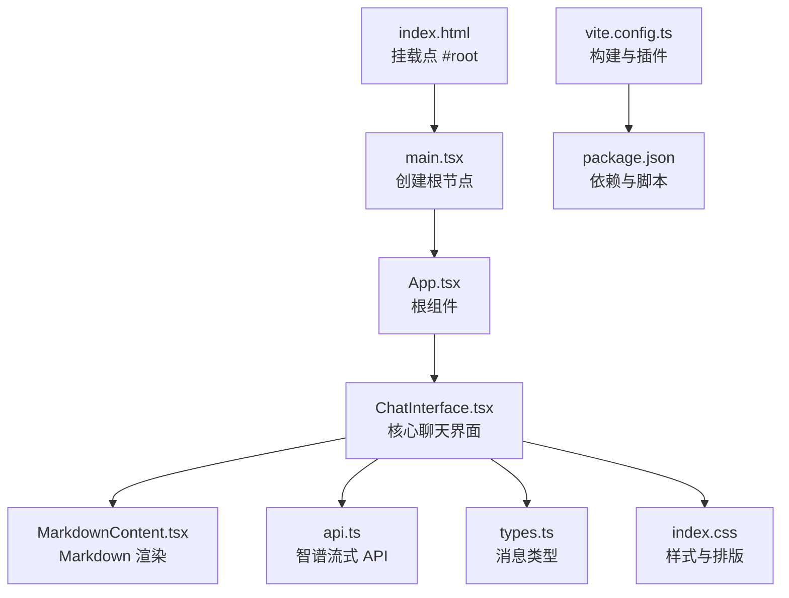
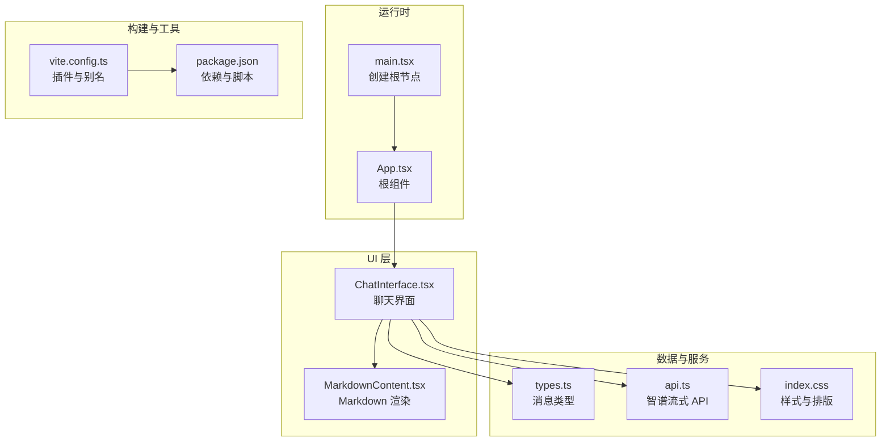
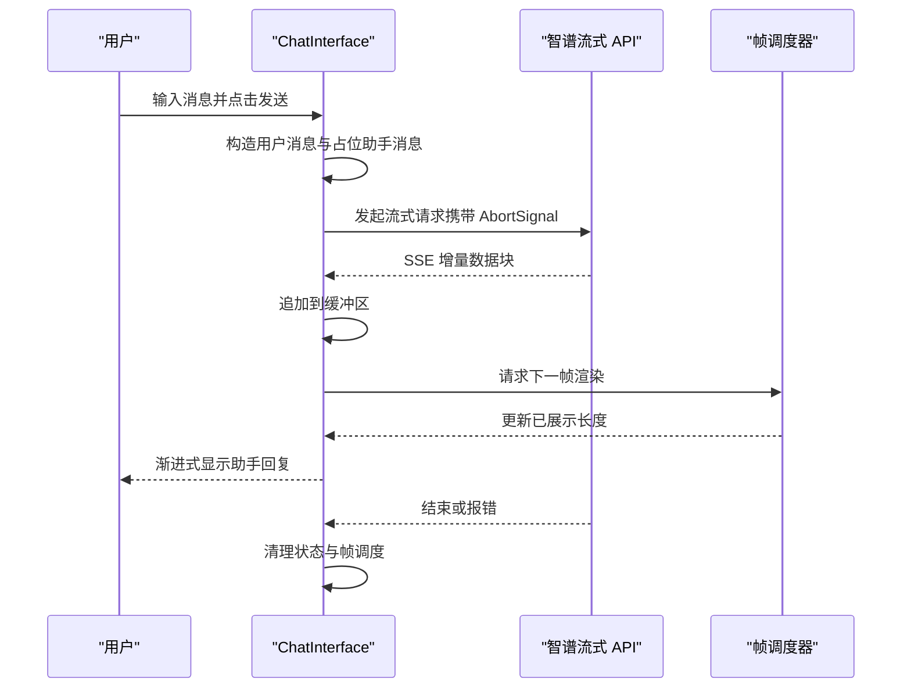
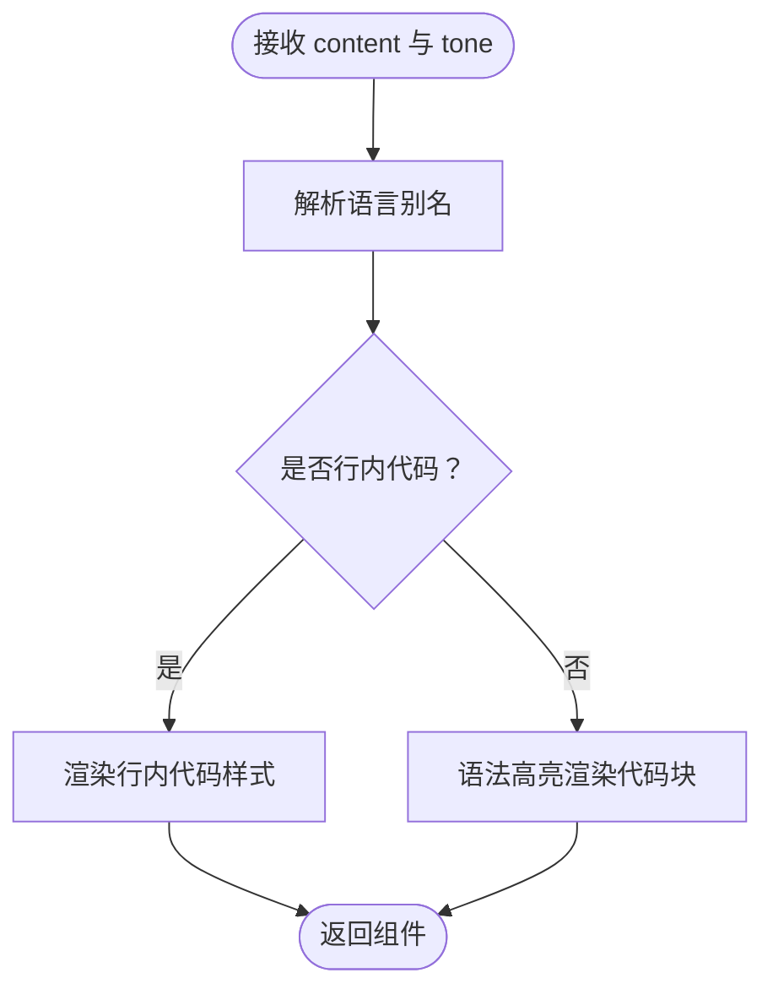
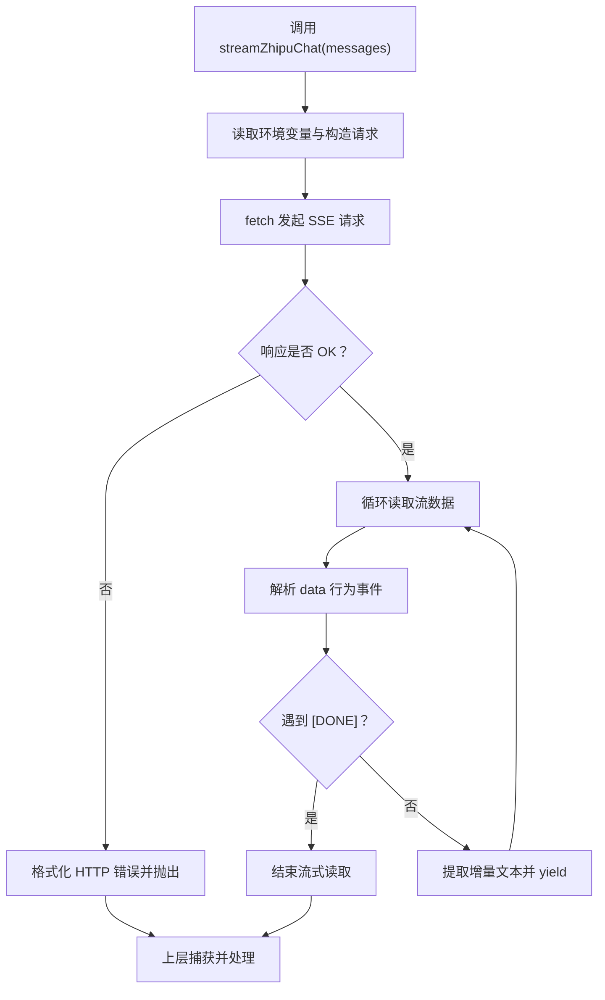
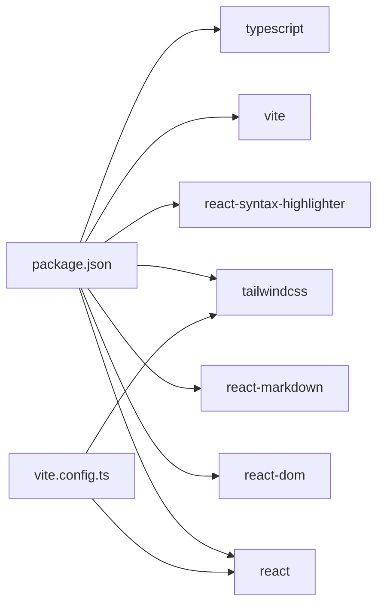

# 整体架构

<cite>
**本文引用的文件**
- [src/main.tsx](file://src/main.tsx)
- [src/App.tsx](file://src/App.tsx)
- [src/components/ChatInterface.tsx](file://src/components/ChatInterface.tsx)
- [src/components/MarkdownContent.tsx](file://src/components/MarkdownContent.tsx)
- [src/api.ts](file://src/api.ts)
- [src/types.ts](file://src/types.ts)
- [src/index.css](file://src/index.css)
- [vite.config.ts](file://vite.config.ts)
- [package.json](file://package.json)
- [index.html](file://index.html)
- [TECH_DESIGN.md](file://TECH_DESIGN.md)
</cite>

## 目录
1. [引言](#引言)
2. [项目结构](#项目结构)
3. [核心组件](#核心组件)
4. [架构总览](#架构总览)
5. [详细组件分析](#详细组件分析)
6. [依赖分析](#依赖分析)
7. [性能考虑](#性能考虑)
8. [故障排查指南](#故障排查指南)
9. [结论](#结论)
10. [附录](#附录)

## 引言
本项目是一个基于 React + TypeScript 的单页应用（SPA），采用函数组件与 Hooks 模式构建，围绕“聊天界面”这一核心功能展开。应用通过调用智谱 AI 的流式 Chat Completions API 实现“边写边读”的对话体验；同时使用 Markdown 渲染与语法高亮增强消息展示效果。本文档从架构视角梳理入口点、根组件、核心功能组件、数据流与状态管理策略，并给出组件间通信机制、系统边界与性能优化建议。

## 项目结构
项目采用“入口文件 → 根组件 → 功能组件”的分层组织方式：
- 入口点负责挂载根组件；
- 根组件仅承担“转发职责”，将渲染委托给核心功能组件；
- 核心功能组件负责完整的业务逻辑与 UI 组合；
- 辅助组件负责特定展示能力（如 Markdown 渲染）；
- API 层封装外部服务交互；
- 类型定义统一数据契约；
- 构建与样式通过 Vite 与 Tailwind 配置集成。

**图示来源**
- [index.html:1-14](file://index.html#L1-L14)
- [src/main.tsx:1-11](file://src/main.tsx#L1-L11)
- [src/App.tsx:1-8](file://src/App.tsx#L1-L8)
- [src/components/ChatInterface.tsx:1-344](file://src/components/ChatInterface.tsx#L1-L344)
- [src/components/MarkdownContent.tsx:1-129](file://src/components/MarkdownContent.tsx#L1-L129)
- [src/api.ts:1-184](file://src/api.ts#L1-L184)
- [src/types.ts:1-9](file://src/types.ts#L1-L9)
- [src/index.css:1-56](file://src/index.css#L1-L56)
- [vite.config.ts:1-14](file://vite.config.ts#L1-L14)
- [package.json:1-36](file://package.json#L1-L36)

**章节来源**
- [index.html:1-14](file://index.html#L1-L14)
- [src/main.tsx:1-11](file://src/main.tsx#L1-L11)
- [src/App.tsx:1-8](file://src/App.tsx#L1-L8)
- [vite.config.ts:1-14](file://vite.config.ts#L1-L14)
- [package.json:1-36](file://package.json#L1-L36)

## 核心组件
- 根组件 App：极简设计，直接返回核心聊天界面组件，承担“单一职责”与“最小耦合”原则，便于后续扩展或替换。
- ChatInterface：核心功能组件，负责消息列表渲染、输入处理、发送流程、流式渲染、错误处理、复制操作等。
- MarkdownContent：专用展示组件，基于 react-markdown 与 react-syntax-highlighter 提供 Markdown 渲染与代码高亮。
- API 层：封装智谱 API 的流式调用、SSE 解析、错误格式化与环境变量读取。
- 类型系统：统一的消息结构，确保前后端契约一致。

**章节来源**
- [src/App.tsx:1-8](file://src/App.tsx#L1-L8)
- [src/components/ChatInterface.tsx:1-344](file://src/components/ChatInterface.tsx#L1-L344)
- [src/components/MarkdownContent.tsx:1-129](file://src/components/MarkdownContent.tsx#L1-L129)
- [src/api.ts:1-184](file://src/api.ts#L1-L184)
- [src/types.ts:1-9](file://src/types.ts#L1-L9)

## 架构总览
应用采用“自顶向下”的组件化架构，入口点负责初始化运行时，根组件负责路由/容器职责，核心功能组件承载业务逻辑与 UI。数据流以“用户输入 → 状态更新 → 流式 API → 状态更新 → 视图渲染”为主线，配合请求生成器与帧调度实现“打字机式”增量展示。

**图示来源**
- [src/main.tsx:1-11](file://src/main.tsx#L1-L11)
- [src/App.tsx:1-8](file://src/App.tsx#L1-L8)
- [src/components/ChatInterface.tsx:1-344](file://src/components/ChatInterface.tsx#L1-L344)
- [src/components/MarkdownContent.tsx:1-129](file://src/components/MarkdownContent.tsx#L1-L129)
- [src/api.ts:1-184](file://src/api.ts#L1-L184)
- [src/types.ts:1-9](file://src/types.ts#L1-L9)
- [src/index.css:1-56](file://src/index.css#L1-L56)
- [vite.config.ts:1-14](file://vite.config.ts#L1-L14)
- [package.json:1-36](file://package.json#L1-L36)

## 详细组件分析

### 根组件 App 的作用与职责
- 单一职责：将渲染委托给 ChatInterface，保持根组件轻量，便于未来替换或扩展。
- 设计意图：遵循“最小根组件”原则，降低耦合，提升可测试性与可维护性。

**章节来源**
- [src/App.tsx:1-8](file://src/App.tsx#L1-L8)

### ChatInterface 核心功能组件设计理念
- 状态管理：使用 useState 管理消息列表、输入框、加载态与错误信息；使用 useRef 管理滚动、请求生成器、帧调度与流式缓冲。
- 数据流：用户输入 → 构造消息 → 发起流式请求 → 增量拼接 → 帧调度渲染 → 完成清理。
- 错误处理：捕获网络异常、SSE 错误、取消信号与空响应，统一格式化并提示。
- 交互细节：支持 Shift+Enter 换行、复制助手回复、自动滚动到底部、思考中占位等。
- 性能策略：使用 requestAnimationFrame 控制渲染节奏，CHARS_PER_FRAME 控制“打字机”速度；通过请求生成器避免竞态。

**图示来源**
- [src/components/ChatInterface.tsx:106-182](file://src/components/ChatInterface.tsx#L106-L182)
- [src/api.ts:70-183](file://src/api.ts#L70-L183)

**章节来源**
- [src/components/ChatInterface.tsx:1-344](file://src/components/ChatInterface.tsx#L1-L344)

### MarkdownContent 组件
- 职责：将 Markdown 内容渲染为 HTML，并对代码块进行语法高亮。
- 特性：支持多种语言别名映射、行内代码样式区分（用户/助手）、长代码块自动换行与横向滚动。
- 依赖：react-markdown、react-syntax-highlighter（Prism 主题）。

**图示来源**
- [src/components/MarkdownContent.tsx:64-129](file://src/components/MarkdownContent.tsx#L64-L129)

**章节来源**
- [src/components/MarkdownContent.tsx:1-129](file://src/components/MarkdownContent.tsx#L1-L129)

### API 层（智谱流式接口）
- 环境配置：从环境变量读取 API Key、Base URL 与模型名，提供默认值与校验。
- 请求构造：将本地消息转换为智谱 API 的消息数组，启用流式返回。
- SSE 解析：逐行解析 data 行，提取增量文本，处理 [DONE] 结束标记与错误字段。
- 错误处理：对网络异常、HTTP 非 OK、SSE 异常与尾部垃圾数据进行健壮处理。

**图示来源**
- [src/api.ts:23-38](file://src/api.ts#L23-L38)
- [src/api.ts:70-183](file://src/api.ts#L70-L183)

**章节来源**
- [src/api.ts:1-184](file://src/api.ts#L1-L184)

### 类型系统
- Message：统一的消息结构，包含角色、内容与时间戳，确保前后端契约一致。
- 用途：贯穿 ChatInterface、API 层与 MarkdownContent 的数据传递。

**章节来源**
- [src/types.ts:1-9](file://src/types.ts#L1-L9)

## 依赖分析
- 运行时依赖：React、react-dom、react-markdown、react-syntax-highlighter。
- 开发依赖：Vite、TailwindCSS、TypeScript、ESLint 及相关插件。
- 构建配置：Vite 插件链路包含 @vitejs/plugin-react 与 @tailwindcss/vite；路径别名 @ 指向 src。
- 样式：Tailwind 基础与自定义 Markdown 气泡样式，保证微信式紧凑排版。

**图示来源**
- [package.json:12-34](file://package.json#L12-L34)
- [vite.config.ts:1-14](file://vite.config.ts#L1-L14)

**章节来源**
- [package.json:1-36](file://package.json#L1-L36)
- [vite.config.ts:1-14](file://vite.config.ts#L1-L14)

## 性能考虑
- 帧调度渲染：通过 requestAnimationFrame 控制“打字机式”增量展示，CHARS_PER_FRAME 可调，平衡流畅度与实时性。
- 状态更新粒度：使用不可变更新与最小化重渲染，避免不必要的重绘。
- 请求并发控制：使用请求生成器与 AbortController，确保新请求会取消旧请求，防止竞态与内存泄漏。
- 滚动与布局：自动滚动到底部，减少布局抖动；长代码块横向滚动，避免破坏整体布局。
- 样式优化：Tailwind 原子类与自定义 CSS 简洁明确，减少复杂选择器带来的重排风险。

[本节为通用性能指导，不直接分析具体文件]

## 故障排查指南
- 网络与 API Key
  - 症状：提示网络异常或未配置 API Key。
  - 处理：检查环境变量 VITE_ZHIPU_API_KEY 是否存在且有效；确认 Base URL 与模型名配置正确。
- SSE 连接中断
  - 症状：提示连接中断或未完整接收回复。
  - 处理：检查网络稳定性、代理与防火墙设置；必要时重试或刷新页面。
- 错误提示与恢复
  - 症状：出现红色错误提示。
  - 处理：根据提示信息调整输入或重试；错误提示可通过按钮关闭。
- 复制失败
  - 症状：复制助手回复失败。
  - 处理：检查浏览器权限或手动复制。

**章节来源**
- [src/api.ts:23-38](file://src/api.ts#L23-L38)
- [src/api.ts:95-102](file://src/api.ts#L95-L102)
- [src/api.ts:133-139](file://src/api.ts#L133-L139)
- [src/components/ChatInterface.tsx:193-204](file://src/components/ChatInterface.tsx#L193-L204)

## 结论
该应用以“根组件轻量化、核心组件强功能”的方式实现了清晰的层次结构与职责分离。通过 React 函数组件与 Hooks 模式，结合流式 API 与帧调度渲染，提供了流畅的聊天体验。类型系统与样式体系进一步提升了可维护性与一致性。建议在后续迭代中引入持久化存储（LocalStorage）与更细粒度的错误分类，以增强用户体验与可诊断性。

## 附录
- 系统边界
  - 外部依赖：智谱 AI Chat Completions API（SSE 流式）。
  - 运行边界：浏览器端 SPA，无服务端渲染。
- 组件间通信
  - 父子通信：ChatInterface 与 MarkdownContent 之间通过 props 传递内容与样式。
  - 事件回调：键盘事件、点击事件由 ChatInterface 处理并触发副作用。
  - 状态共享：消息列表、输入框、加载态与错误信息在 ChatInterface 内部集中管理，避免跨层级传播。

[本节为概念性总结，不直接分析具体文件]