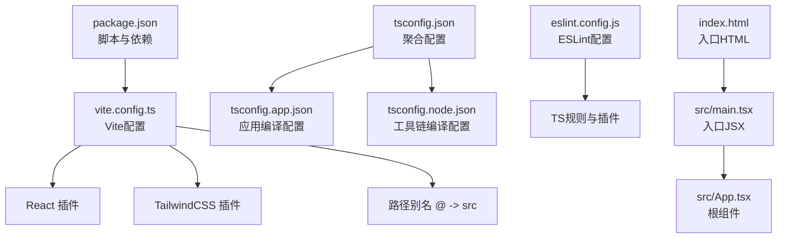
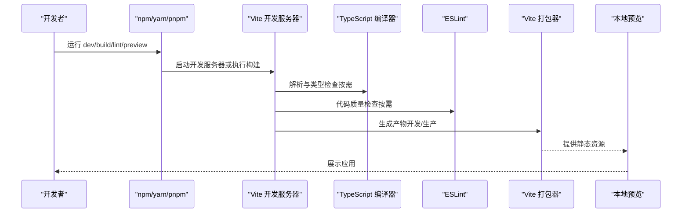
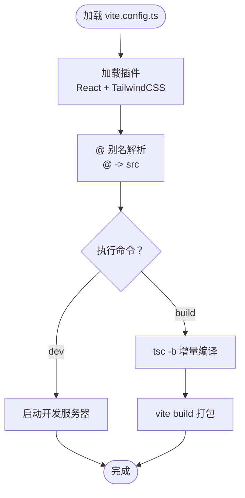
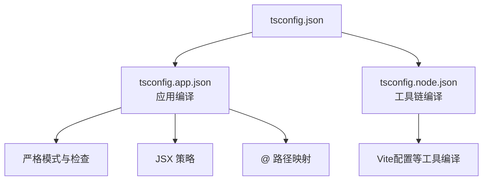
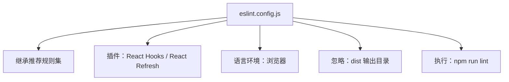
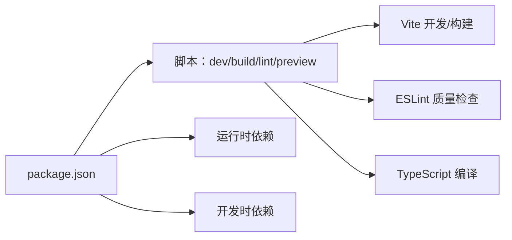
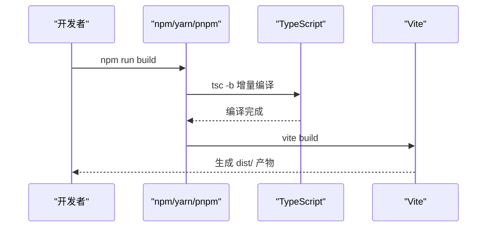
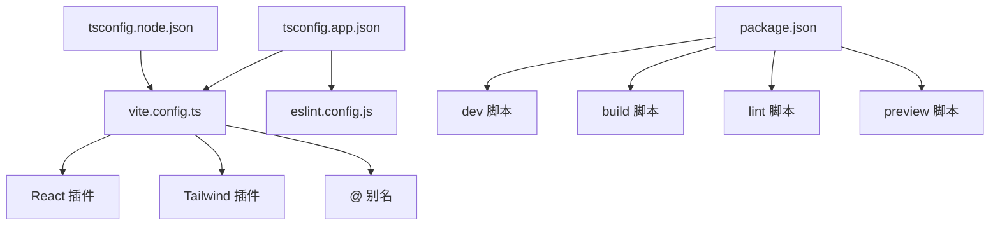

# 构建配置

<cite>
**本文引用的文件列表**
- [vite.config.ts](file://vite.config.ts)
- [package.json](file://package.json)
- [eslint.config.js](file://eslint.config.js)
- [tsconfig.json](file://tsconfig.json)
- [tsconfig.app.json](file://tsconfig.app.json)
- [tsconfig.node.json](file://tsconfig.node.json)
- [index.html](file://index.html)
- [src/main.tsx](file://src/main.tsx)
- [src/App.tsx](file://src/App.tsx)
</cite>

## 目录
1. [简介](#简介)
2. [项目结构](#项目结构)
3. [核心组件](#核心组件)
4. [架构总览](#架构总览)
5. [详细组件分析](#详细组件分析)
6. [依赖关系分析](#依赖关系分析)
7. [性能考虑](#性能考虑)
8. [故障排查指南](#故障排查指南)
9. [结论](#结论)
10. [附录](#附录)

## 简介
本文件面向AI聊天助手项目的构建与开发配置，系统性说明Vite构建工具的配置与作用（开发服务器、插件、优化），TypeScript编译与类型检查策略，ESLint代码规范与质量保障机制，包管理与依赖策略，以及构建流程、环境变量与部署准备。同时提供配置修改指南、自定义扩展方法、开发与生产差异配置说明，以及性能优化与代码分割策略建议。

## 项目结构
该项目采用Vite + React + TypeScript + TailwindCSS的现代前端技术栈，使用独立的TypeScript配置分层（应用与Node工具链）与ESLint配置，配合package.json脚本驱动开发与构建流程。

图表来源
- [package.json:1-36](file://package.json#L1-L36)
- [vite.config.ts:1-14](file://vite.config.ts#L1-L14)
- [tsconfig.json:1-5](file://tsconfig.json#L1-L5)
- [tsconfig.app.json:1-28](file://tsconfig.app.json#L1-L28)
- [tsconfig.node.json:1-23](file://tsconfig.node.json#L1-L23)
- [eslint.config.js:1-29](file://eslint.config.js#L1-L29)
- [index.html:1-14](file://index.html#L1-L14)
- [src/main.tsx:1-11](file://src/main.tsx#L1-L11)
- [src/App.tsx:1-8](file://src/App.tsx#L1-L8)

章节来源
- [package.json:1-36](file://package.json#L1-L36)
- [vite.config.ts:1-14](file://vite.config.ts#L1-L14)
- [tsconfig.json:1-5](file://tsconfig.json#L1-L5)
- [tsconfig.app.json:1-28](file://tsconfig.app.json#L1-L28)
- [tsconfig.node.json:1-23](file://tsconfig.node.json#L1-L23)
- [eslint.config.js:1-29](file://eslint.config.js#L1-L29)
- [index.html:1-14](file://index.html#L1-L14)
- [src/main.tsx:1-11](file://src/main.tsx#L1-L11)
- [src/App.tsx:1-8](file://src/App.tsx#L1-L8)

## 核心组件
- Vite构建配置：定义插件、路径别名、开发服务器与打包行为。
- TypeScript配置：分层配置（应用与Node工具链），启用严格模式与路径映射。
- ESLint配置：基于typescript-eslint，集成React Hooks与React Refresh规则。
- 包管理与脚本：通过npm/yarn/pnpm脚本统一执行开发、构建、预览与质量检查。

章节来源
- [vite.config.ts:1-14](file://vite.config.ts#L1-L14)
- [tsconfig.app.json:1-28](file://tsconfig.app.json#L1-L28)
- [tsconfig.node.json:1-23](file://tsconfig.node.json#L1-L23)
- [eslint.config.js:1-29](file://eslint.config.js#L1-L29)
- [package.json:1-36](file://package.json#L1-L36)

## 架构总览
下图展示从开发到构建的关键流程与组件交互。

图表来源
- [package.json:6-11](file://package.json#L6-L11)
- [vite.config.ts:6-13](file://vite.config.ts#L6-L13)
- [eslint.config.js:7-28](file://eslint.config.js#L7-L28)
- [tsconfig.app.json:13-13](file://tsconfig.app.json#L13-L13)

## 详细组件分析

### Vite 配置与作用
- 插件体系
  - React插件：提供React JSX转换与开发时热更新能力。
  - TailwindCSS插件：集成样式原生支持，便于在开发与构建阶段处理CSS。
- 路径别名
  - 定义@指向src目录，简化导入路径，提升可维护性。
- 开发服务器与构建
  - 开发脚本直接启动Vite开发服务器；构建脚本先执行TypeScript增量编译，再由Vite进行打包。

图表来源
- [vite.config.ts:6-13](file://vite.config.ts#L6-L13)
- [package.json:7-8](file://package.json#L7-L8)

章节来源
- [vite.config.ts:1-14](file://vite.config.ts#L1-L14)
- [package.json:6-11](file://package.json#L6-L11)

### TypeScript 编译与类型检查
- 配置分层
  - 根配置聚合应用与Node工具链两套子配置。
  - 应用配置（tsconfig.app.json）：目标语言、模块系统、严格模式、路径映射、JSX策略等。
  - 工具链配置（tsconfig.node.json）：针对Vite配置文件等Node侧工具的编译设置。
- 关键特性
  - bundler模块解析与verbatimModuleSyntax，适配现代打包器。
  - noEmit与composite用于仅做类型检查与增量构建。
  - 严格模式与未使用项检查，提升代码质量。
- 入口与运行
  - index.html中以模块方式引入/src/main.tsx作为应用入口。
  - src/main.tsx渲染根组件App，App再组合业务组件。

图表来源
- [tsconfig.json:1-5](file://tsconfig.json#L1-L5)
- [tsconfig.app.json:1-28](file://tsconfig.app.json#L1-L28)
- [tsconfig.node.json:1-23](file://tsconfig.node.json#L1-L23)
- [index.html:11-11](file://index.html#L11-L11)
- [src/main.tsx:1-11](file://src/main.tsx#L1-L11)
- [src/App.tsx:1-8](file://src/App.tsx#L1-L8)

章节来源
- [tsconfig.json:1-5](file://tsconfig.json#L1-L5)
- [tsconfig.app.json:1-28](file://tsconfig.app.json#L1-L28)
- [tsconfig.node.json:1-23](file://tsconfig.node.json#L1-L23)
- [index.html:1-14](file://index.html#L1-L14)
- [src/main.tsx:1-11](file://src/main.tsx#L1-L11)
- [src/App.tsx:1-8](file://src/App.tsx#L1-L8)

### ESLint 代码规范与质量保障
- 配置要点
  - 使用typescript-eslint配置，继承推荐规则集。
  - 集成React Hooks与React Refresh插件，提供最佳实践规则。
  - 在浏览器环境下运行，忽略dist目录输出。
- 规则与插件
  - 推荐的React Hooks规则集合。
  - 限制仅导出组件的刷新规则，允许常量导出以减少误报。
- 质量检查流程
  - 通过脚本执行ESLint，可在CI中作为质量门禁。

图表来源
- [eslint.config.js:1-29](file://eslint.config.js#L1-L29)
- [package.json:9-9](file://package.json#L9-L9)

章节来源
- [eslint.config.js:1-29](file://eslint.config.js#L1-L29)
- [package.json:6-11](file://package.json#L6-L11)

### 包管理与依赖策略
- 依赖分类
  - 运行时依赖：React生态与Markdown渲染等。
  - 开发时依赖：Vite、React插件、TailwindCSS、TypeScript、ESLint及其插件。
- 版本策略
  - 采用语义化版本，保持与现代前端生态同步。
- 脚本职责
  - dev：启动开发服务器。
  - build：先增量编译TypeScript，再由Vite打包。
  - lint：执行ESLint质量检查。
  - preview：本地预览构建产物。

图表来源
- [package.json:1-36](file://package.json#L1-L36)

章节来源
- [package.json:1-36](file://package.json#L1-L36)

### 构建流程说明
- 开发流程
  - npm run dev 启动Vite开发服务器，自动热更新。
- 生产构建
  - npm run build：先tsc -b进行TypeScript增量编译，再由Vite进行打包。
- 预览
  - npm run preview：本地预览生产构建产物，验证打包结果。

图表来源
- [package.json:7-10](file://package.json#L7-L10)

章节来源
- [package.json:6-11](file://package.json#L6-L11)

### 环境变量配置与部署准备
- 环境变量
  - 本项目未显式声明环境变量文件，若需要，请在项目根目录添加.env系列文件，并在Vite中通过VITE_前缀暴露给客户端代码。
- 部署准备
  - 构建产物位于默认的dist目录，可通过静态服务器或平台（如Vercel、Netlify、GitHub Pages等）部署。
  - 若使用路由，确保服务端回退至index.html以支持SPA路由。

[本节为通用实践说明，不直接分析具体文件，故无“章节来源”]

### 配置修改指南与自定义扩展
- 自定义Vite插件
  - 可在现有插件基础上新增第三方插件，注意与React/Tailwind的兼容性。
- 优化选项
  - 可在Vite配置中增加构建优化、压缩、资源处理等选项（例如rollupOptions、optimizeDeps等）。
- TypeScript扩展
  - 如需额外编译选项，可在对应tsconfig中添加，避免影响另一套配置。
- ESLint扩展
  - 可在eslint.config.js中新增规则或调整严重级别，保持与团队约定一致。
- 路径别名与导入
  - 通过Vite别名与tsconfig路径映射保持一致，确保IDE与编译器识别一致。

[本节为通用实践说明，不直接分析具体文件，故无“章节来源”]

### 开发与生产差异配置
- 模块解析与语法
  - 两者均使用bundler模块解析与verbatimeModuleSyntax，确保与打包器一致。
- 类型检查与输出
  - 两者均设置noEmit，仅进行类型检查与增量构建，避免重复输出。
- 严格性与安全
  - 严格模式与未使用项检查在两套配置中均开启，保证一致性。
- 构建产物
  - 生产构建由Vite负责，开发服务器与生产构建在插件与优化上可保持一致，以减少差异带来的问题。

章节来源
- [tsconfig.app.json:1-28](file://tsconfig.app.json#L1-L28)
- [tsconfig.node.json:1-23](file://tsconfig.node.json#L1-L23)
- [vite.config.ts:6-13](file://vite.config.ts#L6-L13)

### 性能优化与代码分割策略
- 模块解析与打包器适配
  - 使用bundler模块解析与verbatimeModuleSyntax，有助于Vite与Rollup等打包器更高效地处理模块。
- 代码分割
  - 建议结合路由懒加载与动态import实现按需加载，减少首屏体积。
- 资源优化
  - 可在Vite中配置压缩、资源内联阈值、外部依赖排除等优化项。
- 缓存与增量
  - TypeScript增量编译与Vite的模块缓存可显著缩短二次构建时间。

[本节为通用实践说明，不直接分析具体文件，故无“章节来源”]

## 依赖关系分析
- 组件耦合
  - Vite配置依赖React与Tailwind插件；TypeScript配置被Vite与ESLint共同使用；ESLint依赖typescript-eslint与React插件。
- 外部依赖
  - React生态、Vite、TailwindCSS、TypeScript、ESLint及其插件构成核心工具链。
- 脚本契约
  - 构建脚本明确串联TypeScript与Vite，确保类型安全与产物质量。

图表来源
- [vite.config.ts:1-14](file://vite.config.ts#L1-L14)
- [package.json:6-11](file://package.json#L6-L11)
- [tsconfig.app.json:1-28](file://tsconfig.app.json#L1-L28)
- [tsconfig.node.json:1-23](file://tsconfig.node.json#L1-L23)
- [eslint.config.js:1-29](file://eslint.config.js#L1-L29)

章节来源
- [vite.config.ts:1-14](file://vite.config.ts#L1-L14)
- [package.json:1-36](file://package.json#L1-L36)
- [tsconfig.app.json:1-28](file://tsconfig.app.json#L1-L28)
- [tsconfig.node.json:1-23](file://tsconfig.node.json#L1-L23)
- [eslint.config.js:1-29](file://eslint.config.js#L1-L29)

## 性能考虑
- 构建速度
  - 使用TypeScript增量编译与Vite的模块缓存，减少重复工作。
- 产物体积
  - 结合动态import与路由懒加载，控制首屏大小。
- 开发体验
  - React插件与热更新提升迭代效率；TailwindCSS插件减少CSS处理开销。

[本节提供一般性指导，不直接分析具体文件，故无“章节来源”]

## 故障排查指南
- 构建失败
  - 确认TypeScript增量编译是否成功，再查看Vite打包日志。
- 类型错误
  - 检查tsconfig.app.json与tsconfig.node.json中的严格模式与路径映射。
- ESLint报错
  - 按eslint.config.js中的规则调整代码风格或配置。
- 路径别名无效
  - 确保Vite别名与tsconfig路径映射一致，且IDE已重新索引。

章节来源
- [tsconfig.app.json:1-28](file://tsconfig.app.json#L1-L28)
- [tsconfig.node.json:1-23](file://tsconfig.node.json#L1-L23)
- [eslint.config.js:1-29](file://eslint.config.js#L1-L29)
- [vite.config.ts:6-13](file://vite.config.ts#L6-L13)

## 结论
本项目采用现代化前端构建体系：Vite提供高性能开发与构建，TypeScript确保类型安全，ESLint保障代码质量，TailwindCSS简化样式开发。通过清晰的配置分层与脚本契约，实现了从开发到生产的稳定流程。建议在后续演进中按需扩展Vite优化、路由懒加载与环境变量管理，以进一步提升性能与可维护性。

[本节为总结性内容，不直接分析具体文件，故无“章节来源”]

## 附录
- 入口与运行
  - HTML入口与JSX入口分别位于index.html与src/main.tsx，根组件App负责组织业务界面。
- 常用命令
  - 开发：npm run dev
  - 构建：npm run build
  - 质量检查：npm run lint
  - 预览：npm run preview

章节来源
- [index.html:1-14](file://index.html#L1-L14)
- [src/main.tsx:1-11](file://src/main.tsx#L1-L11)
- [src/App.tsx:1-8](file://src/App.tsx#L1-L8)
- [package.json:6-11](file://package.json#L6-L11)