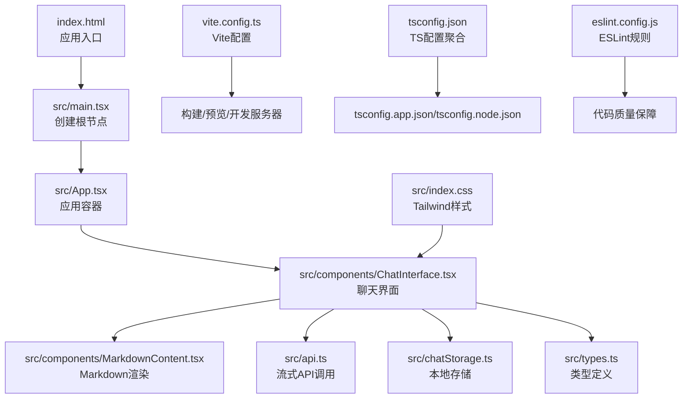
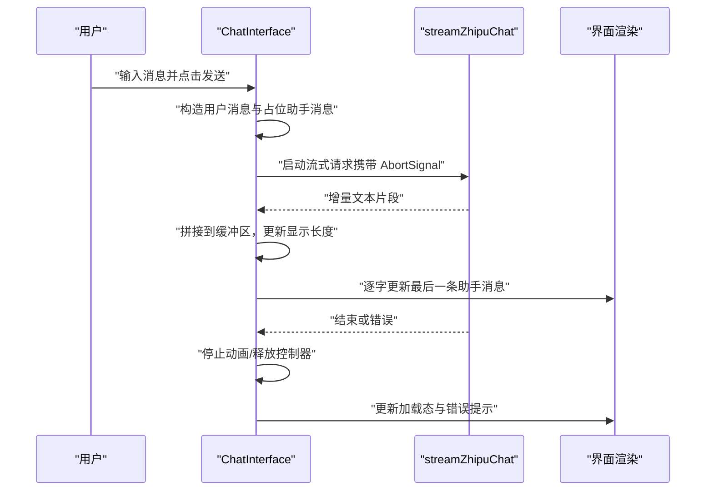
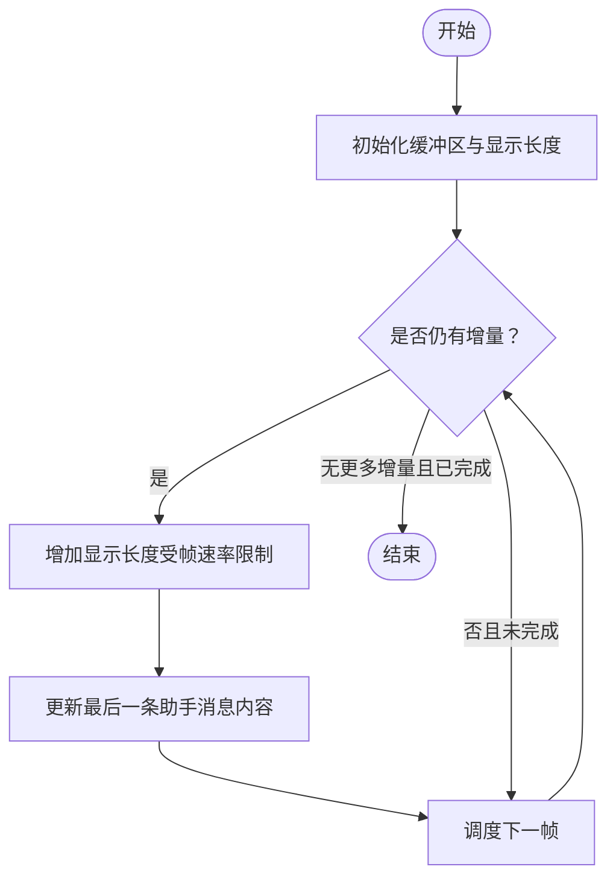
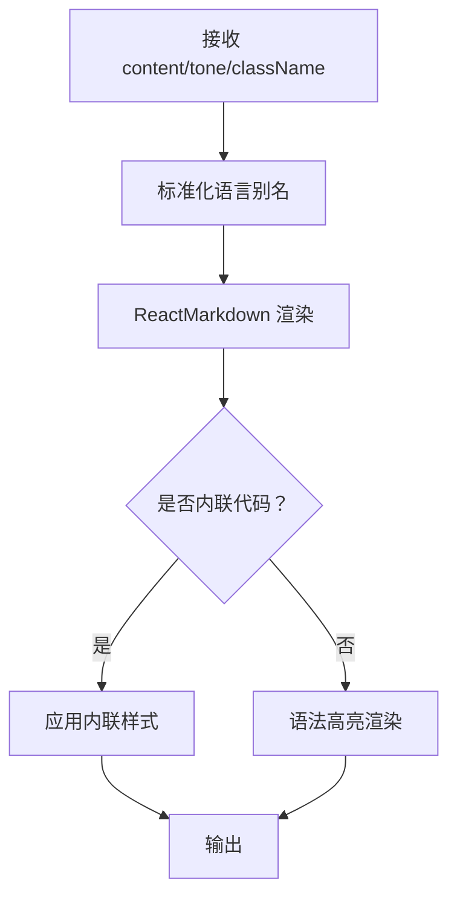
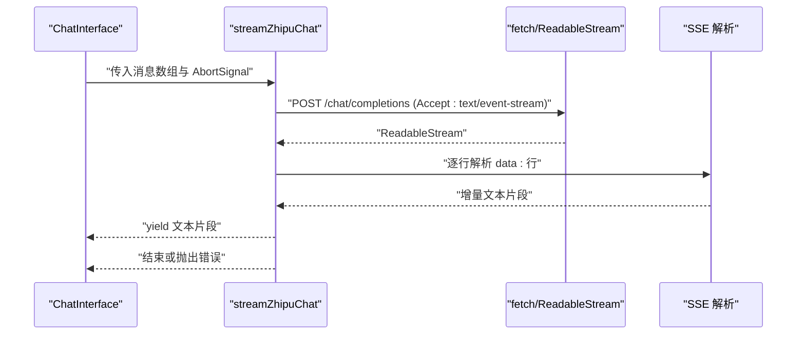
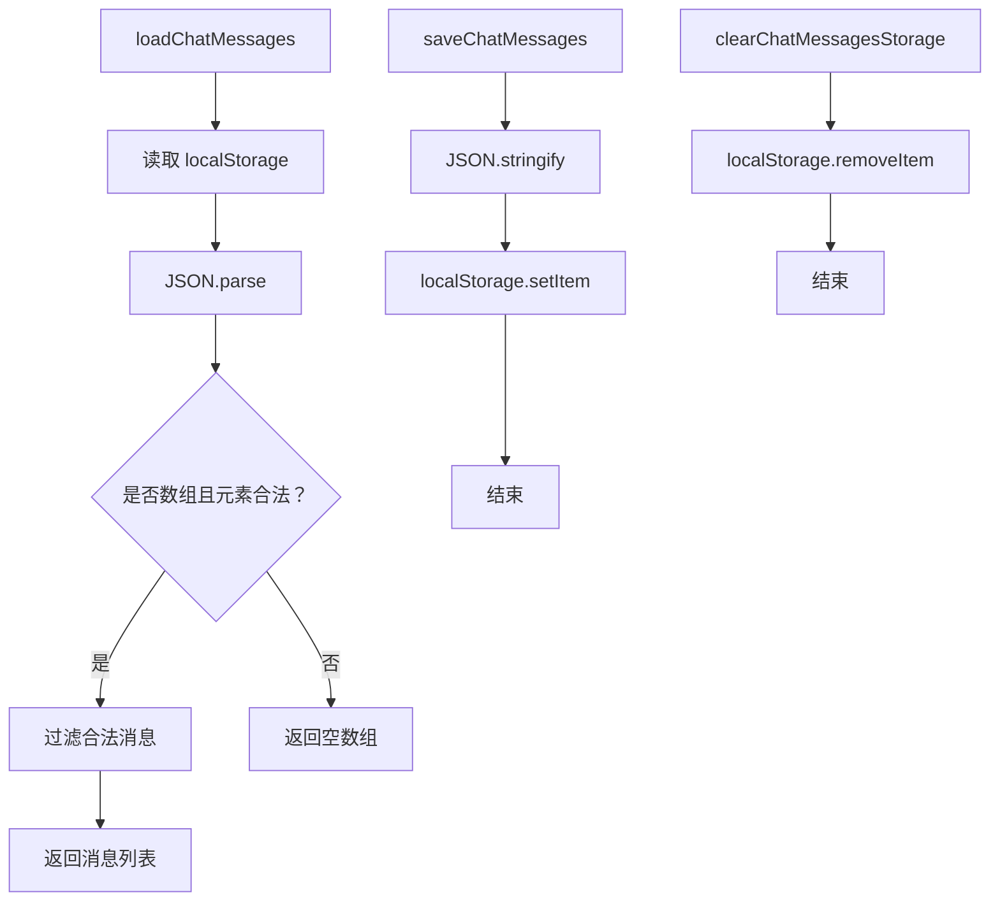
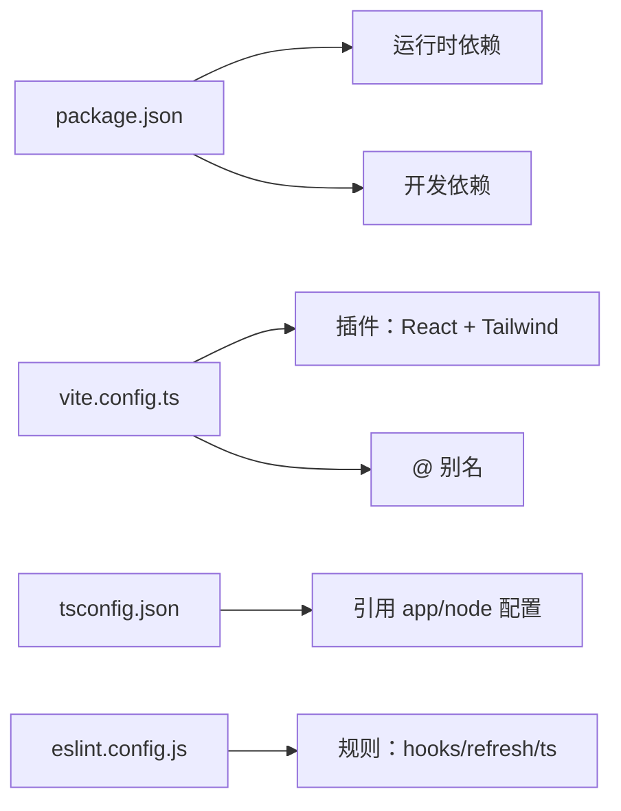

# 架构设计

<cite>
**本文引用的文件**
- [package.json](file://package.json)
- [vite.config.ts](file://vite.config.ts)
- [tsconfig.json](file://tsconfig.json)
- [tsconfig.app.json](file://tsconfig.app.json)
- [tsconfig.node.json](file://tsconfig.node.json)
- [eslint.config.js](file://eslint.config.js)
- [index.html](file://index.html)
- [src/main.tsx](file://src/main.tsx)
- [src/App.tsx](file://src/App.tsx)
- [src/components/ChatInterface.tsx](file://src/components/ChatInterface.tsx)
- [src/components/MarkdownContent.tsx](file://src/components/MarkdownContent.tsx)
- [src/api.ts](file://src/api.ts)
- [src/chatStorage.ts](file://src/chatStorage.ts)
- [src/types.ts](file://src/types.ts)
- [src/index.css](file://src/index.css)
- [PRD.md](file://PRD.md)
- [TECH_DESIGN.md](file://TECH_DESIGN.md)
</cite>

## 目录
1. [引言](#引言)
2. [项目结构](#项目结构)
3. [核心组件](#核心组件)
4. [架构总览](#架构总览)
5. [详细组件分析](#详细组件分析)
6. [依赖分析](#依赖分析)
7. [性能考量](#性能考量)
8. [故障排查指南](#故障排查指南)
9. [结论](#结论)
10. [附录](#附录)

## 引言
本项目是一个基于 React + TypeScript + Vite 的轻量级 AI 聊天助手前端应用，目标是提供简洁现代的聊天界面，支持与第三方大模型服务进行流式对话，具备本地存储、Markdown 渲染与代码高亮、逐字打字效果等特性。本文档从系统架构、组件层次、数据流、构建与类型系统、可扩展性与性能优化、跨平台与响应式设计等方面进行全面阐述。

## 项目结构
项目采用“入口脚本 + 组件化 + 类型与样式 + 构建配置”的分层组织方式，核心入口通过 HTML 容器挂载 React 根节点，应用由单一容器组件包裹业务组件，样式通过 Tailwind CSS 提供原子化样式能力，构建与开发体验由 Vite 提供。



**图表来源**
- [index.html](file://index.html)
- [src/main.tsx](file://src/main.tsx)
- [src/App.tsx](file://src/App.tsx)
- [src/components/ChatInterface.tsx](file://src/components/ChatInterface.tsx)
- [src/components/MarkdownContent.tsx](file://src/components/MarkdownContent.tsx)
- [src/api.ts](file://src/api.ts)
- [src/chatStorage.ts](file://src/chatStorage.ts)
- [src/types.ts](file://src/types.ts)
- [src/index.css](file://src/index.css)
- [vite.config.ts](file://vite.config.ts)
- [tsconfig.json](file://tsconfig.json)
- [eslint.config.js](file://eslint.config.js)

**章节来源**
- [index.html](file://index.html)
- [src/main.tsx](file://src/main.tsx)
- [src/App.tsx](file://src/App.tsx)
- [vite.config.ts](file://vite.config.ts)
- [tsconfig.json](file://tsconfig.json)

## 核心组件
- 应用入口与容器
  - 入口脚本负责挂载根节点，容器组件负责承载聊天界面。
- 聊天界面组件
  - 负责用户输入、消息列表渲染、流式接收与逐字展示、错误处理、复制助手回复等交互逻辑。
- Markdown 内容组件
  - 基于 react-markdown 与 react-syntax-highlighter 实现 Markdown 渲染与代码高亮。
- API 层
  - 封装智谱 AI 的流式接口，解析 SSE 数据，暴露异步迭代器。
- 本地存储
  - 基于 localStorage 的消息持久化，提供加载、保存、清理能力。
- 类型系统
  - 明确定义消息角色与消息结构，确保前后端数据契约一致。
- 样式与主题
  - Tailwind 原子类驱动布局与主题色，CSS 自定义规则优化 Markdown 气泡排版。

**章节来源**
- [src/App.tsx](file://src/App.tsx)
- [src/components/ChatInterface.tsx](file://src/components/ChatInterface.tsx)
- [src/components/MarkdownContent.tsx](file://src/components/MarkdownContent.tsx)
- [src/api.ts](file://src/api.ts)
- [src/chatStorage.ts](file://src/chatStorage.ts)
- [src/types.ts](file://src/types.ts)
- [src/index.css](file://src/index.css)

## 架构总览
系统采用前端单页应用架构，围绕“组件化 + 流式数据 + 本地存储”展开。前端通过 Vite 提供开发与构建能力，TypeScript 提供静态类型约束，Tailwind 提供样式基础，React 组件负责视图与交互，API 层对接第三方大模型服务，本地存储负责会话持久化。

```mermaid
graph TB
subgraph "前端应用"
UI["React 组件树<br/>ChatInterface / MarkdownContent"] --> API["API 层<br/>streamZhipuChat"]
UI --> Store["本地存储<br/>localStorage"]
UI --> Types["类型系统<br/>Message / MessageRole"]
UI --> Styles["样式系统<br/>Tailwind + CSS"]
end
subgraph "构建与开发"
Vite["Vite 配置<br/>插件 + 别名"] --> Dev["开发服务器"]
Vite --> Build["生产构建"]
TS["TypeScript 配置"] --> Build
ESLint["ESLint 规则"] --> Dev
end
subgraph "外部服务"
Zhipu["智谱 AI API<br/>SSE 流式响应"]
end
API --> Zhipu
UI --> |渲染/交互| UI
Store <- --> |读写| Store
```

**图表来源**
- [src/components/ChatInterface.tsx](file://src/components/ChatInterface.tsx)
- [src/components/MarkdownContent.tsx](file://src/components/MarkdownContent.tsx)
- [src/api.ts](file://src/api.ts)
- [src/chatStorage.ts](file://src/chatStorage.ts)
- [src/types.ts](file://src/types.ts)
- [src/index.css](file://src/index.css)
- [vite.config.ts](file://vite.config.ts)
- [tsconfig.json](file://tsconfig.json)
- [eslint.config.js](file://eslint.config.js)

## 详细组件分析

### 聊天界面组件（ChatInterface）
职责与流程
- 状态管理：维护消息列表、输入框文本、加载态、错误信息、滚动引用等。
- 交互控制：处理回车发送、禁用态、复制助手回复、错误提示关闭。
- 流式渲染：使用 requestAnimationFrame 驱动“逐字打字”效果，配合 AbortController 支持取消当前请求。
- 生命周期：在卸载时停止动画循环，避免内存泄漏。



**图表来源**
- [src/components/ChatInterface.tsx](file://src/components/ChatInterface.tsx)
- [src/api.ts](file://src/api.ts)

逐字打字算法流程


**图表来源**
- [src/components/ChatInterface.tsx](file://src/components/ChatInterface.tsx)

**章节来源**
- [src/components/ChatInterface.tsx](file://src/components/ChatInterface.tsx)

### Markdown 内容组件（MarkdownContent）
职责与流程
- 将 Markdown 文本转换为 React 结构，支持内联代码与代码块高亮。
- 语言别名映射，统一到 Prism 支持的语言 ID。
- 根据“用户/助手”色调选择不同的内联代码样式，避免视觉冲突。
- 使用 useMemo 缓存组件映射，减少重复计算。



**图表来源**
- [src/components/MarkdownContent.tsx](file://src/components/MarkdownContent.tsx)

**章节来源**
- [src/components/MarkdownContent.tsx](file://src/components/MarkdownContent.tsx)

### API 层（智谱流式接口）
职责与流程
- 从环境变量读取 API Key、Base URL、模型名。
- 将本地消息结构转换为第三方 API 所需的消息数组。
- 使用 fetch + ReadableStream 读取 SSE，解析 data 行，提取增量文本。
- 错误处理：网络异常、HTTP 非 OK、SSE 异常、模型返回错误等。



**图表来源**
- [src/api.ts](file://src/api.ts)

**章节来源**
- [src/api.ts](file://src/api.ts)

### 本地存储（chatStorage）
职责与流程
- 加载：从 localStorage 读取并校验 JSON 结构，过滤非合法项。
- 保存：序列化消息数组并写入 localStorage，异常静默处理。
- 清理：移除存储键，异常静默处理。



**图表来源**
- [src/chatStorage.ts](file://src/chatStorage.ts)

**章节来源**
- [src/chatStorage.ts](file://src/chatStorage.ts)

### 类型系统（types）
- MessageRole：限定为“user/assistant”，保证角色一致性。
- Message：包含角色、内容、时间戳，作为前后端数据契约。

**章节来源**
- [src/types.ts](file://src/types.ts)

### 样式与主题（index.css + Tailwind）
- Tailwind 原子类用于布局与主题色，如气泡背景、边框、阴影等。
- 自定义 CSS 优化 Markdown 气泡内的段落、列表、标题、引用等排版。
- “用户/助手”两类气泡分别设置不同颜色与链接样式，提升可读性。

**章节来源**
- [src/index.css](file://src/index.css)
- [vite.config.ts](file://vite.config.ts)

## 依赖分析
- 运行时依赖
  - React 生态：React、React DOM。
  - Markdown 渲染：react-markdown、react-syntax-highlighter。
- 开发与构建依赖
  - Vite：开发服务器、热更新、生产构建。
  - React 插件：@vitejs/plugin-react。
  - Tailwind：@tailwindcss/vite。
  - TypeScript：typescript、typescript-eslint。
  - ESLint：@eslint/js、eslint-plugin-react-hooks、eslint-plugin-react-refresh。
- 配置文件
  - package.json：脚本与依赖声明。
  - vite.config.ts：插件启用、路径别名。
  - tsconfig.*：分层 TS 配置聚合。
  - eslint.config.js：ESLint 规则集。



**图表来源**
- [package.json](file://package.json)
- [vite.config.ts](file://vite.config.ts)
- [tsconfig.json](file://tsconfig.json)
- [eslint.config.js](file://eslint.config.js)

**章节来源**
- [package.json](file://package.json)
- [vite.config.ts](file://vite.config.ts)
- [tsconfig.json](file://tsconfig.json)
- [eslint.config.js](file://eslint.config.js)

## 性能考量
- 渲染性能
  - 使用 requestAnimationFrame 控制逐字展示，避免频繁重排；仅更新最后一条助手消息内容，降低重渲染范围。
  - 使用 useMemo 缓存 Markdown 组件映射，减少不必要的渲染。
- 网络与流式
  - 使用 AbortController 取消过时请求，避免竞态与无效渲染。
  - SSE 解析采用增量拼接与行切分，减少内存占用。
- 构建与打包
  - Vite 原生 ESM 与按需编译，开发阶段快速启动；生产构建按需分割与压缩。
- 存储与内存
  - 本地存储采用 JSON 序列化，异常静默处理，避免阻塞主线程。
- 响应式与跨平台
  - 使用 dvh 与安全区域适配移动端；Tailwind 原子类保证在不同设备上的一致表现。

[本节为通用性能建议，不直接分析具体文件，故无“章节来源”]

## 故障排查指南
- 网络与 API
  - 未配置 API Key：检查环境变量与 .env 文件，确认 VITE_ZHIPU_API_KEY 是否存在。
  - 网络异常：检查网络、代理或防火墙设置，参考错误提示。
  - HTTP 非 OK：查看友好状态码与错误详情，必要时联系服务端。
- 流式读取
  - 无法读取流：刷新页面或稍后再试；若连接中断，重新发起请求。
  - SSE 解析异常：关注“[DONE]”终止信号与尾部垃圾数据处理。
- 剪贴板权限
  - 复制失败：检查浏览器权限或手动复制。
- 构建与开发
  - ESLint 报错：遵循 hooks/refresh 规则，避免在非组件导出中使用 hooks。
  - Vite 启动失败：检查插件与别名配置，确保 @ 指向 src。

**章节来源**
- [src/api.ts](file://src/api.ts)
- [src/components/ChatInterface.tsx](file://src/components/ChatInterface.tsx)
- [eslint.config.js](file://eslint.config.js)
- [vite.config.ts](file://vite.config.ts)

## 结论
该聊天助手项目以 React + TypeScript + Vite 为核心，结合 Tailwind 原子样式与 Markdown 渲染，实现了简洁高效的聊天界面与流式交互体验。通过明确的组件职责、清晰的数据流与健壮的错误处理，系统具备良好的可维护性与可扩展性。未来可在会话上下文管理、多模型切换、主题系统与国际化等方面进一步演进。

[本节为总结性内容，不直接分析具体文件，故无“章节来源”]

## 附录

### 系统边界与技术决策
- 系统边界
  - 前端应用：负责 UI、交互、流式渲染、本地存储与样式。
  - 外部服务：智谱 AI API，提供流式对话能力。
- 技术决策与权衡
  - React + TypeScript：强类型约束与组件化架构，提升可维护性。
  - Vite：快速开发与构建，生态完善。
  - Tailwind：原子类样式，减少样式文件体积与样式冲突。
  - react-markdown + react-syntax-highlighter：兼顾 Markdown 与代码高亮。
  - localStorage：简单可靠，适合演示与小规模使用；生产可替换为 IndexedDB 或服务端存储。

**章节来源**
- [PRD.md](file://PRD.md)
- [TECH_DESIGN.md](file://TECH_DESIGN.md)
- [src/api.ts](file://src/api.ts)
- [src/index.css](file://src/index.css)