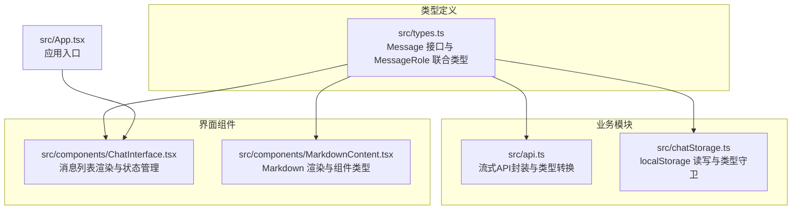
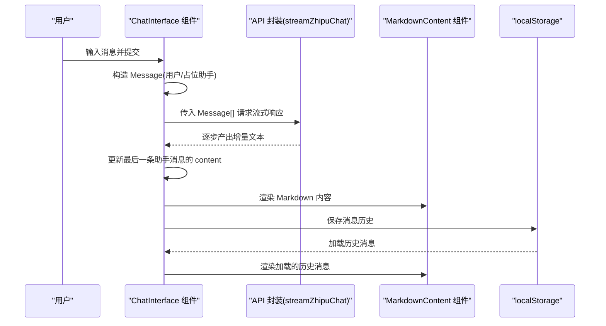
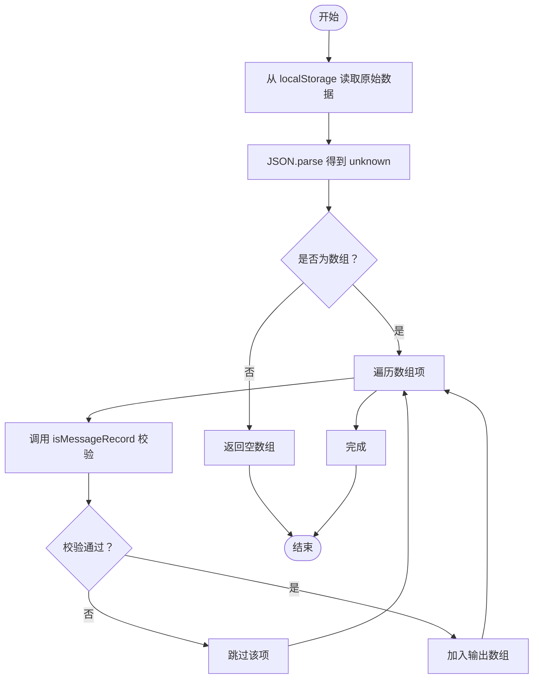
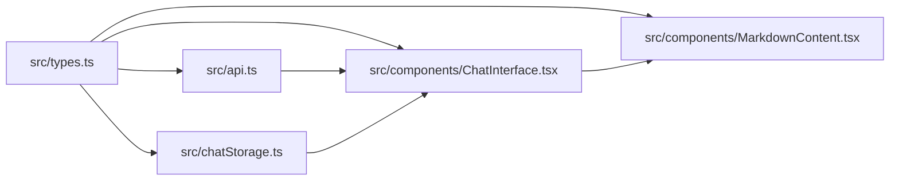

# 类型系统

<cite>
**本文引用的文件**
- [src/types.ts](file://src/types.ts)
- [src/api.ts](file://src/api.ts)
- [src/chatStorage.ts](file://src/chatStorage.ts)
- [src/components/ChatInterface.tsx](file://src/components/ChatInterface.tsx)
- [src/components/MarkdownContent.tsx](file://src/components/MarkdownContent.tsx)
- [src/App.tsx](file://src/App.tsx)
- [tsconfig.app.json](file://tsconfig.app.json)
- [tsconfig.node.json](file://tsconfig.node.json)
- [tsconfig.json](file://tsconfig.json)
- [package.json](file://package.json)
- [eslint.config.js](file://eslint.config.js)
</cite>

## 目录
1. [引言](#引言)
2. [项目结构](#项目结构)
3. [核心组件](#核心组件)
4. [架构总览](#架构总览)
5. [详细组件分析](#详细组件分析)
6. [依赖分析](#依赖分析)
7. [性能考量](#性能考量)
8. [故障排查指南](#故障排查指南)
9. [结论](#结论)
10. [附录](#附录)

## 引言
本文件面向AI聊天助手项目的类型系统，聚焦于TypeScript类型定义的设计与应用，涵盖Message接口与角色类型的定义、类型安全编程最佳实践、接口继承与联合类型的使用、类型推导与泛型的应用、类型断言的安全使用与风险、类型定义的维护与版本兼容性、编译时类型检查带来的好处与调试技巧，以及常见类型错误的解决方案与预防措施。文档以仓库中的实际代码为依据，通过图示与分层讲解帮助不同技术背景的读者理解与应用。

## 项目结构
本项目采用前端单页应用结构，类型定义集中在src/types.ts中，业务逻辑分布在多个模块中：
- 类型定义：src/types.ts
- API封装与外部服务交互：src/api.ts
- 本地存储与类型守卫：src/chatStorage.ts
- 界面组件与状态管理：src/components/ChatInterface.tsx、src/components/MarkdownContent.tsx
- 应用入口与路由：src/App.tsx
- 编译配置与工具链：tsconfig.*.json、package.json、eslint.config.js



**图表来源**
- [src/types.ts:1-9](file://src/types.ts#L1-L9)
- [src/api.ts:1-184](file://src/api.ts#L1-L184)
- [src/chatStorage.ts:1-51](file://src/chatStorage.ts#L1-L51)
- [src/components/ChatInterface.tsx:1-344](file://src/components/ChatInterface.tsx#L1-L344)
- [src/components/MarkdownContent.tsx:1-129](file://src/components/MarkdownContent.tsx#L1-L129)
- [src/App.tsx:1-8](file://src/App.tsx#L1-L8)

**章节来源**
- [src/types.ts:1-9](file://src/types.ts#L1-L9)
- [src/api.ts:1-184](file://src/api.ts#L1-L184)
- [src/chatStorage.ts:1-51](file://src/chatStorage.ts#L1-L51)
- [src/components/ChatInterface.tsx:1-344](file://src/components/ChatInterface.tsx#L1-L344)
- [src/components/MarkdownContent.tsx:1-129](file://src/components/MarkdownContent.tsx#L1-L129)
- [src/App.tsx:1-8](file://src/App.tsx#L1-L8)

## 核心组件
本节聚焦类型系统的核心元素：Message接口与MessageRole联合类型，以及它们在各模块中的使用方式。

- MessageRole联合类型
  - 定义：用户与助手两种角色，确保消息来源的枚举化与可预测性。
  - 使用场景：作为Message接口的role字段类型，用于区分消息发送方；在UI渲染、API请求体转换、本地存储校验等处广泛使用。
  - 参考路径：[src/types.ts:2](file://src/types.ts#L2)

- Message接口
  - 字段：role（MessageRole）、content（字符串）、timestamp（数字）。
  - 使用场景：作为应用内部消息对象的标准形态，贯穿消息列表、API请求体转换、本地存储序列化/反序列化。
  - 参考路径：[src/types.ts:4-8](file://src/types.ts#L4-L8)

- 在ChatInterface中的应用
  - 状态管理：messages为Message[]数组，用于渲染消息列表。
  - 构造消息：发送时构造用户消息与占位助手消息，随后流式更新助手消息content。
  - 参考路径：[src/components/ChatInterface.tsx:25-182](file://src/components/ChatInterface.tsx#L25-L182)

- 在API封装中的应用
  - 请求体转换：将Message[]转换为外部服务期望的ZhipuChatMessage[]（去除了timestamp）。
  - 流式解析：从SSE事件中提取增量文本，逐步拼接到助手消息content。
  - 参考路径：[src/api.ts:40-73](file://src/api.ts#L40-L73)

- 在本地存储中的应用
  - 类型守卫：通过isMessageRole与isMessageRecord进行运行时校验，确保localStorage数据符合Message结构。
  - 参考路径：[src/chatStorage.ts:5-18](file://src/chatStorage.ts#L5-L18)

**章节来源**
- [src/types.ts:1-9](file://src/types.ts#L1-L9)
- [src/components/ChatInterface.tsx:25-182](file://src/components/ChatInterface.tsx#L25-L182)
- [src/api.ts:40-73](file://src/api.ts#L40-L73)
- [src/chatStorage.ts:5-18](file://src/chatStorage.ts#L5-L18)

## 架构总览
下图展示了类型系统在端到端流程中的作用：从用户输入到消息渲染，再到API交互与本地持久化。



**图表来源**
- [src/components/ChatInterface.tsx:106-182](file://src/components/ChatInterface.tsx#L106-L182)
- [src/api.ts:70-183](file://src/api.ts#L70-L183)
- [src/components/MarkdownContent.tsx:117-129](file://src/components/MarkdownContent.tsx#L117-L129)
- [src/chatStorage.ts:20-42](file://src/chatStorage.ts#L20-L42)

## 详细组件分析

### Message与MessageRole：定义与使用
- 设计要点
  - 使用联合类型MessageRole限定角色集合，避免魔法字符串与拼写错误。
  - Message接口简洁明确，便于跨模块传递与序列化。
- 典型用法
  - 在ChatInterface中构造用户消息与占位助手消息，随后流式更新content。
  - 在API封装中将Message[]转换为外部服务期望的消息数组。
  - 在本地存储中通过类型守卫确保数据一致性。
- 复杂度与性能
  - Message结构简单，操作均为浅拷贝与字符串拼接，时间复杂度近似O(n)（n为增量文本长度），空间复杂度与消息数量线性相关。

```mermaid
classDiagram
class MessageRole {
<<union>>
"user"
"assistant"
}
class Message {
+role : MessageRole
+content : string
+timestamp : number
}
class ZhipuApiRole {
<<union>>
"user"
"assistant"
"system"
}
class ZhipuChatMessage {
+role : ZhipuApiRole
+content : string
}
Message --> MessageRole : "使用"
ZhipuChatMessage --> ZhipuApiRole : "使用"
```

**图表来源**
- [src/types.ts:2](file://src/types.ts#L2)
- [src/types.ts:4-8](file://src/types.ts#L4-L8)
- [src/api.ts:6](file://src/api.ts#L6)
- [src/api.ts:8-11](file://src/api.ts#L8-L11)

**章节来源**
- [src/types.ts:1-9](file://src/types.ts#L1-L9)
- [src/api.ts:40-43](file://src/api.ts#L40-L43)

### 类型守卫与运行时校验
- isMessageRole与isMessageRecord
  - 作用：在运行时对未知数据进行结构化校验，确保其满足Message接口要求。
  - 实现：先判断类型与键存在性，再逐一验证字段类型与范围。
  - 场景：localStorage读取后的数据校验，避免因格式错误导致的运行时异常。
- 优势：结合编译期类型与运行时校验，提升健壮性。
- 风险：若外部数据源频繁变更，需要同步更新守卫逻辑。



**图表来源**
- [src/chatStorage.ts:20-34](file://src/chatStorage.ts#L20-L34)
- [src/chatStorage.ts:5-18](file://src/chatStorage.ts#L5-L18)

**章节来源**
- [src/chatStorage.ts:1-51](file://src/chatStorage.ts#L1-L51)

### 接口继承与联合类型的使用
- 联合类型
  - MessageRole与ZhipuApiRole均采用联合类型，限定可用值集合，减少错误分支。
  - 在toZhipuMessages中，将Message.role映射为ZhipuApiRole，体现“收窄”与“映射”的类型转换。
- 接口继承
  - 本项目未直接出现显式的接口继承语法，但通过组合与映射实现了“接口扩展”的效果：Message用于内部，ZhipuChatMessage用于外部API。
- 使用建议
  - 优先使用联合类型表达离散取值集合。
  - 对外部数据结构，尽量保持与内部结构的差异清晰，必要时提供转换函数。

**章节来源**
- [src/types.ts:2](file://src/types.ts#L2)
- [src/types.ts:4-8](file://src/types.ts#L4-L8)
- [src/api.ts:6](file://src/api.ts#L6)
- [src/api.ts:8-11](file://src/api.ts#L8-L11)
- [src/api.ts:40-43](file://src/api.ts#L40-L43)

### 类型推导与泛型的应用
- 类型推导
  - useState<Message[]>、useState<string | null>、useState<boolean>等，利用上下文自动推导类型，减少冗余声明。
  - 在异步生成器streamZhipuChat中，返回类型为AsyncGenerator<string, void, undefined>，明确增量文本的产出类型。
- 泛型
  - 本项目未直接使用自定义泛型函数或类，但在React与标准库中广泛使用了内置泛型（如Promise<T>、Array<T>、Readonly<T>等）。
- 最佳实践
  - 明确关键位置的类型注解（如API返回、状态初始值），避免过度依赖推导导致的类型不明确。
  - 对外暴露的API尽量使用明确的返回类型，便于消费方类型检查。

**章节来源**
- [src/components/ChatInterface.tsx:25-29](file://src/components/ChatInterface.tsx#L25-L29)
- [src/api.ts:70-73](file://src/api.ts#L70-L73)

### 类型断言的安全使用与潜在风险
- 断言位置与动机
  - JSON.parse结果断言为unknown后，再通过类型守卫isMessageRecord进行安全校验，避免直接any断言。
  - 在SSE事件解析中，对JSON.parse结果断言为ZhipuStreamChunk，随后进行字段存在性与类型检查。
- 风险控制
  - 不直接断言为具体类型，而是先断言为unknown，再通过守卫函数或条件判断保证安全。
  - 对可能为空或非字符串的字段，使用typeof与可选链进行防御性检查。
- 建议
  - 优先使用类型守卫替代断言；仅在确定性极高且有充分文档说明的情况下使用断言。

**章节来源**
- [src/api.ts:107-114](file://src/api.ts#L107-L114)
- [src/api.ts:150-155](file://src/api.ts#L150-L155)
- [src/chatStorage.ts:24](file://src/chatStorage.ts#L24)

### 编译时类型检查与调试技巧
- 编译配置
  - app与node配置均启用严格模式，开启未使用局部变量/参数检测、switch穷举检查、未检查副作用导入等规则，有助于早期发现类型问题。
- 工具链
  - TypeScript版本与ESLint集成，配合typescript-eslint规则集，提供静态分析与修复建议。
- 调试技巧
  - 利用IDE的类型提示与快速修复功能，定位类型不匹配的具体位置。
  - 对复杂类型（如异步生成器返回值）可在关键点添加显式类型注解，辅助IDE与编译器进行检查。
  - 在API封装中，对可能的异常分支补充错误类型注解，便于统一处理。

**章节来源**
- [tsconfig.app.json:14-19](file://tsconfig.app.json#L14-L19)
- [tsconfig.node.json:13-17](file://tsconfig.node.json#L13-L17)
- [package.json:31](file://package.json#L31)
- [eslint.config.js:7-28](file://eslint.config.js#L7-L28)

### 常见类型错误与预防措施
- 错误类型
  - 角色值不在联合类型范围内：例如将role设为其他字符串，导致运行时行为不可预期。
  - 时间戳类型不符：将字符串或非有限数传入timestamp，影响排序与显示。
  - API返回结构变化：外部服务返回字段与预期不一致，导致解析失败。
- 预防措施
  - 使用MessageRole与Message接口约束角色与结构。
  - 在API封装中对返回字段进行存在性与类型检查，必要时提供默认值或抛出明确错误。
  - 对localStorage数据使用类型守卫，确保只接受符合结构的数据。

**章节来源**
- [src/types.ts:2](file://src/types.ts#L2)
- [src/types.ts:4-8](file://src/types.ts#L4-L8)
- [src/api.ts:59-64](file://src/api.ts#L59-L64)
- [src/chatStorage.ts:5-18](file://src/chatStorage.ts#L5-L18)

## 依赖分析
- 模块耦合
  - ChatInterface依赖Message类型与API封装；API封装依赖Message类型进行转换；chatStorage依赖Message与MessageRole进行校验。
- 外部依赖
  - React、React-DOM、React-Markdown、React-Syntax-Highlighter等，类型由@types包提供。
- 版本兼容
  - TypeScript版本与ESLint插件版本需匹配，避免规则冲突与类型检查不一致。



**图表来源**
- [src/types.ts:1-9](file://src/types.ts#L1-L9)
- [src/api.ts:1-184](file://src/api.ts#L1-L184)
- [src/chatStorage.ts:1-51](file://src/chatStorage.ts#L1-L51)
- [src/components/ChatInterface.tsx:1-344](file://src/components/ChatInterface.tsx#L1-L344)
- [src/components/MarkdownContent.tsx:1-129](file://src/components/MarkdownContent.tsx#L1-L129)

**章节来源**
- [package.json:12-34](file://package.json#L12-L34)

## 性能考量
- 类型层面
  - 使用联合类型与接口约束可减少分支与错误处理开销，提高运行时稳定性。
  - 通过类型守卫在运行时进行一次性校验，避免后续重复校验。
- 业务层面
  - 流式渲染采用requestAnimationFrame分帧更新，避免主线程阻塞。
  - 对API响应采用增量拼接，减少不必要的状态更新次数。

[本节提供一般性指导，无需特定文件引用]

## 故障排查指南
- 编译错误
  - 检查严格模式下的未使用变量/参数、switch穷举缺失等问题。
  - 确认TS版本与ESLint插件版本兼容。
- 运行时错误
  - 若localStorage数据异常，检查类型守卫逻辑与数据来源。
  - 若API返回结构变化，更新ZhipuStreamChunk与解析逻辑。
- 调试建议
  - 在关键位置添加显式类型注解，借助IDE类型提示定位问题。
  - 对断言使用前增加条件判断与日志记录，缩小问题范围。

**章节来源**
- [tsconfig.app.json:14-19](file://tsconfig.app.json#L14-L19)
- [tsconfig.node.json:13-17](file://tsconfig.node.json#L13-L17)
- [eslint.config.js:7-28](file://eslint.config.js#L7-L28)
- [src/chatStorage.ts:20-34](file://src/chatStorage.ts#L20-L34)
- [src/api.ts:104-123](file://src/api.ts#L104-L123)

## 结论
本项目通过简洁而强类型的Message与MessageRole设计，结合类型守卫与运行时校验，在前端聊天应用中实现了高可靠的消息流转与渲染。联合类型与类型推导提升了开发效率与可维护性；严格的编译配置与ESLint规则进一步保障了类型安全。建议在后续迭代中持续完善类型守卫与API适配层，以应对外部服务结构变化与数据演进。

[本节为总结性内容，无需特定文件引用]

## 附录
- 维护指南
  - 新增角色或字段时，同步更新Message与相关转换函数。
  - 外部API结构变更时，先更新Zhipu*类型，再调整解析逻辑。
  - 本地存储schema变更时，更新类型守卫与迁移策略。
- 版本兼容
  - 升级TypeScript或ESLint插件时，先在本地验证类型检查与规则，再合并到主干。
- 最佳实践清单
  - 优先使用联合类型与接口约束。
  - 用类型守卫替代断言，必要时保留断言注释说明。
  - 对外部数据与localStorage数据进行显式校验。
  - 在关键API与状态更新处添加类型注解，提升可读性与可维护性。

[本节为通用建议，无需特定文件引用]