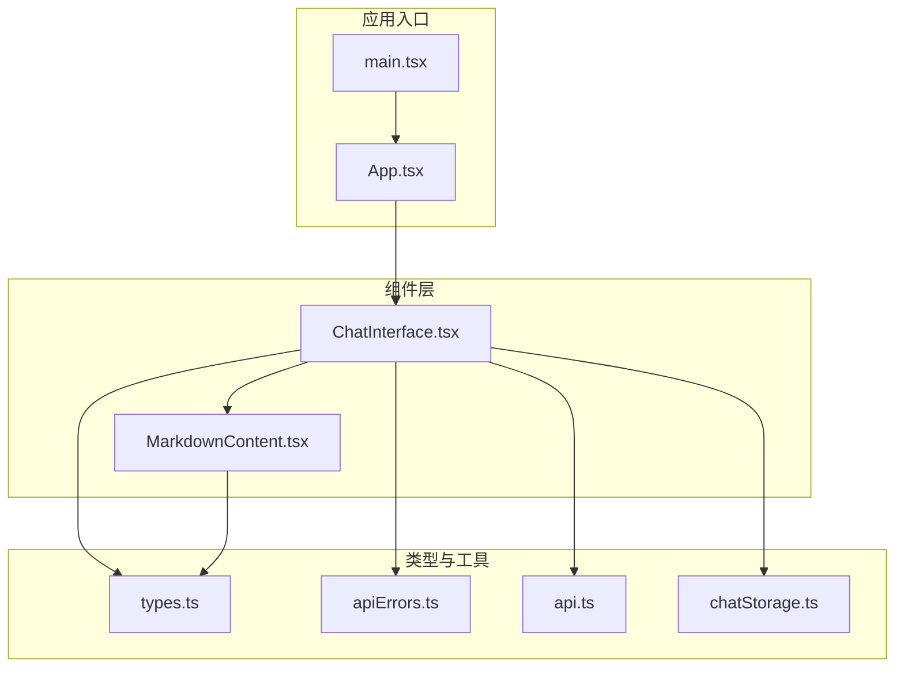
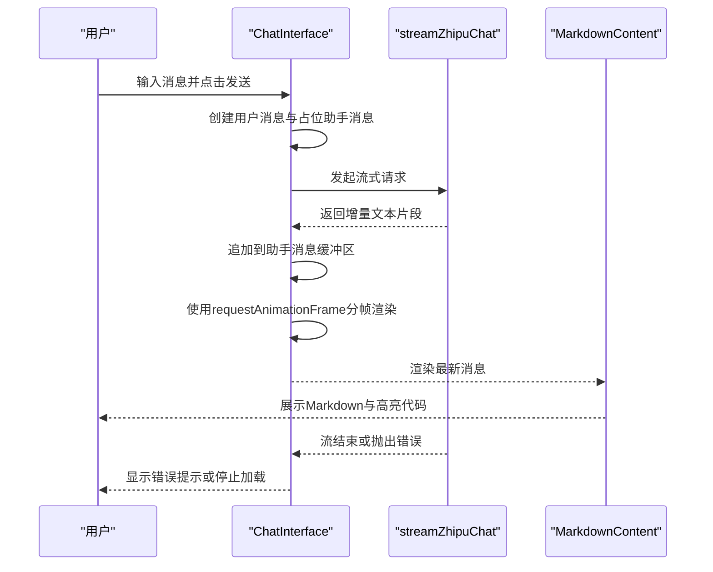
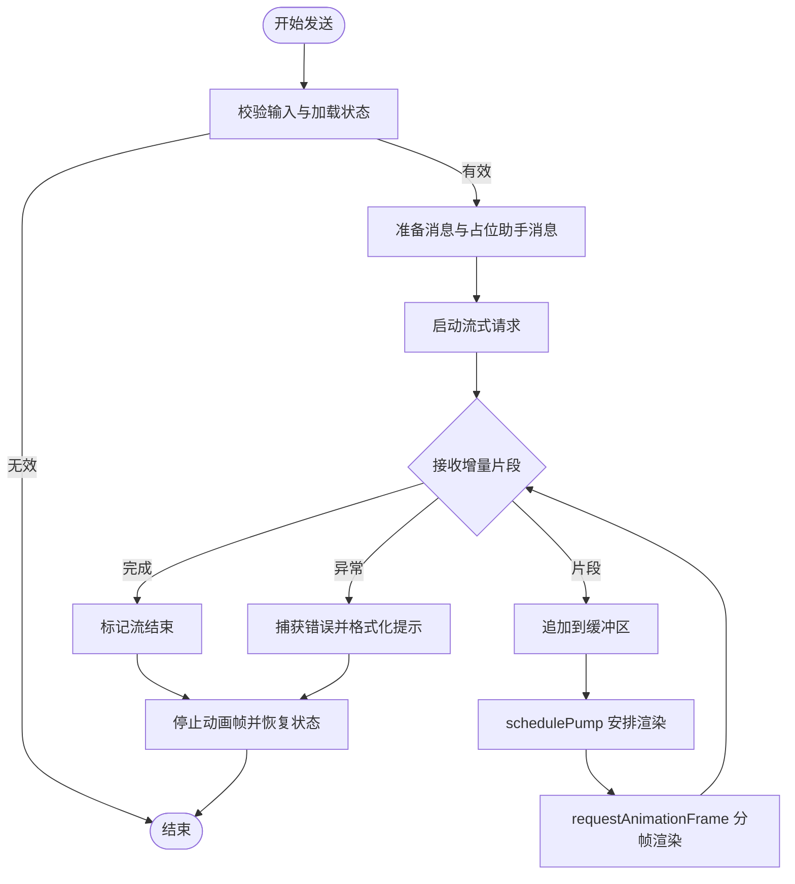
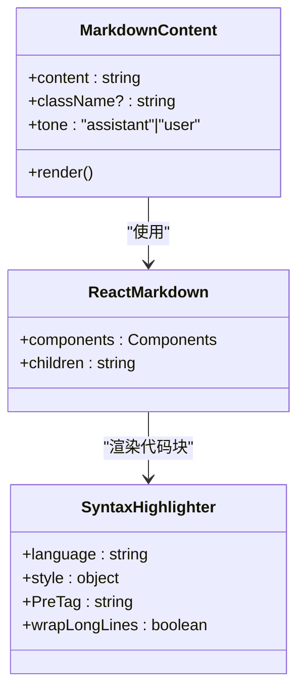
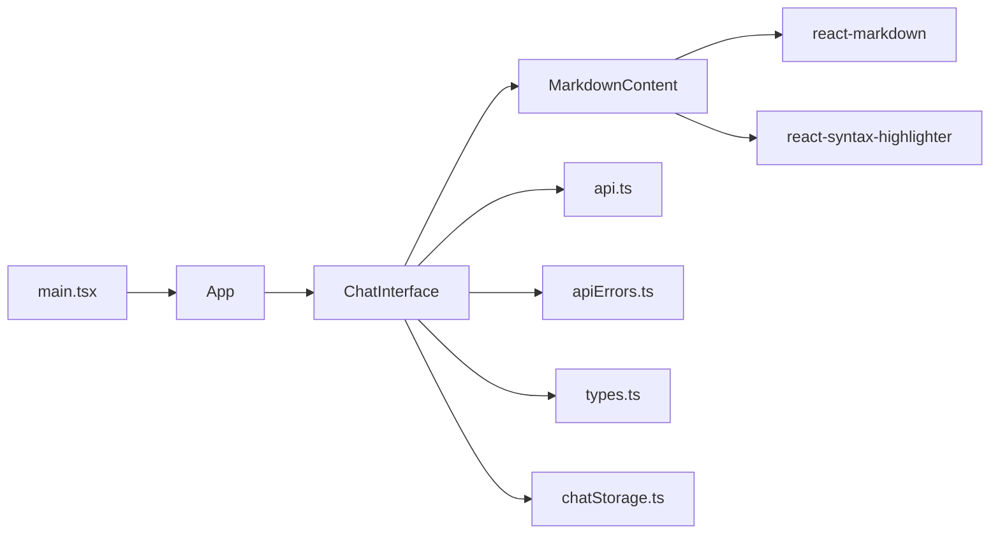

# 组件设计

<cite>
**本文引用的文件列表**
- [ChatInterface.tsx](file://src/components/ChatInterface.tsx)
- [MarkdownContent.tsx](file://src/components/MarkdownContent.tsx)
- [App.tsx](file://src/App.tsx)
- [types.ts](file://src/types.ts)
- [api.ts](file://src/api.ts)
- [apiErrors.ts](file://src/apiErrors.ts)
- [chatStorage.ts](file://src/chatStorage.ts)
- [main.tsx](file://src/main.tsx)
- [package.json](file://src/package.json)
</cite>

## 目录
1. [引言](#引言)
2. [项目结构](#项目结构)
3. [核心组件](#核心组件)
4. [架构总览](#架构总览)
5. [组件详解](#组件详解)
6. [依赖关系分析](#依赖关系分析)
7. [性能考量](#性能考量)
8. [故障排查指南](#故障排查指南)
9. [结论](#结论)
10. [附录](#附录)

## 引言
本设计文档聚焦于AI聊天助手项目的React组件设计，系统阐述组件的设计原则、实现模式与交互流程。重点覆盖以下方面：
- ChatInterface组件的功能职责、状态管理与生命周期
- MarkdownContent组件的渲染机制与代码高亮实现
- 组件间组合关系与数据传递方式
- Props接口设计、事件处理机制与错误边界处理
- 可复用性与扩展性设计
- 使用示例与最佳实践
- 状态提升与局部状态管理策略

## 项目结构
项目采用“功能模块化 + 类型与工具分离”的组织方式：
- 组件层：ChatInterface、MarkdownContent
- 应用入口：App、main
- 类型定义：Message、MessageRole
- 数据流与API：streamZhipuChat、错误格式化
- 存储：localStorage封装的聊天记录持久化
- 依赖：React、react-markdown、react-syntax-highlighter

图表来源
- [main.tsx:1-11](file://src/main.tsx#L1-L11)
- [App.tsx:1-8](file://src/App.tsx#L1-L8)
- [ChatInterface.tsx:1-344](file://src/components/ChatInterface.tsx#L1-L344)
- [MarkdownContent.tsx:1-129](file://src/components/MarkdownContent.tsx#L1-L129)
- [types.ts:1-9](file://src/types.ts#L1-L9)
- [api.ts:1-184](file://src/api.ts#L1-L184)
- [apiErrors.ts:1-62](file://src/apiErrors.ts#L1-L62)
- [chatStorage.ts:1-51](file://src/chatStorage.ts#L1-L51)

章节来源
- [main.tsx:1-11](file://src/main.tsx#L1-L11)
- [App.tsx:1-8](file://src/App.tsx#L1-L8)
- [package.json:1-36](file://src/package.json#L1-L36)

## 核心组件
- ChatInterface：负责消息列表渲染、输入框交互、流式响应处理、复制助手回复、时间戳格式化、错误提示与滚动定位。
- MarkdownContent：负责Markdown解析与渲染，支持内联代码与代码块高亮，基于主题样式与语言别名映射。

章节来源
- [ChatInterface.tsx:25-344](file://src/components/ChatInterface.tsx#L25-L344)
- [MarkdownContent.tsx:7-129](file://src/components/MarkdownContent.tsx#L7-L129)

## 架构总览
整体数据流自上而下：
- App作为根组件，直接渲染ChatInterface
- ChatInterface持有消息列表、输入值、加载态与错误态
- 发送消息时，ChatInterface通过streamZhipuChat消费流式API，逐步更新助手消息内容
- MarkdownContent接收消息内容，进行Markdown解析与代码高亮渲染
- 错误通过友好提示反馈给用户

图表来源
- [ChatInterface.tsx:106-182](file://src/components/ChatInterface.tsx#L106-L182)
- [api.ts:70-183](file://src/api.ts#L70-L183)
- [MarkdownContent.tsx:117-128](file://src/components/MarkdownContent.tsx#L117-L128)

## 组件详解

### ChatInterface 组件
- 设计原则
  - 单一职责：集中管理消息列表、输入、加载与错误状态；负责与API交互与渲染调度
  - 分帧渲染：使用requestAnimationFrame将长文本分批插入，避免主线程阻塞
  - 请求幂等与并发控制：通过requestGenRef与AbortController确保新请求终止旧请求
  - 可访问性与可用性：禁用态、占位符、键盘快捷键、复制按钮、时间戳
- 状态管理
  - 局部状态：messages、input、loading、error、copiedKey
  - 引用状态：assistantTargetRef、assistantDisplayedLenRef、streamFinishedRef、pumpRafRef、abortRef、requestGenRef
  - 生命周期：useEffect用于滚动定位与清理动画帧
- 事件处理
  - 文本域输入onChange、键盘事件onKeyDown（Enter发送、Shift+Enter换行）
  - 复制按钮onClick触发navigator.clipboard写入
- 错误边界
  - 捕获AbortError、网络错误、服务端错误，统一格式化为用户可读提示
  - 错误提示区域可关闭，避免遮挡主界面
- 组合关系与数据传递
  - 向MarkdownContent传递content、tone、className
  - 通过formatTime显示消息时间
- 最佳实践
  - 使用useCallback稳定回调，减少子组件重渲染
  - 使用useMemo稳定组件映射，避免不必要的重渲染
  - 使用AbortController优雅取消请求，防止竞态条件
  - 使用requestAnimationFrame分帧渲染，保证流畅度

图表来源
- [ChatInterface.tsx:106-182](file://src/components/ChatInterface.tsx#L106-L182)
- [ChatInterface.tsx:51-104](file://src/components/ChatInterface.tsx#L51-L104)

章节来源
- [ChatInterface.tsx:25-344](file://src/components/ChatInterface.tsx#L25-L344)

### MarkdownContent 组件
- 设计原则
  - 专注渲染：仅负责Markdown解析与代码高亮，不参与状态管理
  - 主题适配：根据tone区分用户/助手气泡的内联代码样式
  - 语言映射：内置常见语言别名到Prism语言ID的映射，提升兼容性
- 渲染机制
  - 使用ReactMarkdown解析Markdown
  - 自定义code组件：内联代码与代码块分别渲染
  - 代码块高亮：使用react-syntax-highlighter与oneDark主题
- Props接口
  - content: string（必填）
  - className?: string（可选）
  - tone?: "assistant" | "user"（可选，默认assistant）
- 最佳实践
  - 使用useMemo缓存组件映射，避免重复创建
  - 内联代码与代码块样式差异化，提升可读性
  - 保持语言别名映射表可维护与可扩展

图表来源
- [MarkdownContent.tsx:7-129](file://src/components/MarkdownContent.tsx#L7-L129)

章节来源
- [MarkdownContent.tsx:7-129](file://src/components/MarkdownContent.tsx#L7-L129)

### 类型与API
- 类型定义
  - MessageRole: "user" | "assistant"
  - Message: 包含role、content、timestamp
- API与错误处理
  - streamZhipuChat：封装SSE流式响应，解析增量文本
  - friendlyHttpStatus：HTTP状态码到用户可读提示的映射
  - formatChatApiError：统一错误格式化，区分AbortError、网络错误与服务端错误
- 存储
  - loadChatMessages/saveChatMessages/clearChatMessagesStorage：基于localStorage的聊天记录持久化

章节来源
- [types.ts:1-9](file://src/types.ts#L1-L9)
- [api.ts:1-184](file://src/api.ts#L1-L184)
- [apiErrors.ts:1-62](file://src/apiErrors.ts#L1-L62)
- [chatStorage.ts:1-51](file://src/chatStorage.ts#L1-L51)

## 依赖关系分析
- 组件依赖
  - ChatInterface依赖MarkdownContent、api.ts、apiErrors.ts、types.ts、chatStorage.ts
  - MarkdownContent依赖react-markdown、react-syntax-highlighter
- 外部依赖
  - React、react-markdown、react-syntax-highlighter
- 内聚与耦合
  - ChatInterface与API耦合紧密，但通过错误格式化与类型约束降低耦合风险
  - MarkdownContent与渲染库解耦，通过Props传入内容与样式

图表来源
- [ChatInterface.tsx:1-11](file://src/components/ChatInterface.tsx#L1-L11)
- [MarkdownContent.tsx:1-5](file://src/components/MarkdownContent.tsx#L1-L5)
- [App.tsx:1-5](file://src/App.tsx#L1-L5)
- [main.tsx:1-11](file://src/main.tsx#L1-L11)

章节来源
- [package.json:12-34](file://src/package.json#L12-L34)

## 性能考量
- 分帧渲染
  - 使用requestAnimationFrame将长文本分批插入，CHARS_PER_FRAME控制每帧字符数，平衡“逐字”效果与性能
- 回调与渲染优化
  - useCallback稳定回调，useMemo稳定组件映射，减少子组件重渲染
- 并发与竞态
  - AbortController与requestGenRef确保新请求终止旧请求，避免状态错乱
- I/O与内存
  - SSE流式读取，避免一次性加载大文本
  - localStorage持久化在异常情况下静默失败，不影响主流程

章节来源
- [ChatInterface.tsx:22-104](file://src/components/ChatInterface.tsx#L22-L104)
- [ChatInterface.tsx:106-182](file://src/components/ChatInterface.tsx#L106-L182)

## 故障排查指南
- 常见问题与处理
  - API Key未配置：抛出明确错误提示，指引在.env中配置
  - 网络异常：统一格式化为“网络连接异常”，建议检查网络或代理
  - 服务端错误：根据HTTP状态码映射为用户可读提示
  - 流中断：提示“连接中断，未能完整接收模型回复”
  - 复制失败：提示检查浏览器权限或手动复制
- 排查步骤
  - 检查环境变量VITE_ZHIPU_API_KEY、VITE_ZHIPU_API_BASE、VITE_ZHIPU_MODEL
  - 查看错误提示区域，确认是否为网络或服务端错误
  - 若出现“思考中”提示且长时间无响应，尝试重新发送或稍后重试
  - 清除localStorage中的聊天记录以排除历史数据影响

章节来源
- [api.ts:23-38](file://src/api.ts#L23-L38)
- [apiErrors.ts:3-61](file://src/apiErrors.ts#L3-L61)
- [ChatInterface.tsx:153-181](file://src/components/ChatInterface.tsx#L153-L181)
- [ChatInterface.tsx:193-204](file://src/components/ChatInterface.tsx#L193-L204)

## 结论
本项目通过清晰的组件职责划分、稳健的状态管理与渲染优化，实现了流畅的聊天体验。ChatInterface承担消息编排与渲染调度，MarkdownContent专注于内容渲染与高亮，二者通过Props解耦协作。配合完善的错误处理与可扩展的类型与API层，项目具备良好的可维护性与扩展空间。

## 附录

### Props接口设计
- MarkdownContentProps
  - content: string（必填）
  - className?: string（可选）
  - tone?: "assistant" | "user"（可选，默认assistant）

章节来源
- [MarkdownContent.tsx:7-12](file://src/components/MarkdownContent.tsx#L7-L12)

### 事件处理机制
- 文本域事件：onChange更新输入值；onKeyDown处理Enter发送、Shift+Enter换行
- 复制按钮：onClick触发复制助手回复，支持成功反馈与自动清除状态
- 错误提示：可关闭按钮清空错误状态

章节来源
- [ChatInterface.tsx:184-189](file://src/components/ChatInterface.tsx#L184-L189)
- [ChatInterface.tsx:193-204](file://src/components/ChatInterface.tsx#L193-L204)
- [ChatInterface.tsx:298-318](file://src/components/ChatInterface.tsx#L298-L318)

### 组件使用示例与最佳实践
- 使用示例
  - 在App中直接渲染ChatInterface
  - 在MarkdownContent中传入content与tone，实现不同主题下的内联与代码块渲染
- 最佳实践
  - 使用useCallback/useMemo稳定回调与映射
  - 使用AbortController与requestGenRef避免竞态
  - 使用分帧渲染提升长文本渲染性能
  - 将错误格式化逻辑集中在apiErrors.ts，保持UI层简洁

章节来源
- [App.tsx:1-8](file://src/App.tsx#L1-L8)
- [MarkdownContent.tsx:117-128](file://src/components/MarkdownContent.tsx#L117-L128)
- [ChatInterface.tsx:106-182](file://src/components/ChatInterface.tsx#L106-L182)

### 状态提升与局部状态管理策略
- 状态提升
  - ChatInterface持有全局消息列表与输入状态，向上游App暴露最小必要状态
- 局部状态管理
  - 使用useRef保存流式缓冲区与动画帧句柄，避免渲染抖动
  - 使用useState管理UI状态（loading、error、copiedKey），确保可观察与可调试
- 策略总结
  - 局部状态优先：仅在需要渲染或交互处使用useState/ref
  - 稳定性优先：通过useCallback/useMemo稳定函数与映射
  - 可控性优先：通过AbortController与requestGenRef控制并发与回放

章节来源
- [ChatInterface.tsx:25-42](file://src/components/ChatInterface.tsx#L25-L42)
- [ChatInterface.tsx:51-104](file://src/components/ChatInterface.tsx#L51-L104)