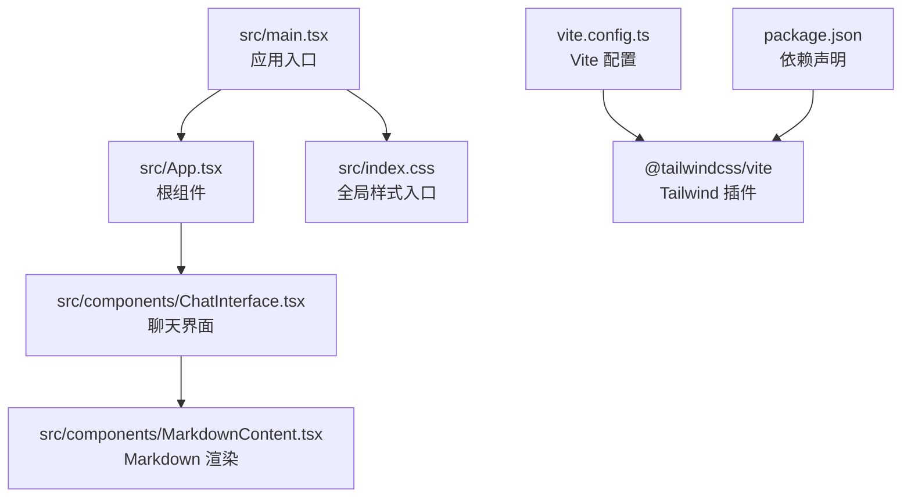
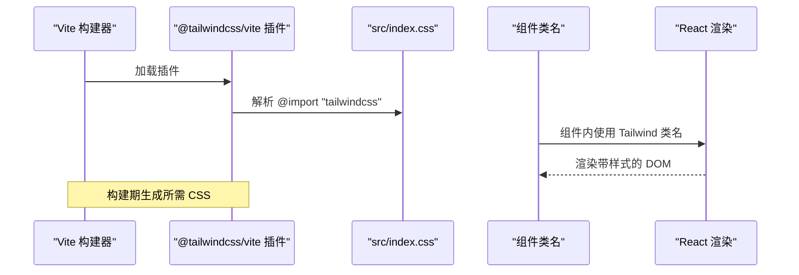
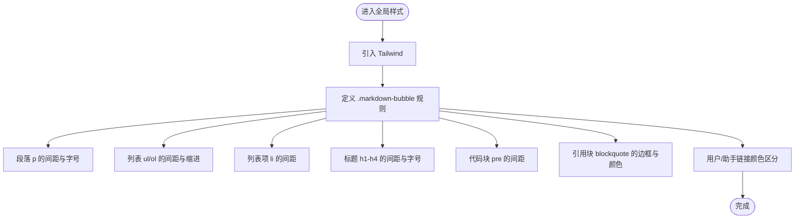
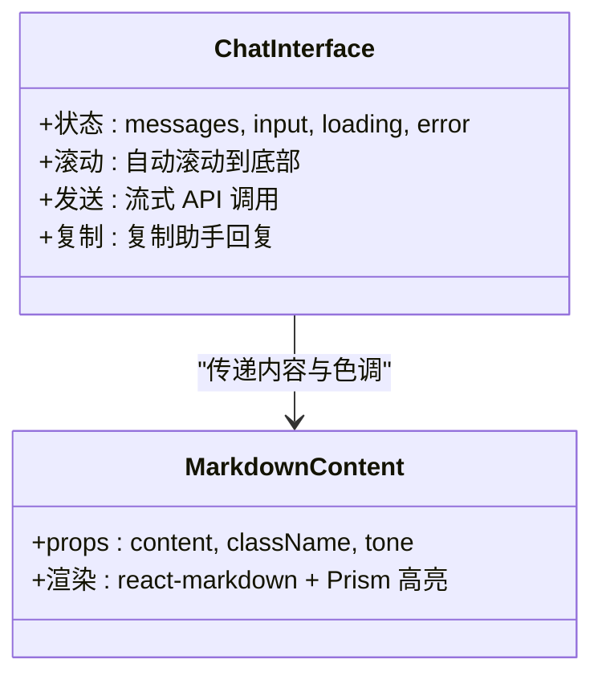
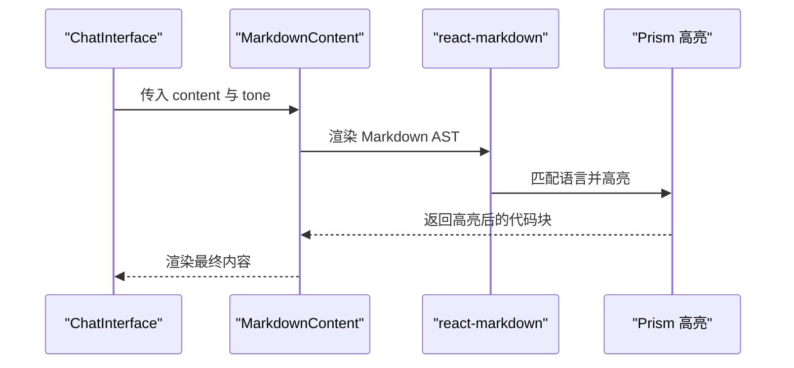
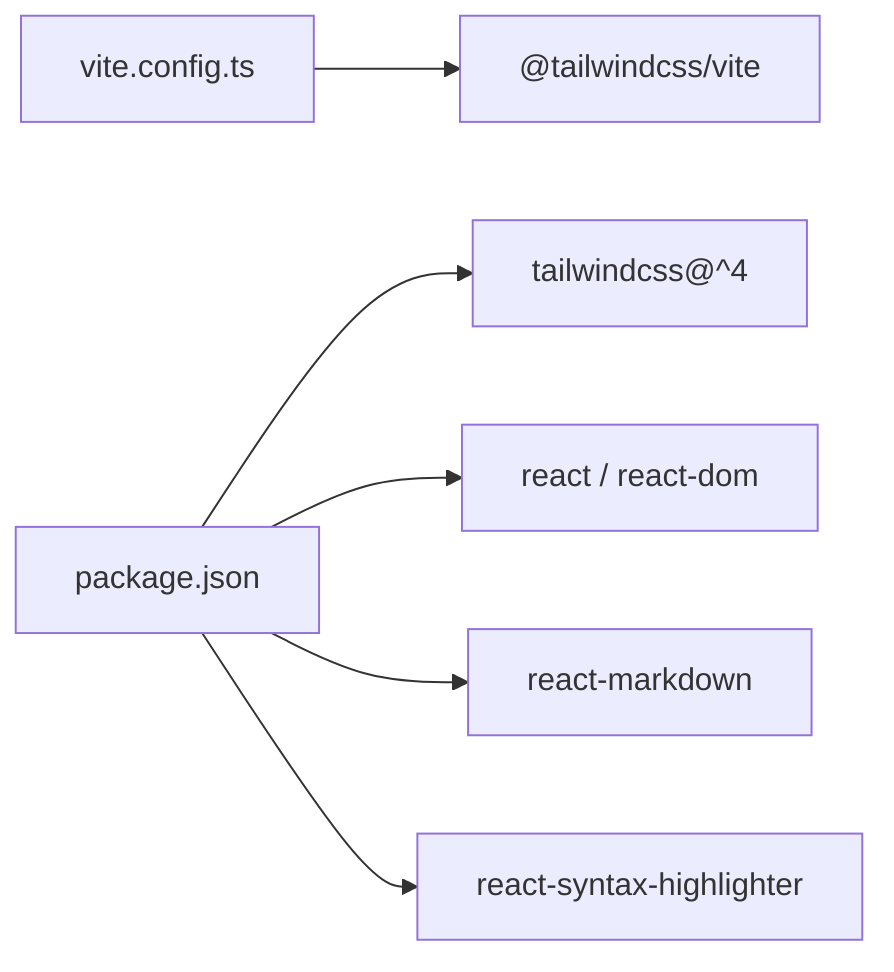

# 样式与主题

<cite>
**本文引用的文件**
- [src/index.css](file://src/index.css)
- [src/main.tsx](file://src/main.tsx)
- [src/App.tsx](file://src/App.tsx)
- [src/components/ChatInterface.tsx](file://src/components/ChatInterface.tsx)
- [src/components/MarkdownContent.tsx](file://src/components/MarkdownContent.tsx)
- [vite.config.ts](file://vite.config.ts)
- [package.json](file://package.json)
- [TECH_DESIGN.md](file://TECH_DESIGN.md)
</cite>

## 目录
1. [简介](#简介)
2. [项目结构](#项目结构)
3. [核心组件](#核心组件)
4. [架构总览](#架构总览)
5. [详细组件分析](#详细组件分析)
6. [依赖分析](#依赖分析)
7. [性能考量](#性能考量)
8. [故障排查指南](#故障排查指南)
9. [结论](#结论)
10. [附录](#附录)

## 简介
本文件聚焦于本项目的样式系统与主题机制，围绕 Tailwind CSS 的配置与定制策略展开，涵盖颜色体系、字体与间距规范、主题切换与暗色模式、响应式设计原则、类名约定与组件样式隔离、全局样式管理、自定义主题创建、颜色变量使用、动画效果、移动端适配、浏览器兼容性与性能优化，以及第三方组件的样式集成策略。

## 项目结构
本项目采用 React + TypeScript + Vite 架构，Tailwind CSS 通过 Vite 插件进行构建期处理。全局样式入口位于 src/index.css，应用根节点在 src/main.tsx 中挂载，主界面由 ChatInterface 组件负责渲染，Markdown 内容通过 MarkdownContent 组件渲染并集成代码高亮。

**图示来源**
- [src/main.tsx:1-11](file://src/main.tsx#L1-L11)
- [src/App.tsx:1-8](file://src/App.tsx#L1-L8)
- [src/components/ChatInterface.tsx:1-344](file://src/components/ChatInterface.tsx#L1-L344)
- [src/components/MarkdownContent.tsx:1-129](file://src/components/MarkdownContent.tsx#L1-L129)
- [src/index.css:1-56](file://src/index.css#L1-L56)
- [vite.config.ts:1-14](file://vite.config.ts#L1-L14)
- [package.json:1-36](file://package.json#L1-L36)

**章节来源**
- [src/main.tsx:1-11](file://src/main.tsx#L1-L11)
- [src/App.tsx:1-8](file://src/App.tsx#L1-L8)
- [vite.config.ts:1-14](file://vite.config.ts#L1-L14)
- [package.json:1-36](file://package.json#L1-L36)
- [TECH_DESIGN.md:1-17](file://TECH_DESIGN.md#L1-L17)

## 核心组件
- 全局样式入口：在全局样式中引入 Tailwind 并定义 Markdown 气泡排版规则，确保气泡内的段落、列表、标题、代码块、引用等元素具有统一且紧凑的视觉节奏。
- 应用入口与根组件：应用在 main.tsx 中引入全局样式并挂载根组件 App；App 直接渲染 ChatInterface。
- 聊天界面：ChatInterface 负责消息列表、输入框、发送按钮、错误提示区域的布局与交互，并通过 Tailwind 类名控制颜色、圆角、阴影、间距与响应式断点。
- Markdown 渲染：MarkdownContent 使用 react-markdown 渲染 Markdown，并通过 Prism 主题实现代码高亮，同时根据气泡“用户/助手”色调调整内联代码背景以避免冲突。

**章节来源**
- [src/index.css:1-56](file://src/index.css#L1-L56)
- [src/main.tsx:1-11](file://src/main.tsx#L1-L11)
- [src/App.tsx:1-8](file://src/App.tsx#L1-L8)
- [src/components/ChatInterface.tsx:206-342](file://src/components/ChatInterface.tsx#L206-L342)
- [src/components/MarkdownContent.tsx:70-128](file://src/components/MarkdownContent.tsx#L70-L128)

## 架构总览
Tailwind CSS 通过 @tailwindcss/vite 插件在构建时扫描源码中的类名并生成所需样式。全局样式入口引入 Tailwind，随后在组件中直接使用 Tailwind 类名进行布局与视觉控制。Markdown 内容渲染链路中，代码块通过 Prism 主题进行高亮，与整体气泡风格保持一致。

**图示来源**
- [vite.config.ts:1-14](file://vite.config.ts#L1-L14)
- [package.json:21-30](file://package.json#L21-L30)
- [src/index.css:1-1](file://src/index.css#L1-L1)
- [src/components/ChatInterface.tsx:206-342](file://src/components/ChatInterface.tsx#L206-L342)

## 详细组件分析

### 全局样式与 Markdown 气泡排版
- 引入 Tailwind：全局样式入口通过 @import 引入 Tailwind，确保所有 Tailwind 类名可用。
- 气泡内 Markdown 排版：针对 .markdown-bubble 及其子元素（段落、列表、标题、代码块、引用）设定紧凑的间距与字号，保证在聊天气泡内的阅读体验。
- 链接颜色区分：.markdown-bubble-user 与 .markdown-bubble-assistant 下的链接分别使用不同强调色，便于区分消息来源。

**图示来源**
- [src/index.css:1-56](file://src/index.css#L1-L56)

**章节来源**
- [src/index.css:1-56](file://src/index.css#L1-L56)

### 聊天界面样式与主题策略
- 颜色系统：界面采用浅灰背景与白色气泡，用户消息使用绿色气泡，助手消息使用白色边框气泡，配合阴影与圆角营造层级感。
- 字体与字号：统一使用较小字号（如 11px/15px），标题与正文通过语义化标签与 Tailwind 类名控制。
- 间距规范：使用 Tailwind 的 gap、px、py、pt/pb 等类名控制气泡间距与内边距，保证在不同屏幕下的可读性。
- 响应式设计：通过 max-width、flex、w-full、h-[100dvh] 等类名适配移动端与桌面端，header/footer 使用安全区域 inset 适配刘海屏/底部安全区。
- 动画与交互：发送按钮与输入框在交互态使用过渡类名，提升反馈体验。

**图示来源**
- [src/components/ChatInterface.tsx:206-342](file://src/components/ChatInterface.tsx#L206-L342)
- [src/components/MarkdownContent.tsx:70-128](file://src/components/MarkdownContent.tsx#L70-L128)

**章节来源**
- [src/components/ChatInterface.tsx:206-342](file://src/components/ChatInterface.tsx#L206-L342)

### Markdown 渲染与代码高亮
- 语言别名映射：通过 LANGUAGE_ALIASES 将常见语言别名标准化为 Prism 支持的语言 ID，提升高亮兼容性。
- 内联与块级代码：根据是否存在换行判断内联或块级代码，内联代码在用户气泡下使用更深底纹以避免与绿色冲突，在助手气泡下使用浅色背景。
- Prism 主题：使用 oneDark 主题，自定义代码块容器的圆角、字号与内边距，确保在气泡内的视觉一致性。

**图示来源**
- [src/components/MarkdownContent.tsx:70-128](file://src/components/MarkdownContent.tsx#L70-L128)

**章节来源**
- [src/components/MarkdownContent.tsx:14-62](file://src/components/MarkdownContent.tsx#L14-L62)
- [src/components/MarkdownContent.tsx:70-128](file://src/components/MarkdownContent.tsx#L70-L128)

### 主题切换与暗色模式
- 当前状态：项目未实现显式的主题切换与暗色模式逻辑。
- 建议方案：
  - 使用 CSS 变量集中管理颜色，例如 --color-bg、--color-text 等，通过根元素或特定容器切换类名动态切换。
  - 在 Tailwind 配置中新增暗色模式分组，或通过 JIT 的暗色模式指令实现自动变体。
  - 在组件层通过条件类名切换（如基于状态的 className 拼接）实现即时切换，避免全量重绘。
  - 为第三方组件（如代码高亮）提供暗色主题变体，确保整体一致性。

[本节为概念性指导，不直接分析具体文件，故无章节来源]

### 响应式设计原则
- 视口与视高：使用 h-[100dvh] 适配现代浏览器的动态视口单位，配合 env(safe-area-inset-*) 处理刘海屏与底部安全区。
- 宽度与最大宽度：通过 max-w-lg 限制内容宽度，同时在小屏设备上使用 w-full 与 flex 布局保证自适应。
- 文本与交互控件：在小屏设备上适当增大触摸目标尺寸（如按钮与输入框），并使用合适的行高与字间距提升可读性。

**章节来源**
- [src/components/ChatInterface.tsx:206-342](file://src/components/ChatInterface.tsx#L206-L342)

### 类名约定与组件样式隔离
- 类名约定：优先使用 Tailwind 的原子化类名，结合语义化命名（如 markdown-bubble、markdown-bubble-user）实现可读性与复用性的平衡。
- 样式隔离：通过组件内部类名组合与作用域化容器（如 header、main、footer 区域）实现样式边界，避免全局污染。
- 全局样式管理：仅在 src/index.css 中放置必要的全局重置与通用规则，避免在组件内重复定义。

**章节来源**
- [src/index.css:1-56](file://src/index.css#L1-L56)
- [src/components/ChatInterface.tsx:206-342](file://src/components/ChatInterface.tsx#L206-L342)

### 第三方组件样式集成
- react-markdown：通过自定义组件映射（code、pre 等）实现与 Tailwind 的融合。
- react-syntax-highlighter：使用 Prism 主题并自定义容器样式，确保与气泡背景与字号协调。
- 交互反馈：为按钮与输入框添加 hover/active/disabled 状态类名，提升可用性。

**章节来源**
- [src/components/MarkdownContent.tsx:70-128](file://src/components/MarkdownContent.tsx#L70-L128)
- [src/components/ChatInterface.tsx:320-340](file://src/components/ChatInterface.tsx#L320-L340)

## 依赖分析
- 构建工具链：Vite 通过 @tailwindcss/vite 插件集成 Tailwind CSS；Tailwind 版本为 4.0.0。
- 运行时依赖：React、react-markdown、react-syntax-highlighter 等用于界面与内容渲染。
- 开发依赖：TypeScript、ESLint、Tailwind CSS 与 Vite 插件共同保障开发体验与样式构建质量。

**图示来源**
- [vite.config.ts:1-14](file://vite.config.ts#L1-L14)
- [package.json:12-34](file://package.json#L12-L34)

**章节来源**
- [vite.config.ts:1-14](file://vite.config.ts#L1-L14)
- [package.json:12-34](file://package.json#L12-L34)

## 性能考量
- 构建期优化：Tailwind 4 通过更高效的 JIT 扫描与裁剪策略减少产物体积，建议启用生产构建并开启压缩。
- 样式体积控制：避免在组件内重复定义样式，尽量使用原子化类名；对第三方组件（如代码高亮）仅引入必要主题与样式。
- 运行时性能：在 ChatInterface 中使用 requestAnimationFrame 控制流式输出的渲染节拍，避免主线程阻塞；合理使用 CSS 过渡与阴影，避免过度复杂的效果影响滚动性能。
- 图片与资源：若后续引入图标或图片，建议使用 SVG 或 WebP，并在移动端按需加载。

[本节提供通用指导，不直接分析具体文件，故无章节来源]

## 故障排查指南
- Tailwind 类名无效：确认 vite.config.ts 中已正确加载 @tailwindcss/vite 插件，且 src/index.css 正确引入了 Tailwind。
- Markdown 渲染异常：检查 react-markdown 的组件映射是否正确，特别是代码块与行内代码的处理逻辑。
- 代码高亮不生效：确认 Prism 主题已正确导入并应用于代码块容器，同时检查语言别名映射是否覆盖常用语言。
- 移动端显示异常：检查是否使用了动态视口单位与安全区域 inset，确保在刘海屏与底部安全区场景下的布局稳定。

**章节来源**
- [vite.config.ts:1-14](file://vite.config.ts#L1-L14)
- [src/index.css:1-1](file://src/index.css#L1-L1)
- [src/components/MarkdownContent.tsx:70-128](file://src/components/MarkdownContent.tsx#L70-L128)

## 结论
本项目以 Tailwind CSS 为核心样式框架，结合原子化类名与组件化渲染，实现了简洁、可维护的聊天界面样式系统。当前未内置主题切换与暗色模式，但具备良好的扩展基础。通过 CSS 变量、暗色模式分组与第三方组件主题适配，可进一步完善主题体系与跨设备一致性。建议在后续迭代中完善主题切换、增强可访问性与性能优化，以满足更广泛的使用场景。

## 附录
- 自定义主题创建步骤（建议）
  - 在全局 CSS 中定义一组 CSS 变量作为颜色基线，例如 --color-primary、--color-bg、--color-text 等。
  - 在 Tailwind 配置中新增暗色模式分组或使用 JIT 暗色模式指令，将变量映射到暗色模式。
  - 在应用根节点或主题容器上切换类名（如 data-theme="dark"），驱动变量值变化。
  - 为第三方组件（如代码高亮）提供暗色主题变体，确保整体风格一致。
- 颜色变量使用方法（建议）
  - 在组件中优先使用变量而非硬编码颜色值，便于主题切换与品牌统一。
  - 对于需要对比度的元素（如按钮、链接），确保在明/暗两种模式下均满足可读性要求。
- 动画效果实现（建议）
  - 使用 Tailwind 的 transition、duration、ease-* 类名实现平滑过渡。
  - 对于复杂的交互动效，建议封装为独立的 Hook 或工具函数，避免在组件中分散逻辑。

[本节为概念性指导，不直接分析具体文件，故无章节来源]