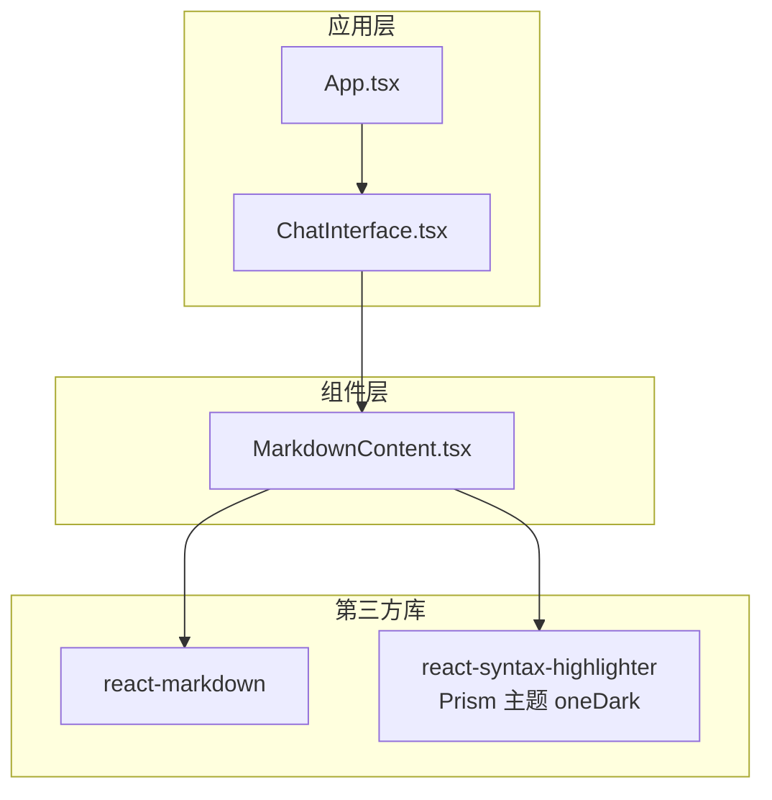
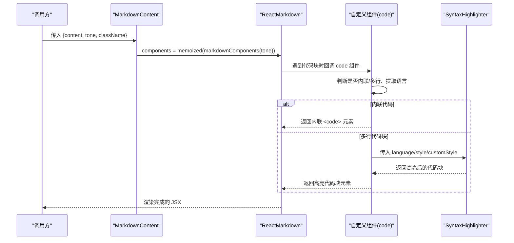
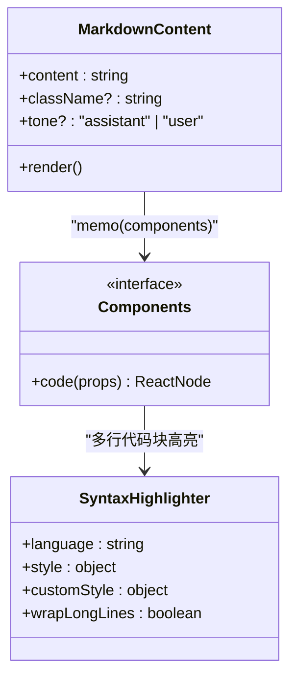
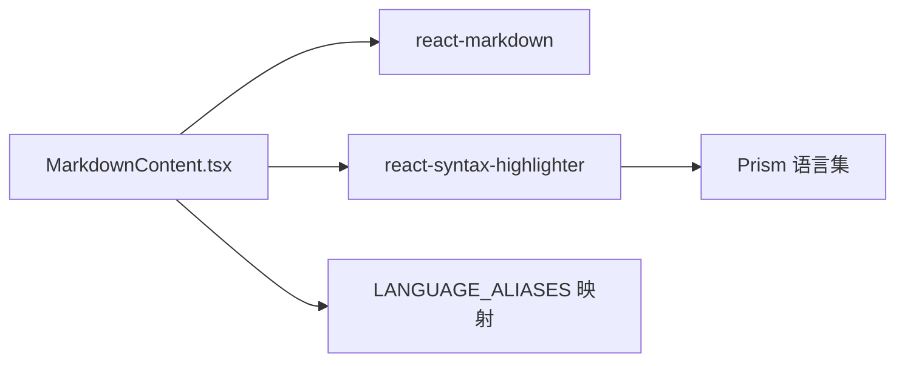

# Markdown内容渲染组件

<cite>
**本文引用的文件**
- [MarkdownContent.tsx](file://src/components/MarkdownContent.tsx)
- [ChatInterface.tsx](file://src/components/ChatInterface.tsx)
- [App.tsx](file://src/App.tsx)
- [types.ts](file://src/types.ts)
- [package.json](file://package.json)
- [PRD.md](file://PRD.md)
- [TECH_DESIGN.md](file://TECH_DESIGN.md)
</cite>

## 目录
1. [简介](#简介)
2. [项目结构](#项目结构)
3. [核心组件](#核心组件)
4. [架构总览](#架构总览)
5. [详细组件分析](#详细组件分析)
6. [依赖关系分析](#依赖关系分析)
7. [性能考虑](#性能考虑)
8. [故障排查指南](#故障排查指南)
9. [结论](#结论)
10. [附录](#附录)

## 简介
本文件为 MarkdownContent 组件的技术文档，聚焦于：
- react-markdown 渲染引擎的集成与配置
- 支持的 Markdown 语法特性与代码块渲染
- react-syntax-highlighter 的使用方法（语言映射、主题与自定义样式）
- 组件 props 接口设计与使用场景
- 渲染性能优化策略（代码块懒加载与缓存思路）
- 可扩展性与自定义渲染规则的实现方法
- 实际使用示例与最佳实践

## 项目结构
MarkdownContent 组件位于 src/components/MarkdownContent.tsx，被 ChatInterface.tsx 在聊天气泡中使用，用于渲染用户与助手的消息内容。项目采用 React + TypeScript + Vite 架构，并通过 Tailwind CSS 提供基础样式。

图表来源
- [App.tsx:1-8](file://src/App.tsx#L1-L8)
- [ChatInterface.tsx:1-344](file://src/components/ChatInterface.tsx#L1-L344)
- [MarkdownContent.tsx:1-129](file://src/components/MarkdownContent.tsx#L1-L129)
- [package.json:12-16](file://package.json#L12-L16)

章节来源
- [App.tsx:1-8](file://src/App.tsx#L1-L8)
- [ChatInterface.tsx:206-295](file://src/components/ChatInterface.tsx#L206-L295)
- [MarkdownContent.tsx:1-129](file://src/components/MarkdownContent.tsx#L1-L129)
- [package.json:12-16](file://package.json#L12-L16)

## 核心组件
MarkdownContent 是一个轻量、可复用的 Markdown 渲染组件，负责：
- 将 Markdown 文本渲染为安全的 HTML 结构
- 自动识别代码块语言并进行语法高亮
- 针对“用户”和“助手”两种语气提供差异化样式
- 通过 memo 化优化渲染性能

其 props 接口如下：
- content: string —— 待渲染的 Markdown 文本
- className?: string —— 外层容器类名，便于统一样式控制
- tone?: "assistant" | "user" —— 语气选择，影响内联代码与代码块的视觉风格

章节来源
- [MarkdownContent.tsx:7-12](file://src/components/MarkdownContent.tsx#L7-L12)
- [ChatInterface.tsx:247-266](file://src/components/ChatInterface.tsx#L247-L266)

## 架构总览
MarkdownContent 的渲染流程由 react-markdown 驱动，通过自定义组件映射实现代码块高亮；react-syntax-highlighter 负责语法高亮与主题渲染。

图表来源
- [MarkdownContent.tsx:70-115](file://src/components/MarkdownContent.tsx#L70-L115)
- [MarkdownContent.tsx:117-128](file://src/components/MarkdownContent.tsx#L117-L128)

## 详细组件分析

### 组件类图

图表来源
- [MarkdownContent.tsx:7-12](file://src/components/MarkdownContent.tsx#L7-L12)
- [MarkdownContent.tsx:70-115](file://src/components/MarkdownContent.tsx#L70-L115)
- [MarkdownContent.tsx:89-112](file://src/components/MarkdownContent.tsx#L89-L112)

章节来源
- [MarkdownContent.tsx:1-129](file://src/components/MarkdownContent.tsx#L1-L129)

### Props 接口与语义
- content: Markdown 字符串，支持标题、列表、链接、加粗、斜体、代码块等常见语法
- className: 外层容器类名，便于统一布局与间距
- tone: 
  - "assistant"：默认样式，适合助手消息的代码块
  - "user"：用户消息中的内联代码使用更深底纹，避免与绿色气泡背景冲突

章节来源
- [MarkdownContent.tsx:7-12](file://src/components/MarkdownContent.tsx#L7-L12)
- [ChatInterface.tsx:247-266](file://src/components/ChatInterface.tsx#L247-L266)

### 代码块语言映射与高亮
- 语言别名映射表覆盖主流前端、后端与运维语言，确保代码块能正确识别语言
- normalizePrismLanguage 函数负责规范化语言标识，若未识别则回退为纯文本
- 语法高亮主题使用 oneDark，代码块样式通过 customStyle 进行字号、圆角、内边距等微调
- 代码标签字体族通过 codeTagProps 指定，保证跨平台一致性

章节来源
- [MarkdownContent.tsx:14-68](file://src/components/MarkdownContent.tsx#L14-L68)
- [MarkdownContent.tsx:89-112](file://src/components/MarkdownContent.tsx#L89-L112)

### 内联代码与多行代码块的差异化处理
- 内联代码：根据 tone 动态选择不同的背景色与内边距，确保在不同背景下具备良好可读性
- 多行代码块：包裹在滚动容器中，启用长行换行，提供统一的圆角与字号样式

章节来源
- [MarkdownContent.tsx:73-114](file://src/components/MarkdownContent.tsx#L73-L114)

### 在聊天界面中的使用
- 用户消息与助手消息分别传入不同的 tone，以获得合适的内联代码底纹
- className 用于统一气泡样式与 Markdown 容器的排版

章节来源
- [ChatInterface.tsx:247-266](file://src/components/ChatInterface.tsx#L247-L266)

### 自定义渲染规则与可扩展性
- 通过 react-markdown 的 components 属性注入自定义渲染函数，可扩展支持表格、图片、脚注等
- 当前仅重写 code 组件；如需扩展其他节点，可在 markdownComponents 中添加对应键值
- 由于使用 useMemo 缓存组件映射，新增自定义组件时应确保依赖稳定

章节来源
- [MarkdownContent.tsx:70-115](file://src/components/MarkdownContent.tsx#L70-L115)
- [MarkdownContent.tsx](file://src/components/MarkdownContent.tsx#L122)

## 依赖关系分析
- react-markdown：负责解析 Markdown 并触发自定义组件回调
- react-syntax-highlighter：提供语法高亮能力，内置 Prism 主题 oneDark
- 语言映射依赖：通过 LANGUAGE_ALIASES 将常见别名映射到 Prism 支持的语言 ID

图表来源
- [MarkdownContent.tsx:1-5](file://src/components/MarkdownContent.tsx#L1-L5)
- [MarkdownContent.tsx:14-68](file://src/components/MarkdownContent.tsx#L14-L68)
- [package.json:15-16](file://package.json#L15-L16)

章节来源
- [MarkdownContent.tsx:1-5](file://src/components/MarkdownContent.tsx#L1-L5)
- [package.json:12-16](file://package.json#L12-L16)

## 性能考虑
当前实现的性能优化点：
- 使用 useMemo 缓存组件映射，避免每次渲染都重新生成组件对象
- 代码块高亮在需要时才执行，减少不必要的计算

可进一步优化的方向（建议）：
- 代码块懒加载：仅在可见区域或首次交互时渲染高亮，可通过 IntersectionObserver 或虚拟化列表实现
- 语言识别缓存：对已识别的语言进行缓存，避免重复正则匹配
- 主题样式缓存：将 oneDark 主题样式对象缓存，避免重复构建
- 批量渲染：对于大量消息的场景，可考虑分帧渲染或 Web Worker 分担计算

章节来源
- [MarkdownContent.tsx](file://src/components/MarkdownContent.tsx#L122)

## 故障排查指南
- 代码块未高亮
  - 检查语言别名是否在映射表中，或是否使用了不常见的语言标识
  - 确认 normalizePrismLanguage 是否正确返回语言 ID
- 内联代码颜色不明显
  - tone 设置为 "user" 时会使用更深底纹，确认传参是否正确
- 代码块过宽导致横向滚动
  - 当前已启用横向滚动容器，若仍异常，检查外层容器宽度限制
- 主题样式不符合预期
  - customStyle 与 codeTagProps 已定制字号与字体，确认是否被上层样式覆盖

章节来源
- [MarkdownContent.tsx:73-114](file://src/components/MarkdownContent.tsx#L73-L114)

## 结论
MarkdownContent 组件通过 react-markdown 与 react-syntax-highlighter 的组合，实现了简洁而强大的 Markdown 渲染能力。其 props 设计清晰，语义明确；通过 tone 参数与内联/多行代码块的差异化处理，满足了聊天界面的视觉一致性需求。结合 useMemo 的缓存策略，组件在性能上具备良好的表现。未来可进一步引入懒加载与缓存机制，以应对大规模内容渲染场景。

## 附录

### 使用示例（路径指引）
- 在用户消息中渲染 Markdown（内联代码深底纹）
  - [ChatInterface.tsx:247-253](file://src/components/ChatInterface.tsx#L247-L253)
- 在助手消息中渲染 Markdown（默认浅底纹）
  - [ChatInterface.tsx:254-266](file://src/components/ChatInterface.tsx#L254-L266)
- 组件 props 说明
  - [MarkdownContent.tsx:7-12](file://src/components/MarkdownContent.tsx#L7-L12)

### 支持的语言别名（节选）
- JavaScript/TypeScript 生态：js、ts、jsx、tsx、mjs、cjs
- Python：py、python、python3
- Ruby/Rust/Go：rb、rs、go
- Shell：sh、shell、bash、zsh
- YAML/JSON/HTML/CSS/SQL：yml、yaml、json、jsonc、html、xml、vue、css、scss、less、sql
- Kotlin/Swift/Java/C/C++：kt、kotlin、kts、swift、java、csharp、cs、cpp、cxx、cc、c
- Docker/GraphQL/TOML：dockerfile、docker、graphql、gql、toml

章节来源
- [MarkdownContent.tsx:14-62](file://src/components/MarkdownContent.tsx#L14-L62)