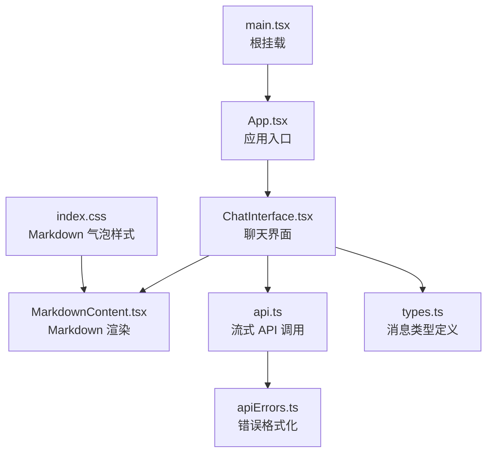
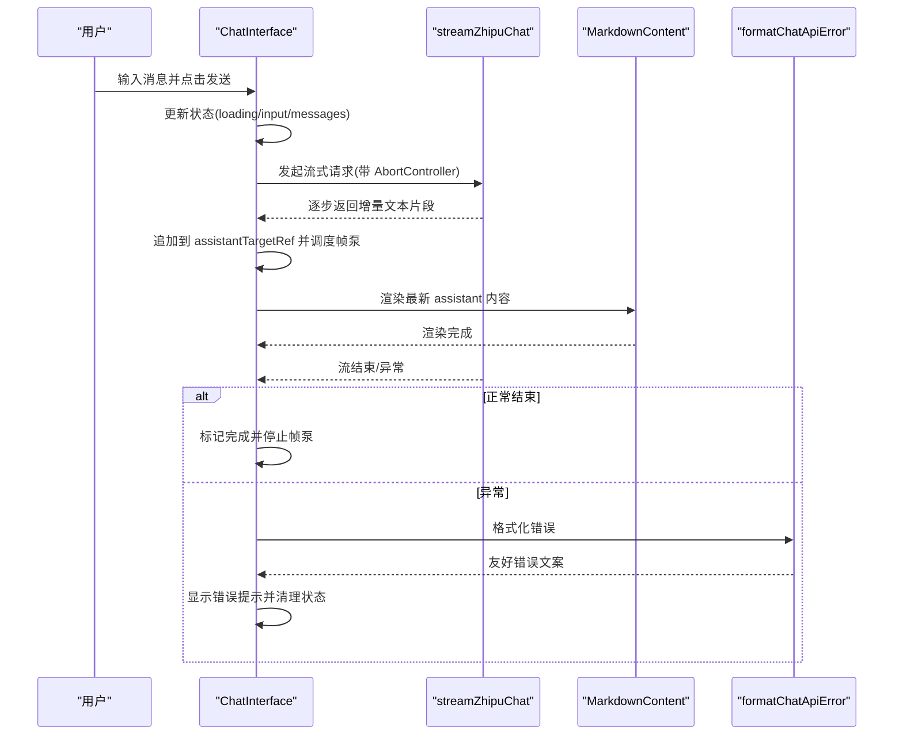
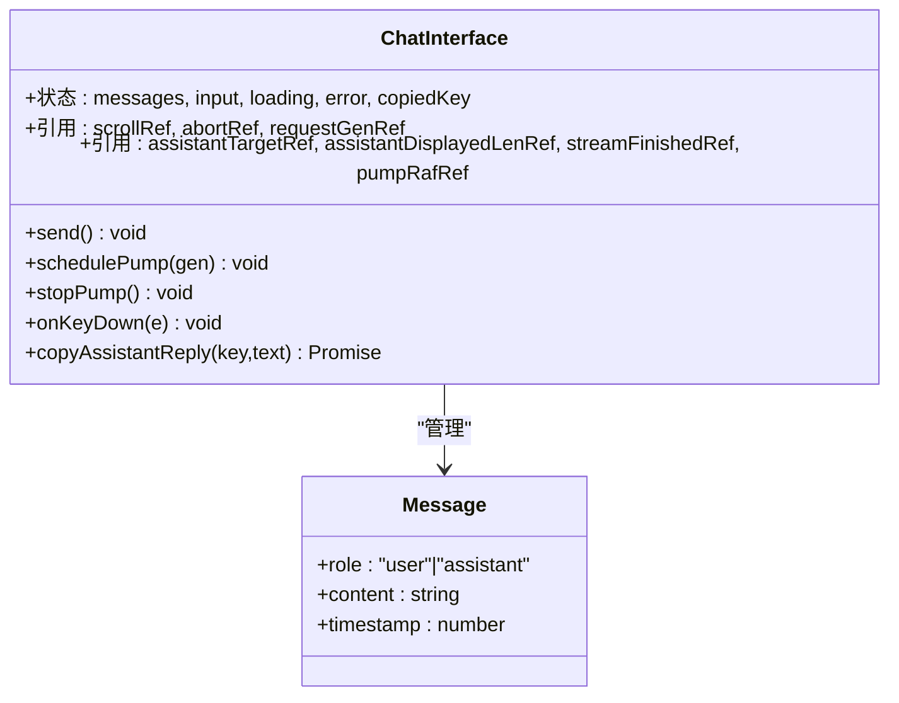
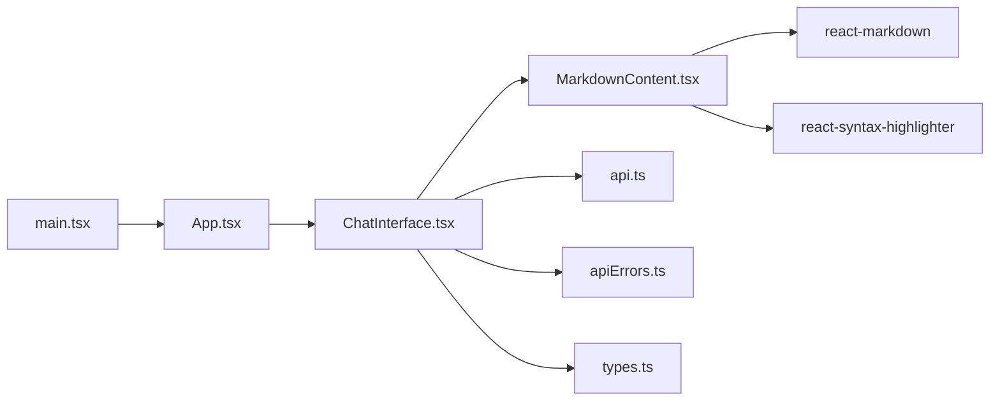

# 核心组件

<cite>
**本文引用的文件**
- [ChatInterface.tsx](file://src/components/ChatInterface.tsx)
- [MarkdownContent.tsx](file://src/components/MarkdownContent.tsx)
- [App.tsx](file://src/App.tsx)
- [types.ts](file://src/types.ts)
- [api.ts](file://src/api.ts)
- [apiErrors.ts](file://src/apiErrors.ts)
- [main.tsx](file://src/main.tsx)
- [index.css](file://src/index.css)
- [package.json](file://src/package.json)
</cite>

## 目录
1. [简介](#简介)
2. [项目结构](#项目结构)
3. [核心组件](#核心组件)
4. [架构总览](#架构总览)
5. [详细组件分析](#详细组件分析)
6. [依赖关系分析](#依赖关系分析)
7. [性能考量](#性能考量)
8. [故障排查指南](#故障排查指南)
9. [结论](#结论)
10. [附录](#附录)

## 简介
本技术文档聚焦于AI聊天助手的核心组件，系统性解析以下要点：
- ChatInterface 组件的状态管理、事件处理与流式文本显示逻辑
- MarkdownContent 组件的渲染机制、代码高亮实现与自定义样式配置
- 组件间通信模式、props 传递与回调处理
- 生命周期管理、性能优化策略与内存泄漏防护
- 具体的使用模式与可复用性、扩展性设计

## 项目结构
该项目采用以功能模块为中心的组织方式，核心组件位于 src/components 下，应用入口与类型定义分别位于 src/App.tsx、src/main.tsx 与 src/types.ts。Markdown 渲染与代码高亮通过第三方库实现，样式通过 TailwindCSS 与局部 CSS 类进行定制。



图表来源
- [App.tsx:1-8](file://src/App.tsx#L1-L8)
- [ChatInterface.tsx:1-344](file://src/components/ChatInterface.tsx#L1-L344)
- [MarkdownContent.tsx:1-129](file://src/components/MarkdownContent.tsx#L1-L129)
- [api.ts:1-184](file://src/api.ts#L1-L184)
- [apiErrors.ts:1-62](file://src/apiErrors.ts#L1-L62)
- [types.ts:1-9](file://src/types.ts#L1-L9)
- [main.tsx:1-11](file://src/main.tsx#L1-L11)
- [index.css:1-56](file://src/index.css#L1-L56)

章节来源
- [App.tsx:1-8](file://src/App.tsx#L1-L8)
- [main.tsx:1-11](file://src/main.tsx#L1-L11)
- [package.json:1-36](file://src/package.json#L1-L36)

## 核心组件
本节概述两个核心组件的职责与交互：
- ChatInterface：负责消息列表状态、输入框控制、发送流程、流式响应处理、滚动定位、错误提示与复制功能。
- MarkdownContent：负责将 Markdown 文本渲染为 HTML，并对代码块进行语法高亮与样式定制。

章节来源
- [ChatInterface.tsx:25-344](file://src/components/ChatInterface.tsx#L25-L344)
- [MarkdownContent.tsx:117-129](file://src/components/MarkdownContent.tsx#L117-L129)

## 架构总览
下图展示了从用户输入到流式响应显示的端到端流程，以及组件之间的数据与控制流。



图表来源
- [ChatInterface.tsx:106-182](file://src/components/ChatInterface.tsx#L106-L182)
- [api.ts:70-183](file://src/api.ts#L70-L183)
- [MarkdownContent.tsx:117-129](file://src/components/MarkdownContent.tsx#L117-L129)
- [apiErrors.ts:33-61](file://src/apiErrors.ts#L33-L61)

## 详细组件分析

### ChatInterface 组件
ChatInterface 是聊天界面的核心，承担以下职责：
- 状态管理：维护消息列表、输入框内容、加载状态、错误信息、复制状态等。
- 事件处理：键盘事件（Enter 发送）、按钮点击、滚动行为、复制操作。
- 流式文本显示：通过 requestAnimationFrame 驱动的“帧泵”算法，将增量文本以逐字效果展示。
- 请求与取消：使用 AbortController 管理并发请求，确保新请求会取消旧请求。
- 错误处理：统一格式化 API 错误，向用户展示可读提示。
- 组件通信：向 MarkdownContent 传递内容与样式属性；通过回调处理复制操作。

状态与引用说明
- messages：消息数组，包含用户与助手消息，用于渲染对话气泡。
- input：当前输入框内容。
- loading：是否处于流式请求中。
- error：当前错误信息。
- copiedKey：当前已复制的助手消息键值。
- assistantTargetRef：当前助手消息的完整增量文本缓冲区。
- assistantDisplayedLenRef：当前已展示的字符长度。
- streamFinishedRef：流是否已完成。
- pumpRafRef：帧泵的 requestAnimationFrame 句柄。
- abortRef：当前请求的 AbortController。
- requestGenRef：请求代数，用于区分新旧请求。

逐字显示算法（帧泵）
- 通过 requestAnimationFrame 循环，每次将 assistantDisplayedLenRef 增长 CHARS_PER_FRAME（默认为 1），并更新最后一条助手消息的 content。
- 当 assistantTargetRef 的长度达到目标时，标记流完成并停止帧泵。
- 若请求被取消，停止帧泵并清理状态。

发送流程
- 校验输入与加载状态，创建新的 AbortController，递增 requestGenRef。
- 追加用户消息与占位助手消息，启动帧泵。
- 调用 streamZhipuChat 获取增量文本，追加到 assistantTargetRef。
- 正常完成后标记完成并停止帧泵；异常时格式化错误并清理状态。

键盘与复制
- Enter（不按 Shift）触发发送；禁用 Shift+Enter 换行，由 textarea 自身支持。
- 复制按钮调用 copyAssistantReply，成功后短暂提示“已复制”。

渲染与样式
- 使用 TailwindCSS 类控制布局、颜色与阴影；Markdown 气泡样式通过 index.css 定义。
- 助手消息包含“思考中”提示，当最后一条助手消息为空且仍在加载时显示。

章节来源
- [ChatInterface.tsx:25-344](file://src/components/ChatInterface.tsx#L25-L344)
- [types.ts:4-8](file://src/types.ts#L4-L8)
- [api.ts:70-183](file://src/api.ts#L70-L183)
- [apiErrors.ts:33-61](file://src/apiErrors.ts#L33-L61)
- [index.css:8-56](file://src/index.css#L8-L56)

#### ChatInterface 类图


图表来源
- [ChatInterface.tsx:25-344](file://src/components/ChatInterface.tsx#L25-L344)
- [types.ts:4-8](file://src/types.ts#L4-L8)

### MarkdownContent 组件
MarkdownContent 负责将 Markdown 文本渲染为 HTML，并对代码块进行语法高亮与样式定制：
- 渲染引擎：使用 react-markdown。
- 代码高亮：使用 react-syntax-highlighter，主题为 oneDark。
- 语言映射：内置常见语言别名到 Prism 语言 ID 的映射，支持多种编程语言与标记语言。
- 行内与块级代码：根据是否存在换行判断是否为行内代码；行内代码使用不同背景色以适配用户/助手气泡。
- 自定义样式：通过 className 传入容器样式；根据 tone（assistant/user）调整行内代码背景与对比度。

渲染流程
- 接收 content、className、tone 三个 props。
- 使用 useMemo 缓存 Components 对象，避免不必要的重渲染。
- 将自定义 code 组件注入 ReactMarkdown，实现代码块高亮与行内代码样式。
- 输出包裹在容器 div 中的渲染结果。

章节来源
- [MarkdownContent.tsx:117-129](file://src/components/MarkdownContent.tsx#L117-L129)
- [MarkdownContent.tsx:70-115](file://src/components/MarkdownContent.tsx#L70-L115)
- [MarkdownContent.tsx:14-68](file://src/components/MarkdownContent.tsx#L14-L68)
- [index.css:8-56](file://src/index.css#L8-L56)

#### MarkdownContent 类图
```mermaid
classDiagram
class MarkdownContent {
+props : content, className?, tone?
+normalizePrismLanguage(raw) string
+markdownComponents(tone) Components
+render() JSX.Element
}
class Components {
+code({className, children}) JSX.Element
}
MarkdownContent --> Components : "生成"
```

图表来源
- [MarkdownContent.tsx:117-129](file://src/components/MarkdownContent.tsx#L117-L129)
- [MarkdownContent.tsx:70-115](file://src/components/MarkdownContent.tsx#L70-L115)

### 组件间通信与 Props 传递
- ChatInterface 向 MarkdownContent 传递：
  - content：当前消息内容（字符串）
  - tone：assistant 或 user（决定行内代码背景）
  - className：Markdown 气泡容器类名（如 markdown-bubble、markdown-bubble-assistant）
- ChatInterface 通过回调处理复制操作，向 MarkdownContent 不传递回调。
- ChatInterface 通过 props 控制 MarkdownContent 的渲染样式与行为。

章节来源
- [ChatInterface.tsx:248-289](file://src/components/ChatInterface.tsx#L248-L289)
- [MarkdownContent.tsx:117-129](file://src/components/MarkdownContent.tsx#L117-L129)

### 生命周期管理与内存泄漏防护
- 帧泵清理：在 ChatInterface 卸载时调用 stopPump，取消 requestAnimationFrame，防止后台循环。
- 请求取消：每次发送前创建新的 AbortController，旧请求通过 abortRef.abort() 取消，避免竞态与内存泄漏。
- 状态隔离：通过 requestGenRef 区分新旧请求，确保回调只作用于当前请求代数。
- 错误分支：捕获 AbortError 与网络错误，及时清理状态并停止帧泵。

章节来源
- [ChatInterface.tsx:191-191](file://src/components/ChatInterface.tsx#L191-L191)
- [ChatInterface.tsx:110-114](file://src/components/ChatInterface.tsx#L110-L114)
- [ChatInterface.tsx:154-161](file://src/components/ChatInterface.tsx#L154-L161)

## 依赖关系分析
- ChatInterface 依赖：
  - MarkdownContent：渲染消息内容
  - api.ts：流式 API 调用
  - apiErrors.ts：错误格式化
  - types.ts：消息类型定义
- MarkdownContent 依赖：
  - react-markdown：Markdown 渲染
  - react-syntax-highlighter：代码高亮
  - oneDark 主题：代码块主题
- 应用入口：
  - main.tsx：根节点挂载
  - App.tsx：根组件



图表来源
- [ChatInterface.tsx:1-11](file://src/components/ChatInterface.tsx#L1-L11)
- [MarkdownContent.tsx:1-5](file://src/components/MarkdownContent.tsx#L1-L5)
- [api.ts:1-2](file://src/api.ts#L1-L2)
- [apiErrors.ts:1-1](file://src/apiErrors.ts#L1-L1)
- [types.ts:1-1](file://src/types.ts#L1-L1)
- [App.tsx:1-1](file://src/App.tsx#L1-L1)
- [main.tsx:1-4](file://src/main.tsx#L1-L4)

章节来源
- [package.json:12-17](file://src/package.json#L12-L17)
- [package.json:18-34](file://src/package.json#L18-L34)

## 性能考量
- 帧泵逐字显示：CHARS_PER_FRAME 控制每帧增量字符数量，兼顾流畅度与性能。建议在低端设备上适当降低该值。
- useMemo 缓存：MarkdownContent 使用 useMemo 缓存 Components，避免重复创建导致的重渲染。
- 请求取消：通过 AbortController 及时取消过期请求，减少无意义的网络与渲染开销。
- 滚动优化：仅在消息列表变化时滚动到底部，避免频繁 DOM 访问。
- 代码高亮：仅在需要时渲染代码块，行内代码不触发高亮器，减少计算量。
- 样式优化：通过 TailwindCSS 与局部 CSS 类减少内联样式的复杂度，提升渲染效率。

[本节为通用性能建议，无需特定文件来源]

## 故障排查指南
- API Key 未配置：检查 .env 文件中的 VITE_ZHIPU_API_KEY 是否存在且有效。
- 网络异常：检查网络连接、代理或防火墙设置；错误会被格式化为用户可读提示。
- 请求超时/限频：根据状态码返回友好提示，稍后再试。
- 流式连接中断：捕获连接中断错误并提示重试。
- 复制失败：若剪贴板权限不足，组件会提示检查权限或手动复制。

章节来源
- [api.ts:23-38](file://src/api.ts#L23-L38)
- [apiErrors.ts:3-31](file://src/apiErrors.ts#L3-L31)
- [ChatInterface.tsx:193-204](file://src/components/ChatInterface.tsx#L193-L204)

## 结论
本项目通过 ChatInterface 与 MarkdownContent 的协同，实现了流畅的流式对话体验与高质量的 Markdown 渲染。通过帧泵逐字显示、请求取消与错误格式化等机制，系统在可用性与性能之间取得了良好平衡。组件设计具备良好的可复用性与扩展性，便于后续接入更多模型与增强渲染能力。

[本节为总结性内容，无需特定文件来源]

## 附录
- 使用模式
  - 在父组件中引入 ChatInterface，即可获得完整的聊天功能。
  - 如需自定义 Markdown 样式，可在 MarkdownContent 外层容器传入 className，并结合 index.css 覆盖默认样式。
- 扩展建议
  - 支持更多模型：在 api.ts 中调整模型选择与环境变量。
  - 自定义代码高亮主题：替换 oneDark 或增加更多主题。
  - 增强错误处理：扩展 apiErrors.ts 的错误分类与提示。
  - 添加历史记录：在 ChatInterface 中持久化 messages，配合 chatStorage.ts 实现。

[本节为概念性内容，无需特定文件来源]