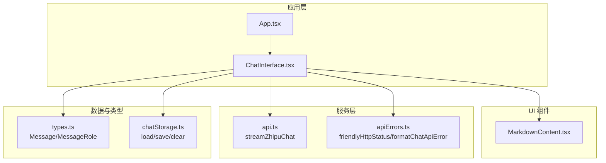
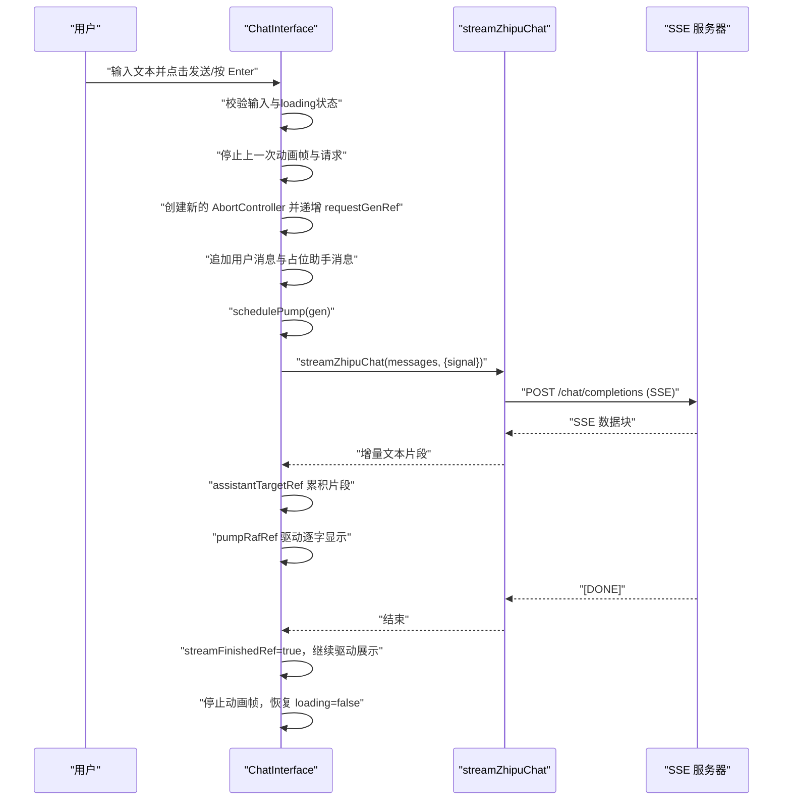
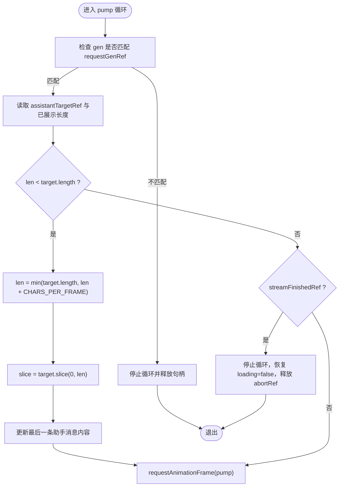
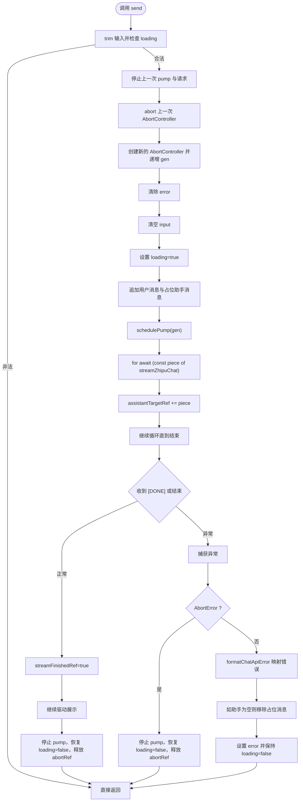
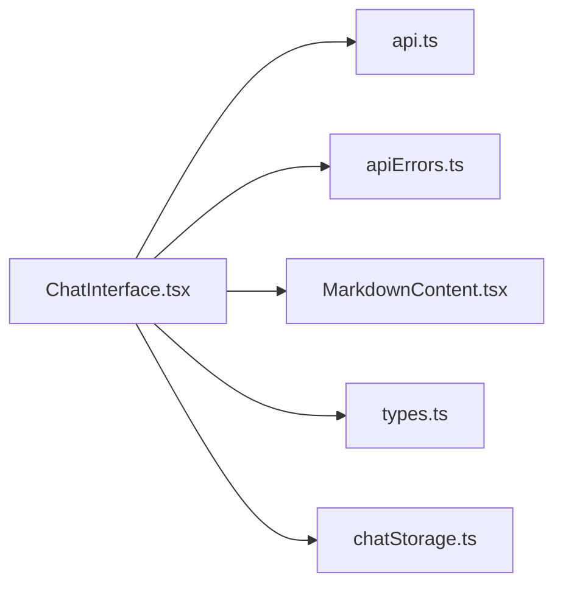

# 聊天界面组件

<cite>
**本文引用的文件**
- [ChatInterface.tsx](file://src/components/ChatInterface.tsx)
- [api.ts](file://src/api.ts)
- [apiErrors.ts](file://src/apiErrors.ts)
- [MarkdownContent.tsx](file://src/components/MarkdownContent.tsx)
- [chatStorage.ts](file://src/chatStorage.ts)
- [types.ts](file://src/types.ts)
- [App.tsx](file://src/App.tsx)
</cite>

## 目录
1. [简介](#简介)
2. [项目结构](#项目结构)
3. [核心组件](#核心组件)
4. [架构总览](#架构总览)
5. [详细组件分析](#详细组件分析)
6. [依赖关系分析](#依赖关系分析)
7. [性能考量](#性能考量)
8. [故障排查指南](#故障排查指南)
9. [结论](#结论)
10. [附录](#附录)

## 简介
本文件为 ChatInterface 组件的深度技术文档，聚焦以下主题：
- 状态管理机制：messages、input、loading、error 的管理策略与生命周期联动
- 流式文本显示：基于 requestAnimationFrame 的动画循环、CHARS_PER_FRAME 节流、assistantTargetRef 缓冲区与展示进度的协同
- send 函数全流程：输入校验、并发请求控制、API 调用、流式响应处理、错误捕获与回退
- 键盘事件与交互：Enter 发送、Shift+Enter 换行、禁用态与防抖式触发
- 生命周期与内存防护：取消动画帧、AbortController 取消、组件卸载清理
- 性能优化与扩展建议：渲染节流、滚动行为、Markdown 渲染优化、存储与复用

## 项目结构
ChatInterface 是一个独立的 React 组件，负责用户输入、消息列表渲染、流式响应展示与错误提示。其依赖外部 API 层（流式 SSE）、错误格式化工具、Markdown 渲染组件以及可选的消息持久化存储。

图表来源
- [App.tsx:1-8](file://src/App.tsx#L1-L8)
- [ChatInterface.tsx:1-344](file://src/components/ChatInterface.tsx#L1-L344)
- [api.ts:1-184](file://src/api.ts#L1-L184)
- [apiErrors.ts:1-62](file://src/apiErrors.ts#L1-L62)
- [MarkdownContent.tsx:1-129](file://src/components/MarkdownContent.tsx#L1-L129)
- [chatStorage.ts:1-51](file://src/chatStorage.ts#L1-L51)
- [types.ts:1-9](file://src/types.ts#L1-L9)

章节来源
- [App.tsx:1-8](file://src/App.tsx#L1-L8)
- [ChatInterface.tsx:1-344](file://src/components/ChatInterface.tsx#L1-L344)

## 核心组件
ChatInterface 是一个无状态函数组件，内部通过 useState/useState/useRef 管理对话状态与渲染控制；通过 useEffect 管理滚动与清理；通过 useCallback 优化回调以减少重渲染。

关键状态与引用：
- messages：对话历史数组，包含用户与助手消息，时间戳用于唯一键值
- input：当前输入框文本
- loading：是否正在等待流式响应
- error：错误提示文本
- scrollRef：容器滚动元素引用，用于自动滚动到底部
- abortRef：AbortController 引用，用于取消正在进行的请求
- requestGenRef：请求代数，用于区分并发请求的新旧，防止竞态
- copiedKey：复制按钮状态键
- assistantTargetRef：助手流式文本的完整缓冲区
- assistantDisplayedLenRef：已展示到界面的字符长度
- streamFinishedRef：流式传输是否完成
- pumpRafRef：requestAnimationFrame 的句柄，用于驱动逐字显示

章节来源
- [ChatInterface.tsx:25-49](file://src/components/ChatInterface.tsx#L25-L49)
- [ChatInterface.tsx:106-182](file://src/components/ChatInterface.tsx#L106-L182)

## 架构总览
下图展示了从用户输入到流式渲染的端到端流程，包括状态变更、API 调用、流式解析与逐字展示。

图表来源
- [ChatInterface.tsx:106-182](file://src/components/ChatInterface.tsx#L106-L182)
- [api.ts:70-183](file://src/api.ts#L70-L183)

## 详细组件分析

### 状态管理机制
- messages：每次新增用户消息后，立即插入一条占位助手消息，保证 UI 连贯性；助手消息内容通过逐字展示更新
- input：受控输入，发送前 trim 并清空；发送期间禁用输入
- loading：发送开始设为 true，收到结束信号或异常后设为 false
- error：仅在 API 错误时设置，支持用户关闭
- requestGenRef：每轮新请求自增，用于区分旧请求，避免竞态导致的 UI 回退
- abortRef：每个请求拥有独立 AbortController，可随时取消
- assistantTargetRef/assistantDisplayedLenRef/streamFinishedRef：流式缓冲与展示进度的三元状态，配合 requestAnimationFrame 驱动

章节来源
- [ChatInterface.tsx:25-49](file://src/components/ChatInterface.tsx#L25-L49)
- [ChatInterface.tsx:106-182](file://src/components/ChatInterface.tsx#L106-L182)

### 流式文本显示实现
逐字显示的核心是基于 requestAnimationFrame 的泵（pump）循环，通过 CHARS_PER_FRAME 控制每帧展示的字符数量，从而实现“打字机”效果。

图表来源
- [ChatInterface.tsx:51-104](file://src/components/ChatInterface.tsx#L51-L104)
- [ChatInterface.tsx:22-23](file://src/components/ChatInterface.tsx#L22-L23)

章节来源
- [ChatInterface.tsx:51-104](file://src/components/ChatInterface.tsx#L51-L104)

### send 函数完整工作流程
send 函数负责完整的对话发送流程，包含输入校验、并发控制、API 调用、流式处理与错误捕获。

图表来源
- [ChatInterface.tsx:106-182](file://src/components/ChatInterface.tsx#L106-L182)
- [api.ts:70-183](file://src/api.ts#L70-L183)
- [apiErrors.ts:33-61](file://src/apiErrors.ts#L33-L61)

章节来源
- [ChatInterface.tsx:106-182](file://src/components/ChatInterface.tsx#L106-L182)
- [api.ts:70-183](file://src/api.ts#L70-L183)
- [apiErrors.ts:33-61](file://src/apiErrors.ts#L33-L61)

### 键盘事件处理与交互
- Enter 发送：阻止默认换行，调用 send
- Shift+Enter 换行：允许默认行为
- 输入禁用：发送期间禁用 textarea 与按钮
- 复制助手回复：点击复制按钮，成功后短暂高亮“已复制”，失败时弹出错误提示

章节来源
- [ChatInterface.tsx:184-204](file://src/components/ChatInterface.tsx#L184-L204)

### Markdown 内容渲染
助手消息通过 MarkdownContent 组件渲染，支持代码高亮与内联代码样式区分（用户气泡内联代码采用更深底色以避免与绿色气泡冲突）。

章节来源
- [MarkdownContent.tsx:70-129](file://src/components/MarkdownContent.tsx#L70-L129)

### 生命周期管理与内存防护
- 自动滚动：messages 更新后滚动到底部
- 动画帧清理：组件卸载时取消 requestAnimationFrame
- 请求取消：每次新请求前 abort 上一次请求
- 引用隔离：使用多个 useRef 保存跨渲染周期的状态，避免闭包陷阱

章节来源
- [ChatInterface.tsx:44-49](file://src/components/ChatInterface.tsx#L44-L49)
- [ChatInterface.tsx:191](file://src/components/ChatInterface.tsx#L191)
- [ChatInterface.tsx:110-115](file://src/components/ChatInterface.tsx#L110-L115)

### 错误处理与回退
- 网络异常与超时：统一映射为用户可读提示
- API 返回错误：根据状态码与详情生成友好提示
- 流中断：抛出明确错误并清理状态
- 占位助手消息：若助手为空则移除，避免空消息残留

章节来源
- [apiErrors.ts:3-31](file://src/apiErrors.ts#L3-L31)
- [apiErrors.ts:33-61](file://src/apiErrors.ts#L33-L61)
- [ChatInterface.tsx:153-181](file://src/components/ChatInterface.tsx#L153-L181)

### 数据模型与类型
- Message：角色（用户/助手）、内容、时间戳
- MessageRole：枚举类型

章节来源
- [types.ts:4-8](file://src/types.ts#L4-L8)

### 存储与复用
- loadChatMessages：从 localStorage 加载历史消息
- saveChatMessages：保存消息到 localStorage
- clearChatMessagesStorage：清理存储

章节来源
- [chatStorage.ts:20-50](file://src/chatStorage.ts#L20-L50)

## 依赖关系分析
- ChatInterface 依赖：
  - api.ts：流式 API 调用与 SSE 解析
  - apiErrors.ts：错误映射与用户提示
  - MarkdownContent.tsx：消息内容渲染
  - types.ts：消息类型定义
  - chatStorage.ts：可选的历史消息持久化
- 组件间耦合度低，职责清晰，便于测试与替换

图表来源
- [ChatInterface.tsx:1-11](file://src/components/ChatInterface.tsx#L1-L11)
- [api.ts:1-2](file://src/api.ts#L1-L2)
- [apiErrors.ts:1](file://src/apiErrors.ts#L1)
- [MarkdownContent.tsx:1-3](file://src/components/MarkdownContent.tsx#L1-L3)
- [types.ts:1-2](file://src/types.ts#L1-L2)
- [chatStorage.ts:1](file://src/chatStorage.ts#L1)

## 性能考量
- 渲染节流：CHARS_PER_FRAME 控制每帧字符增量，避免高频 setState 导致的卡顿
- requestAnimationFrame：将 UI 更新与浏览器合成线程对齐，降低掉帧风险
- 滚动优化：仅在消息数组变化时滚动，避免不必要的滚动计算
- Markdown 渲染：使用 useMemo 缓存组件对象，减少子树重渲染
- 请求并发：通过 requestGenRef 严格区分新旧请求，避免竞态与回退
- 存储开销：localStorage 读写在主线程执行，建议在空闲时机或批量操作

[本节为通用性能建议，无需特定文件来源]

## 故障排查指南
- 无法发送消息
  - 检查 loading 状态与输入是否为空
  - 确认网络连接与代理设置
- 流式响应无显示
  - 确认 pump 循环是否被停止（查看 stopPump 调用）
  - 检查 CHARS_PER_FRAME 设置是否过大导致视觉延迟
- 错误提示频繁出现
  - 查看 API 返回状态码与错误详情
  - 确认 VITE_ZHIPU_API_KEY、VITE_ZHIPU_API_BASE、VITE_ZHIPU_MODEL 配置
- 复制失败
  - 检查浏览器剪贴板权限与安全上下文（HTTPS）

章节来源
- [ChatInterface.tsx:106-182](file://src/components/ChatInterface.tsx#L106-L182)
- [api.ts:23-38](file://src/api.ts#L23-L38)
- [apiErrors.ts:33-61](file://src/apiErrors.ts#L33-L61)

## 结论
ChatInterface 通过严谨的状态管理、请求并发控制与流式渲染机制，实现了流畅的对话体验。其设计强调：
- 竞态防护：通过 gen 与 AbortController 避免旧请求干扰
- 渲染平滑：逐字显示与帧调度确保 UI 流畅
- 错误友好：统一错误映射与用户提示
- 可维护性：模块化依赖与清晰的职责边界

[本节为总结，无需特定文件来源]

## 附录

### 使用模式与扩展建议
- 扩展消息类型：在 Message 中增加字段（如附件、引用），并在 MarkdownContent 中适配渲染
- 多模型支持：在 env 中配置不同模型，动态切换
- 历史加载：在组件初始化时调用 loadChatMessages，注入初始 messages
- 自定义样式：通过 className 与 CSS 变量覆盖默认样式
- 无障碍增强：为按钮添加 aria-label，为 textarea 添加 aria-multiline
- 性能监控：在 pump 循环中记录帧耗时，动态调整 CHARS_PER_FRAME

[本节为概念性建议，无需特定文件来源]