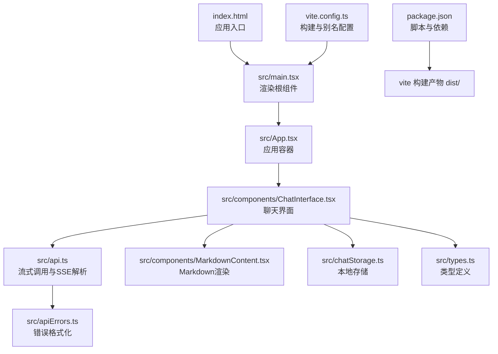
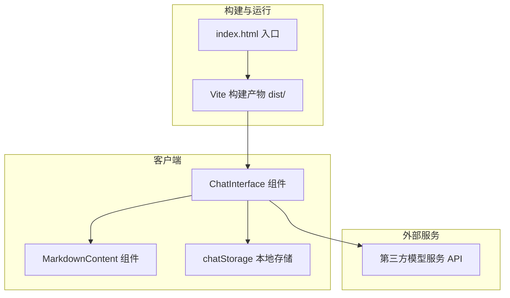
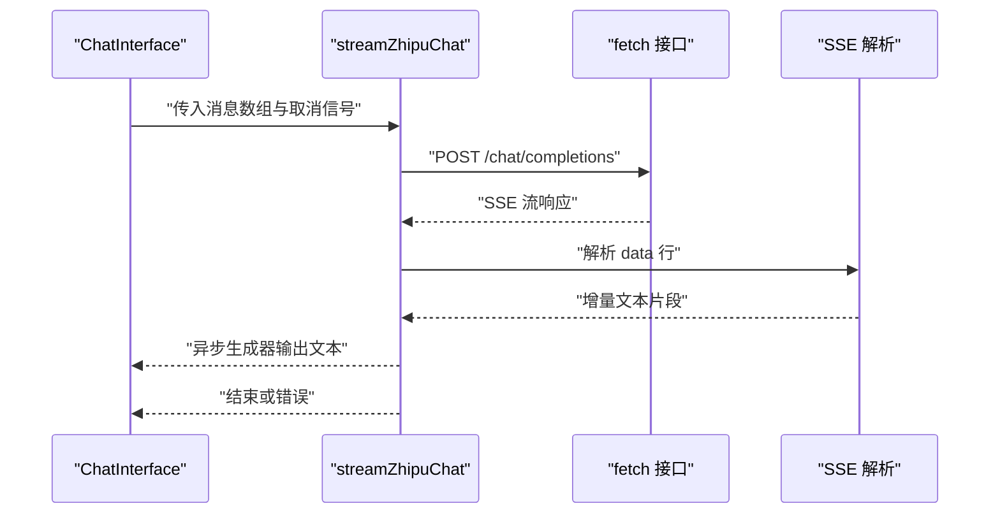
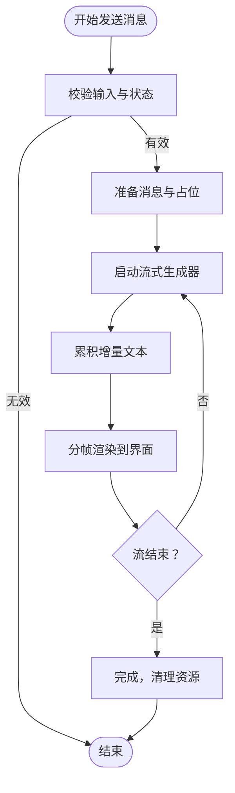
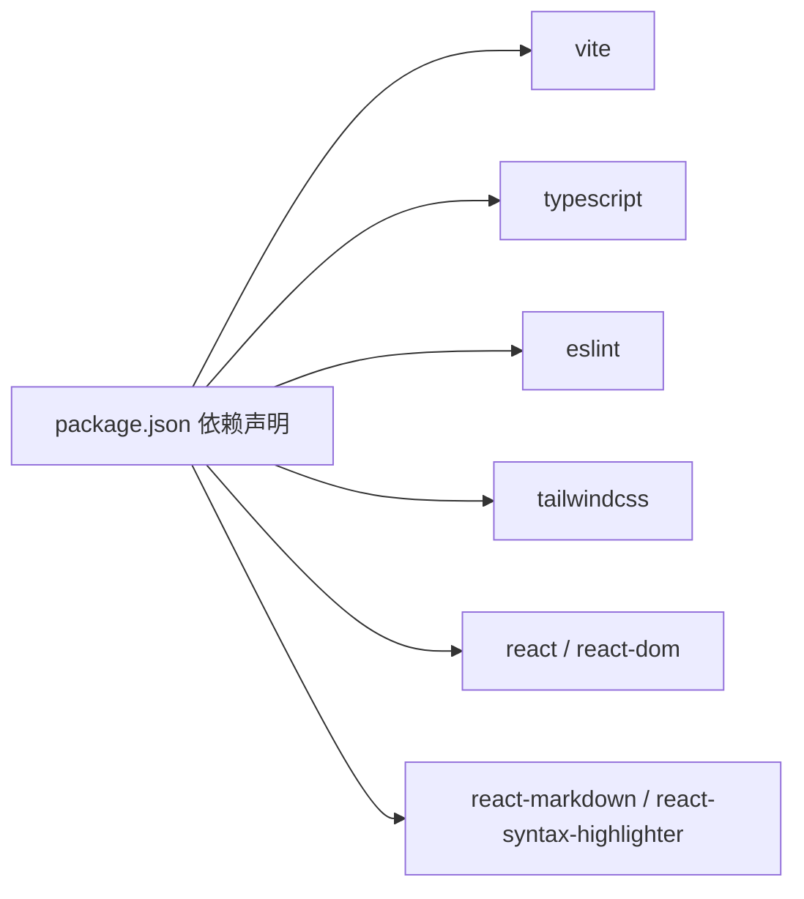

# 部署指南

<cite>
**本文引用的文件**
- [package.json](file://package.json)
- [vite.config.ts](file://vite.config.ts)
- [index.html](file://index.html)
- [src/main.tsx](file://src/main.tsx)
- [src/App.tsx](file://src/App.tsx)
- [src/api.ts](file://src/api.ts)
- [src/components/ChatInterface.tsx](file://src/components/ChatInterface.tsx)
- [src/components/MarkdownContent.tsx](file://src/components/MarkdownContent.tsx)
- [src/chatStorage.ts](file://src/chatStorage.ts)
- [src/apiErrors.ts](file://src/apiErrors.ts)
- [src/types.ts](file://src/types.ts)
- [eslint.config.js](file://eslint.config.js)
- [tsconfig.json](file://tsconfig.json)
</cite>

## 目录
1. [简介](#简介)
2. [项目结构](#项目结构)
3. [核心组件](#核心组件)
4. [架构总览](#架构总览)
5. [详细组件分析](#详细组件分析)
6. [依赖分析](#依赖分析)
7. [性能考虑](#性能考虑)
8. [故障排除指南](#故障排除指南)
9. [结论](#结论)
10. [附录](#附录)

## 简介
本指南面向AI聊天助手前端应用的生产部署，涵盖构建流程、静态资源优化与缓存策略、部署平台选择（静态托管、CDN）、域名与HTTPS配置、环境变量与API密钥保护、Docker容器化与CI/CD建议、性能监控与日志、错误追踪、负载均衡与回滚策略等内容。由于当前仓库为纯前端Vite项目，不包含后端服务，因此部署重点在于静态资源的构建、缓存与分发。

## 项目结构
该项目采用Vite + React + TypeScript技术栈，使用TailwindCSS进行样式开发。核心入口为HTML模板与React根组件，业务逻辑集中在聊天界面组件中，通过API模块调用第三方大模型服务。

图表来源
- [index.html:1-14](file://index.html#L1-L14)
- [src/main.tsx:1-11](file://src/main.tsx#L1-L11)
- [src/App.tsx:1-8](file://src/App.tsx#L1-L8)
- [src/components/ChatInterface.tsx:1-344](file://src/components/ChatInterface.tsx#L1-L344)
- [src/api.ts:1-184](file://src/api.ts#L1-L184)
- [src/components/MarkdownContent.tsx:1-129](file://src/components/MarkdownContent.tsx#L1-L129)
- [src/chatStorage.ts:1-51](file://src/chatStorage.ts#L1-L51)
- [src/apiErrors.ts:1-62](file://src/apiErrors.ts#L1-L62)
- [src/types.ts:1-9](file://src/types.ts#L1-L9)
- [vite.config.ts:1-14](file://vite.config.ts#L1-L14)
- [package.json:1-36](file://package.json#L1-L36)

章节来源
- [package.json:1-36](file://package.json#L1-L36)
- [vite.config.ts:1-14](file://vite.config.ts#L1-L14)
- [index.html:1-14](file://index.html#L1-L14)
- [src/main.tsx:1-11](file://src/main.tsx#L1-L11)
- [src/App.tsx:1-8](file://src/App.tsx#L1-L8)

## 核心组件
- 应用入口与渲染
  - HTML模板负责挂载点与基础元信息；React根组件负责渲染应用容器。
- 聊天界面
  - 负责消息列表渲染、输入处理、流式响应展示、复制功能与错误提示。
- API调用
  - 通过环境变量读取第三方模型服务地址与密钥，发起流式请求并解析SSE事件。
- Markdown渲染
  - 使用语法高亮与主题适配，支持多种语言别名映射。
- 本地存储
  - 基于localStorage持久化对话历史，具备类型校验与容错。

章节来源
- [src/components/ChatInterface.tsx:1-344](file://src/components/ChatInterface.tsx#L1-L344)
- [src/api.ts:1-184](file://src/api.ts#L1-L184)
- [src/components/MarkdownContent.tsx:1-129](file://src/components/MarkdownContent.tsx#L1-L129)
- [src/chatStorage.ts:1-51](file://src/chatStorage.ts#L1-L51)
- [src/types.ts:1-9](file://src/types.ts#L1-L9)

## 架构总览
前端应用通过Vite构建生成静态资源，运行时通过fetch调用第三方模型服务的流式接口。聊天界面负责UI交互与数据展示，API模块封装网络请求与错误处理，Markdown组件负责内容渲染，本地存储用于会话持久化。

图表来源
- [src/components/ChatInterface.tsx:1-344](file://src/components/ChatInterface.tsx#L1-L344)
- [src/components/MarkdownContent.tsx:1-129](file://src/components/MarkdownContent.tsx#L1-L129)
- [src/chatStorage.ts:1-51](file://src/chatStorage.ts#L1-L51)
- [src/api.ts:1-184](file://src/api.ts#L1-L184)
- [index.html:1-14](file://index.html#L1-L14)

## 详细组件分析

### API调用与流式处理
- 环境变量
  - 通过Vite的导入元对象读取API密钥、基础地址与模型名，未配置时抛出明确错误。
- 请求与响应
  - 发起POST请求，启用SSE流式返回；解析data行，提取增量文本；处理错误与连接中断。
- 错误格式化
  - 将HTTP状态与常见网络错误映射为用户可读提示。

图表来源
- [src/api.ts:70-184](file://src/api.ts#L70-L184)
- [src/components/ChatInterface.tsx:106-182](file://src/components/ChatInterface.tsx#L106-L182)

章节来源
- [src/api.ts:23-38](file://src/api.ts#L23-L38)
- [src/api.ts:83-123](file://src/api.ts#L83-L123)
- [src/api.ts:132-183](file://src/api.ts#L132-L183)
- [src/apiErrors.ts:3-31](file://src/apiErrors.ts#L3-L31)

### 聊天界面与渲染
- 交互控制
  - 输入框、发送按钮、复制按钮；支持键盘快捷键；加载态与错误提示。
- 流式展示
  - 使用requestAnimationFrame分帧渲染，提升体验；支持取消请求。
- Markdown渲染
  - 内联与块级代码高亮，主题适配用户/助手气泡。

图表来源
- [src/components/ChatInterface.tsx:106-182](file://src/components/ChatInterface.tsx#L106-L182)
- [src/components/MarkdownContent.tsx:70-115](file://src/components/MarkdownContent.tsx#L70-L115)

章节来源
- [src/components/ChatInterface.tsx:25-191](file://src/components/ChatInterface.tsx#L25-L191)
- [src/components/MarkdownContent.tsx:1-129](file://src/components/MarkdownContent.tsx#L1-L129)

### 本地存储与类型校验
- 存储键名统一管理，JSON序列化/反序列化，类型守卫确保数据结构正确。
- 异常静默处理，避免影响主流程。

章节来源
- [src/chatStorage.ts:1-51](file://src/chatStorage.ts#L1-L51)
- [src/types.ts:1-9](file://src/types.ts#L1-L9)

## 依赖分析
- 构建工具链
  - Vite负责开发与生产构建，插件包含React与TailwindCSS。
- 运行时依赖
  - React生态、Markdown渲染与语法高亮。
- 开发依赖
  - TypeScript、ESLint、TailwindCSS及相关插件。

图表来源
- [package.json:12-34](file://package.json#L12-L34)

章节来源
- [package.json:1-36](file://package.json#L1-L36)
- [eslint.config.js:1-29](file://eslint.config.js#L1-L29)
- [tsconfig.json:1-5](file://tsconfig.json#L1-L5)

## 性能考虑
- 构建与打包
  - 使用Vite的原生ESM与按需编译，减少打包体积与启动时间。
  - 合理拆分代码与动态导入，避免首屏阻塞。
- 缓存策略
  - 静态资源采用强缓存（带内容指纹），HTML与动态资源短缓存或不缓存。
  - CDN分发与边缘缓存，结合地理位置就近加速。
- 渲染优化
  - 分帧渲染与最小化DOM更新，降低主线程压力。
- 网络优化
  - 启用Gzip/Brotli压缩，合理设置TTFB与并发限制。
- 监控与日志
  - 前端性能指标（FP/FCP/LCP/INP/CLS）采集与上报。
  - 错误追踪（Sentry/Datadog等）接入，区分用户行为与系统错误。

## 故障排除指南
- 环境变量缺失
  - 未配置API密钥时会抛出明确错误，检查项目根目录的环境文件与变量名。
- 网络与跨域
  - 若出现跨域问题，需在第三方服务侧配置CORS或通过代理转发。
- 流式连接中断
  - 检查网络稳定性与代理设置；必要时增加重试与断点续传。
- 错误提示
  - 使用错误格式化函数将HTTP状态与网络异常转为用户可读信息。

章节来源
- [src/api.ts:23-38](file://src/api.ts#L23-L38)
- [src/apiErrors.ts:33-61](file://src/apiErrors.ts#L33-L61)

## 结论
本项目为纯前端应用，部署以静态资源为核心。建议采用现代静态托管平台配合CDN分发，结合严格的缓存策略与HTTPS配置，确保用户体验与安全性。同时，通过完善的监控与错误追踪体系，保障线上稳定运行。

## 附录

### 生产构建与发布流程
- 本地构建
  - 使用构建脚本生成dist目录，产物包含HTML、JS、CSS与静态资源。
- 静态托管
  - 可选择GitHub Pages、Vercel、Cloudflare Pages等平台，配置根路径与404回退。
- CDN与缓存
  - 对dist中的静态资源启用强缓存（如一年），HTML与动态资源短缓存或协商缓存。
- 域名与HTTPS
  - 绑定自定义域名，开启自动TLS证书与强制HTTPS跳转。
- 环境变量与密钥
  - 仅在构建时注入的环境变量需严格保密；运行时密钥应由后端代理转发。
- Docker容器化（可选）
  - 使用Nginx镜像部署dist目录，配置gzip、缓存头与安全头。
- CI/CD流水线（建议）
  - 触发条件：分支保护与PR审查；步骤：安装依赖、类型检查、测试、构建、上传制品、部署到目标环境。
- 负载均衡与回滚
  - 多节点部署与健康检查；蓝绿/金丝雀发布，失败快速回滚。
- 性能监控与日志
  - 前端埋点与APM接入，错误追踪与告警联动。