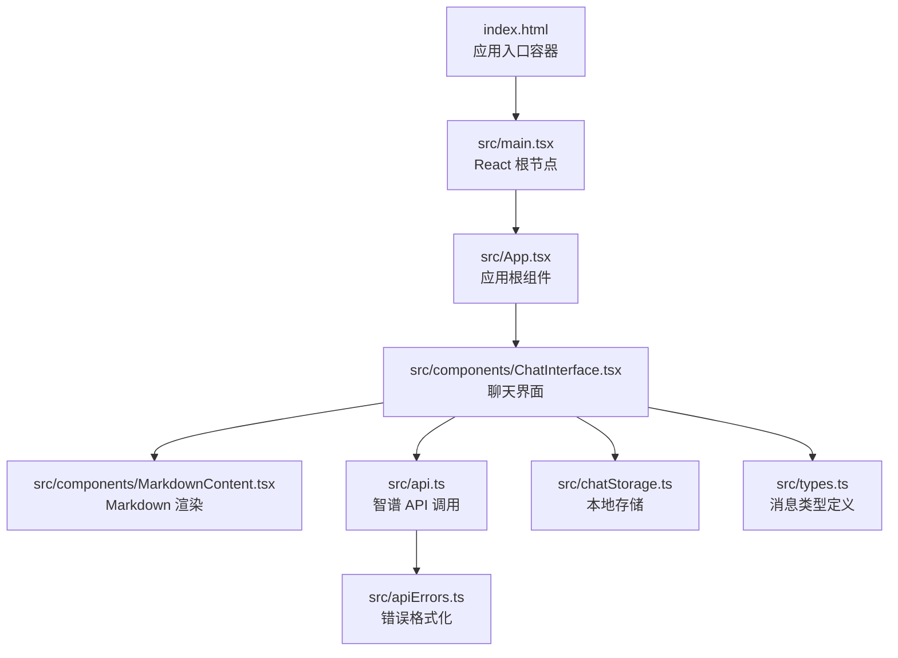
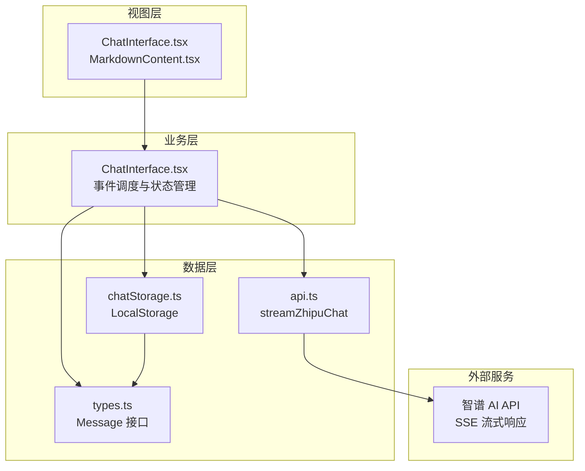
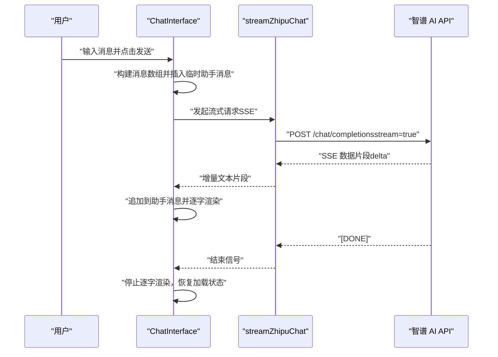
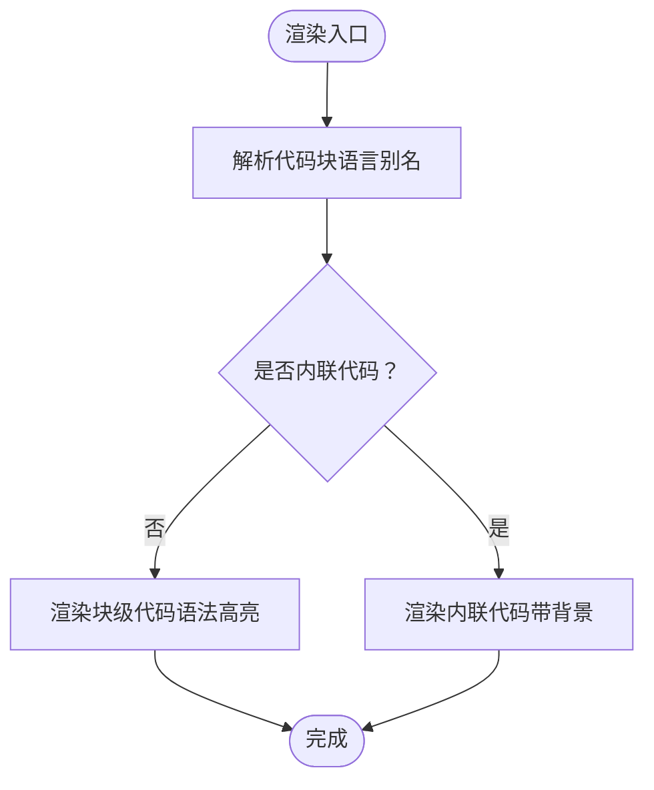
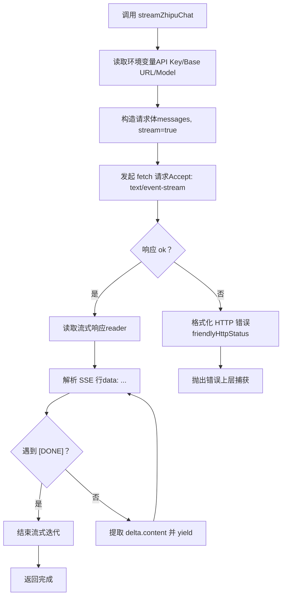
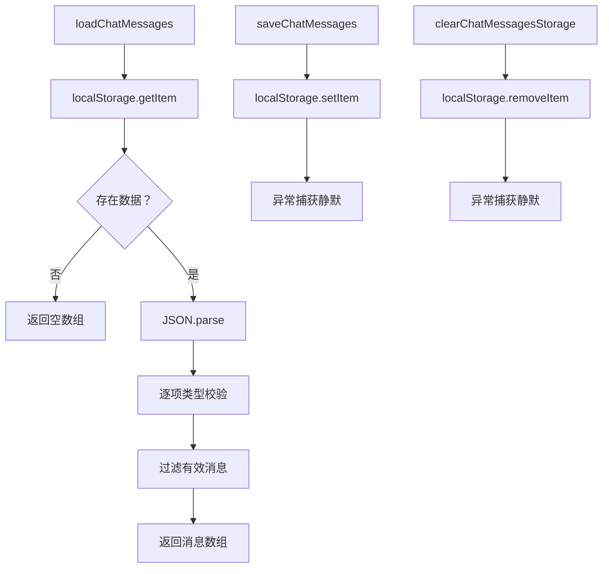
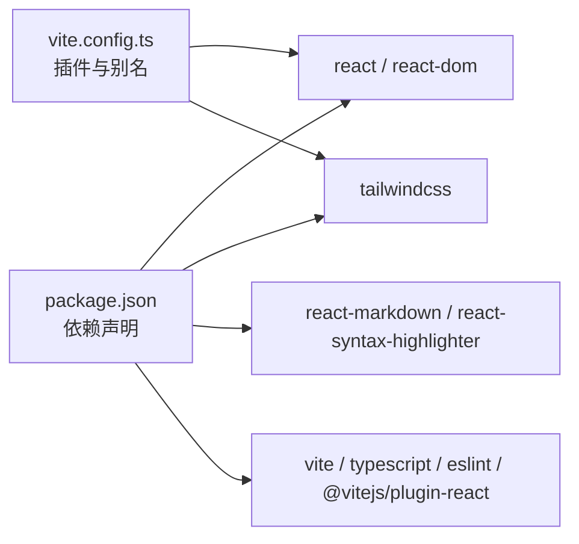

# 项目概述

<cite>
**本文档引用的文件**
- [package.json](file://package.json)
- [PRD.md](file://PRD.md)
- [TECH_DESIGN.md](file://TECH_DESIGN.md)
- [AGENTS.md](file://AGENTS.md)
- [src/App.tsx](file://src/App.tsx)
- [src/main.tsx](file://src/main.tsx)
- [src/index.css](file://src/index.css)
- [index.html](file://index.html)
- [vite.config.ts](file://vite.config.ts)
- [src/components/ChatInterface.tsx](file://src/components/ChatInterface.tsx)
- [src/components/MarkdownContent.tsx](file://src/components/MarkdownContent.tsx)
- [src/api.ts](file://src/api.ts)
- [src/apiErrors.ts](file://src/apiErrors.ts)
- [src/chatStorage.ts](file://src/chatStorage.ts)
- [src/types.ts](file://src/types.ts)
</cite>

## 目录
1. [简介](#简介)
2. [项目结构](#项目结构)
3. [核心组件](#核心组件)
4. [架构总览](#架构总览)
5. [详细组件分析](#详细组件分析)
6. [依赖关系分析](#依赖关系分析)
7. [性能考虑](#性能考虑)
8. [故障排除指南](#故障排除指南)
9. [结论](#结论)
10. [附录](#附录)

## 简介
本项目是一个基于 React + TypeScript + Vite 构建的 AI 聊天助手应用，通过调用智谱 AI 的 Chat Completions API 实现流式对话体验。项目遵循微信风格的简洁设计，支持多轮对话、Markdown 渲染与代码高亮、本地存储对话历史、以及逐字显示的自然反馈机制。项目目标是为用户提供即时、流畅且具备良好可读性的智能对话体验，同时保持前端工程的现代化与可维护性。

## 项目结构
项目采用前端单页应用（SPA）结构，核心入口位于 HTML 容器与 React 根节点，组件化组织聊天界面与 Markdown 渲染逻辑，API 层负责与第三方服务交互，工具模块提供数据持久化与错误格式化能力。

图表来源
- [index.html:1-14](file://index.html#L1-L14)
- [src/main.tsx:1-11](file://src/main.tsx#L1-L11)
- [src/App.tsx:1-8](file://src/App.tsx#L1-L8)
- [src/components/ChatInterface.tsx:1-344](file://src/components/ChatInterface.tsx#L1-L344)
- [src/components/MarkdownContent.tsx:1-129](file://src/components/MarkdownContent.tsx#L1-L129)
- [src/api.ts:1-184](file://src/api.ts#L1-L184)
- [src/apiErrors.ts:1-62](file://src/apiErrors.ts#L1-L62)
- [src/chatStorage.ts:1-51](file://src/chatStorage.ts#L1-L51)
- [src/types.ts:1-9](file://src/types.ts#L1-L9)

章节来源
- [index.html:1-14](file://index.html#L1-L14)
- [src/main.tsx:1-11](file://src/main.tsx#L1-L11)
- [src/App.tsx:1-8](file://src/App.tsx#L1-L8)
- [vite.config.ts:1-14](file://vite.config.ts#L1-L14)

## 核心组件
- 应用根组件：负责挂载聊天界面组件，作为单一职责的容器。
- 聊天界面组件：实现完整的对话流程，包括输入处理、流式渲染、滚动控制、错误提示与复制功能。
- Markdown 内容组件：封装 React Markdown 与语法高亮，支持多种语言别名与内联/块级代码渲染。
- API 模块：封装智谱 AI 的 SSE 流式响应解析，统一错误处理与环境变量读取。
- 存储模块：基于 LocalStorage 的消息持久化，包含类型校验与异常容错。
- 类型定义：标准化消息结构，确保前后端数据一致性。

章节来源
- [src/App.tsx:1-8](file://src/App.tsx#L1-L8)
- [src/components/ChatInterface.tsx:1-344](file://src/components/ChatInterface.tsx#L1-L344)
- [src/components/MarkdownContent.tsx:1-129](file://src/components/MarkdownContent.tsx#L1-L129)
- [src/api.ts:1-184](file://src/api.ts#L1-L184)
- [src/chatStorage.ts:1-51](file://src/chatStorage.ts#L1-L51)
- [src/types.ts:1-9](file://src/types.ts#L1-L9)

## 架构总览
系统采用“视图层 + 业务层 + 数据层”的分层设计：
- 视图层：React 组件负责 UI 呈现与用户交互。
- 业务层：聊天界面组件协调输入、渲染、滚动与错误处理。
- 数据层：API 模块对接第三方服务，存储模块管理本地历史。

图表来源
- [src/components/ChatInterface.tsx:1-344](file://src/components/ChatInterface.tsx#L1-L344)
- [src/api.ts:1-184](file://src/api.ts#L1-L184)
- [src/chatStorage.ts:1-51](file://src/chatStorage.ts#L1-L51)
- [src/types.ts:1-9](file://src/types.ts#L1-L9)

## 详细组件分析

### 聊天界面组件（ChatInterface）
- 多轮对话与流式渲染：通过 AbortController 控制并发请求，使用 requestAnimationFrame 驱动“逐字”展示，结合 SSE 流式数据增量拼接，实现自然的打字机效果。
- 状态与副作用：维护消息列表、输入框、加载状态与错误提示；自动滚动至底部；键盘快捷键支持（Enter 发送，Shift+Enter 换行）。
- 错误处理：区分网络异常、API 返回错误与用户取消，提供友好提示与回退逻辑。
- 交互增强：支持复制助手回复、时间戳格式化、空闲占位提示。

图表来源
- [src/components/ChatInterface.tsx:106-182](file://src/components/ChatInterface.tsx#L106-L182)
- [src/api.ts:70-183](file://src/api.ts#L70-L183)

章节来源
- [src/components/ChatInterface.tsx:1-344](file://src/components/ChatInterface.tsx#L1-L344)

### Markdown 渲染组件（MarkdownContent）
- 语言别名映射：内置常见语言别名到 Prism 语言 ID 的映射表，覆盖 JS/TS/Python/Go/Rust 等主流语言。
- 内联与块级代码：根据是否存在换行判断内联或块级渲染；块级代码启用语法高亮与自动换行。
- 主题适配：根据消息色调（用户/助手）调整内联代码背景，提升可读性。

图表来源
- [src/components/MarkdownContent.tsx:14-62](file://src/components/MarkdownContent.tsx#L14-L62)
- [src/components/MarkdownContent.tsx:70-115](file://src/components/MarkdownContent.tsx#L70-L115)

章节来源
- [src/components/MarkdownContent.tsx:1-129](file://src/components/MarkdownContent.tsx#L1-L129)

### API 模块（智谱 AI）
- 环境变量读取：从 Vite 环境变量读取 API Key、基础地址与模型名，提供默认值与清理逻辑。
- SSE 解析：自定义解析器提取 data 行，兼容尾随缓冲区与 [DONE] 结束标记。
- 错误处理：区分网络错误、HTTP 状态码与服务端错误，统一格式化为用户可读提示。

图表来源
- [src/api.ts:23-38](file://src/api.ts#L23-L38)
- [src/api.ts:70-183](file://src/api.ts#L70-L183)
- [src/apiErrors.ts:3-31](file://src/apiErrors.ts#L3-L31)

章节来源
- [src/api.ts:1-184](file://src/api.ts#L1-L184)
- [src/apiErrors.ts:1-62](file://src/apiErrors.ts#L1-L62)

### 存储模块（LocalStorage）
- 类型校验：严格校验本地存储中的消息对象字段，确保数据完整性与类型安全。
- 异常容错：在隐私模式或配额不足时静默失败，不影响主流程。
- 生命周期：提供加载、保存与清空三个操作，配合应用初始化与清理场景。

图表来源
- [src/chatStorage.ts:20-50](file://src/chatStorage.ts#L20-L50)

章节来源
- [src/chatStorage.ts:1-51](file://src/chatStorage.ts#L1-L51)

### 类型定义（Message）
- 角色枚举：限定为 user 与 assistant，保证消息来源一致性。
- 时间戳：统一使用毫秒级时间戳，便于排序与格式化显示。

章节来源
- [src/types.ts:1-9](file://src/types.ts#L1-L9)

## 依赖关系分析
- 运行时依赖：React、React DOM、Tailwind CSS、react-markdown、react-syntax-highlighter。
- 开发依赖：Vite、TypeScript、ESLint、Tailwind CSS 插件、React 插件等。
- 构建配置：Vite 集成 React 与 Tailwind CSS 插件，路径别名 @ 指向 src。

图表来源
- [package.json:12-34](file://package.json#L12-L34)
- [vite.config.ts:1-14](file://vite.config.ts#L1-L14)

章节来源
- [package.json:1-36](file://package.json#L1-L36)
- [vite.config.ts:1-14](file://vite.config.ts#L1-L14)

## 性能考虑
- 流式渲染优化：使用 requestAnimationFrame 控制逐字渲染速率，CHARS_PER_FRAME 参数可微调“逐字”体验与性能平衡。
- 并发控制：AbortController 确保同一时刻仅保留最新请求，避免竞态与多余渲染。
- 渲染开销：Markdown 渲染与语法高亮在大段代码块时可能带来开销，建议在长对话中适当节流或懒加载。
- 存储策略：LocalStorage 读写为同步操作，建议限制历史长度或定期清理，避免影响主线程。

## 故障排除指南
- API Key 未配置：检查 .env 文件中 VITE_ZHIPU_API_KEY 是否存在且非空。
- 网络异常：检查网络连通性、代理设置或防火墙规则。
- 401/403 权限问题：确认账户状态、余额与模型权限是否正常。
- 429 频率过高：降低请求频率，或等待配额恢复。
- 服务端错误：查看详细错误信息，必要时更换模型或稍后重试。
- 复制失败：检查浏览器剪贴板权限或改用手动复制。

章节来源
- [src/apiErrors.ts:3-31](file://src/apiErrors.ts#L3-L31)
- [src/api.ts:23-38](file://src/api.ts#L23-L38)

## 结论
本项目以简洁的前端技术栈实现了高质量的 AI 聊天体验，重点在于流式渲染、Markdown 渲染与本地存储三大特性。通过清晰的组件划分与完善的错误处理，既满足初学者的易用性需求，也为有经验的开发者提供了可扩展的架构基础。后续可在性能优化、历史长度控制与多模型切换等方面进一步演进。

## 附录
- 版本信息：当前版本为 0.0.1，基于 React 19、TypeScript 5.7 与 Vite 6。
- 技术亮点：流式对话、Markdown 代码高亮、本地持久化、逐字渲染、错误友好提示。
- 业务目标：提供即时、自然、可读性强的智能对话体验，支持多轮上下文与知识沉淀。
- 目标用户：需要快速获取信息、进行技术交流与知识整理的个人用户与开发者。